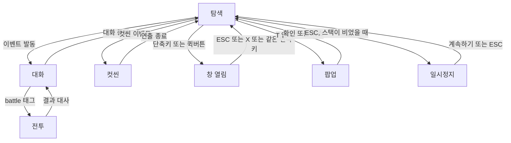
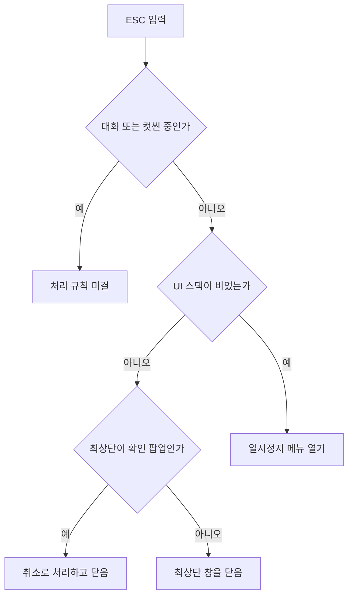
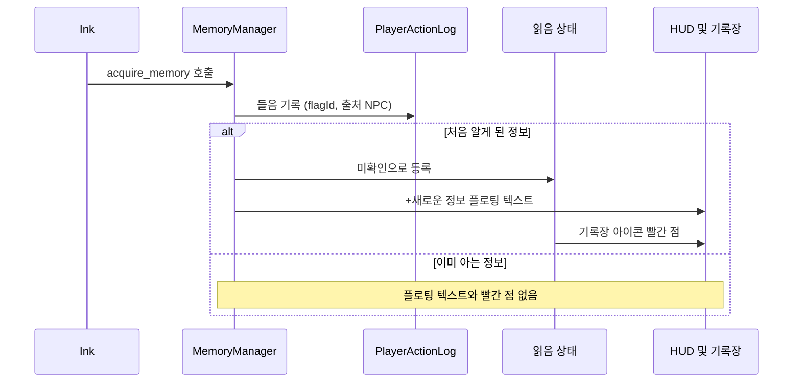
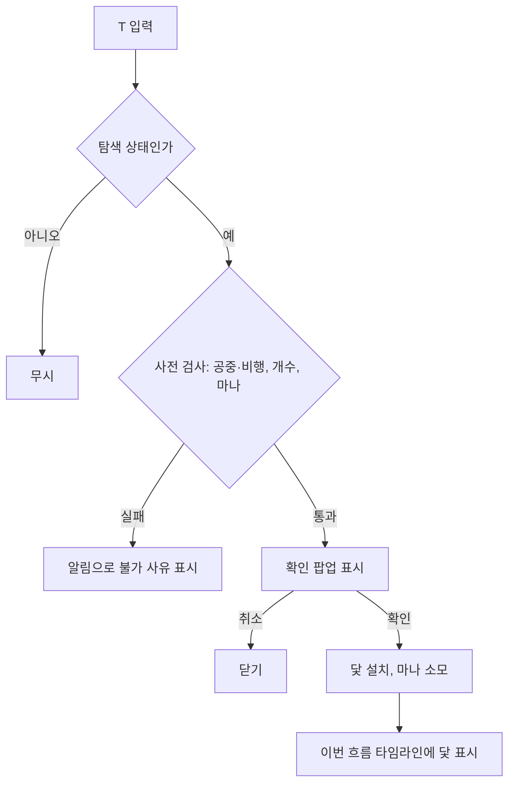
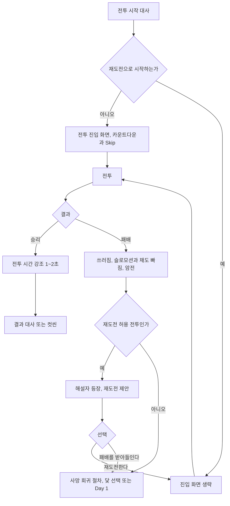
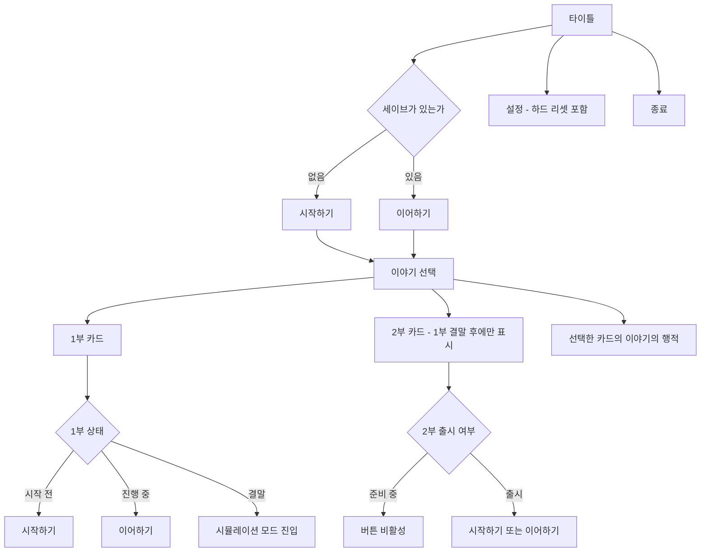
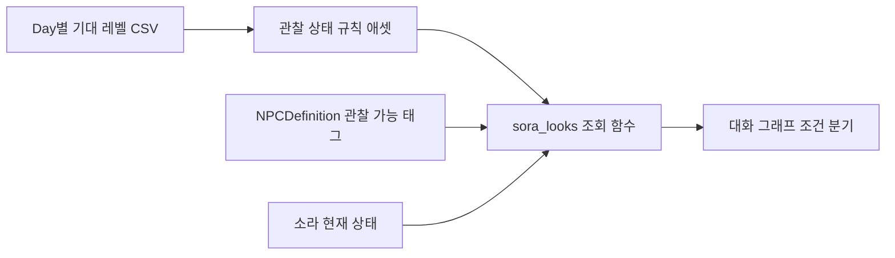
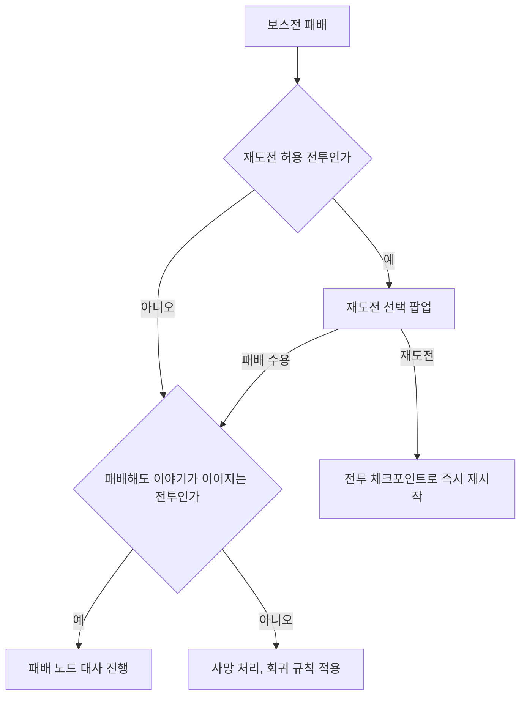
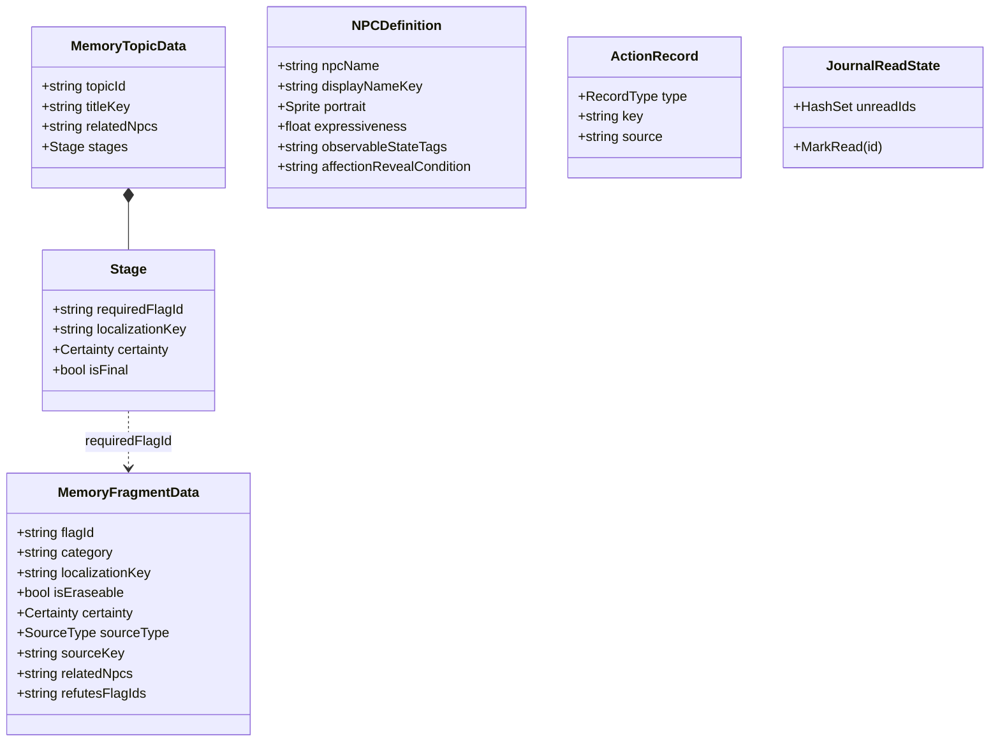
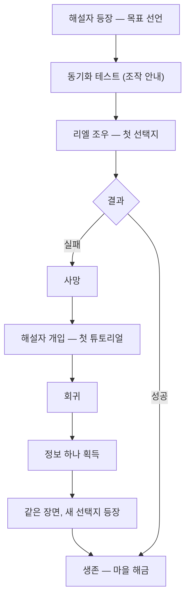

# 라스트메르헨 — UI 기획서 v0.3.3

| 항목 | 내용 |
| --- | --- |
| 버전 | 0.3.3 |
| 작성일 | 2026-09-16 작성, 2026-09-29 v0.3 갱신, 2026-10-06 v0.3.1 갱신, 2026-10-07 v0.3.2·v0.3.3 갱신 |
| 이전 버전 | v0.1 — UI 시스템 전체 목록 초안 (7월 27일) |
| 관련 문서 | 라스트메르헨 통합 인수인계 문서 |
| 범위 | 인게임 UI의 정보 노출 정책, 화면 상태·입력 규칙, 화면별 명세, 회귀 규칙과 UI의 관계, 데이터·툴 요구사항 |

**상태 표기**

| 표기 | 의미 |
| --- | --- |
| **[확정]** | 논의를 거쳐 결정된 사항이다 |
| **[제안]** | 방향은 합의했거나 제안된 상태이며, 와이어프레임·구현 단계에서 확정한다 |
| **[미결]** | 아직 결정되지 않았다. 10장에 모아 두었다 |
| **[기술 검증]** | 기획은 확정이나 구현 방식을 테스트로 확인해야 한다 |

**v0.3.3 변경 이력**

| 절 | 변경 내용 |
| --- | --- |
| 부록 D | D-0 몰아서 테스트 순서 추가 (2026-10-10) — 준비가 같은 항목을 묶음 1~8로, 테스트용 인스펙터 값, 줄마다 `[묶음 N]`·`[통과]`·`[대체]`·`[보류]` 표시 |
| 7-2 | 자발적 회귀의 화면과 연출 [제안] (2026-10-09) — 회귀 직전 연출과 접근성(빠른 버튼) 검토, 닻 선택 화면과 같은 구조를 두 모드로(사망: 검정 배경·푸른 반투명 몸 / 자발적: 지금 모습) |
| 6-10-5 (신규) | 화자 이름과 정체 [제안] (2026-10-09) — 인물(세계의 진실)과 겉모습(플레이어가 보는 모습), 아는 이름 단계, 확실한 정보로만 정체 연결, 장면 별칭, 기록장은 지금 아는 이름 |
| 6-6-4 | 마일스톤의 출처 확정 (2026-10-09) — 작가가 노드에 표시한 장면(`#milestone`) + 자동(보스전 결과, 영혼 레벨 경신) |
| 7-2 | 회귀 직후 체력·마나 규칙 확정 (2026-10-09) — 경로 1은 남은 마나를 생명력으로 바꿔 회복, 경로 2는 닻 시점의 체력·마나, 자발적 회귀는 비용만 |
| 6-6-4 | 지난 회차 상세는 숨김 수치·카운터까지 무손실 저장. 거둔 닻 표시 확정 |
| 7-2 | Day 1 선택 확정 — 마나를 쓰지 않는다. 닻 선택 화면에 선택지별 대가 표시, 명백히 손해인 선택에만 해설자 확인 |
| 용어 | 스킬 레벨 → 스킬 숙련도 (숫자 단계 표기) |
| 11-5 (신규) | 스킬 숙련도 성장 방식 [제안] |
| 10 | 미결 23 재정의(숙련도의 회귀 처리), 미결 24 추가(세이브와 회귀 우회) |
| 7-2 | 회귀 경로 재정리 — 사망 후 Day 1 선택 가능(마나 없음, 몸 초기화, 정신력 하락), 자발적 회귀는 닻으로만. 정신력 충격을 몸이 되돌아간 폭에 비례 |
| 6-12 (신규) | 타이틀과 이야기 선택(1부·2부·시뮬레이션) |
| 8, 9-7 | 세이브 슬롯 폐지 — 플레이어당 세계 하나, 결과 시점 자동 저장. 미결 24 해결 |
| 9-8 (신규) | 기록 시스템 — 모든 상태 변화 기록, 스냅샷 + 변경 기록, 버그 리포트 내보내기 |
| 11-5 | 숙련도 표기는 로마 숫자, 회귀 처리 확정(미결 23 해결) |
| 문서 형식 | 노션 붙여넣기용 마크다운으로 전환. 다이어그램은 mermaid 코드 블록 |
| 11-1, 8 외 | 용어 정정 — 혼은 원소 에너지, 소라에게는 영혼 대신 의지(정신). "소라의 혼" 층위를 "소라의 의지"로 |
| 6-12 | 이야기 선택 카드 규칙(2부는 1부 결말 후 표시, 실행 버튼 전환, 타이틀에서 연 행적) |
| 9-7 | 하드 리셋 확인·재시작 해설자 대사, 플레이 권장 문구 |
| 11-1 | 표기 원칙 — 설정·인물의 말은 의지·정신, UI와 해설자는 플레이어의 언어(영혼 레벨 유지) |
| 8 | 시뮬레이션 소개 대사, 결말 후 1부 진행 종료 |

**v0.3.2 변경 이력**

| 절 | 변경 내용 |
| --- | --- |
| 5-4 (신규) | 시각 표기 — 12시간제/24시간제를 설정 하나로 전환, 모든 화면이 같은 포맷터를 쓴다 |
| 6-6-4 | 4차 초안 반영: 선택 회차 표시 방식, 회차 이동·컷씬 숨기기 배치, 마일스톤 최대 5개 + 펼치기, ★ 표시 규칙, 사망 라벨 2종, 닻 번호 규칙, 사용 전 닻 툴팁 |
| 6-6-4, 9-2 | 지난 회차의 상세 행적도 저장한다 — 회차별 분리·압축·지연 로드 |
| 7-2, 10 | 사망·불완전 결말 후 돌아갈 지점은 플레이어가 고른다(미결 22 해결). 닻 선택 화면 필요 |
| 8 | 소라의 몸에 공·방·민 추가 (11-3과 일치) |
| 10 | 미결 23 추가 — 스킬 레벨과 스킬 숙련도의 층위 |
| C-7, C-8 (신규) | 닻 선택 화면 추가, 연출 시스템 목록 신설 |

**v0.3.1 변경 이력**

| 절 | 변경 내용 |
| --- | --- |
| 6-6-3 | 행적 타임라인은 기록장 이번 흐름 탭으로 통합된 사실 반영. 닻 복귀는 이번 흐름 탭에서만 한다 |
| 6-6-4 | 절 번호 중복(6-6-1) 정리. 결말 분류 4종 정의, 닻 복귀 불가, 세이브 슬롯 단위 명시, 와이어프레임 미반영 항목을 [제안]으로 기재 |
| 6-7 | 옛 메뉴 표 삭제, 확정 구성(설정 / 저장하기 / 타이틀로 / 종료)만 남김 |
| 7-4 | 회차 산정 확정 — 모든 회귀마다 +1, 보스전 재도전만 제외 |
| 7-6 외 | 용어 통일: 기다리기 → 시간 보내기 |
| 8 | 세이브 슬롯 = 서로 간섭하지 않는 독립된 세계. 모든 층위는 슬롯에 속함 |
| 10 | 미결 2·10 해결, 22 추가 |
| 부록 A·C-7 | 용어(회차·결말·세이브 슬롯) 갱신, 남은 와이어프레임 순서 갱신 |

**v0.3 변경 이력**

| 절 | 변경 내용 |
| --- | --- |
| 6-4-2 | 기록장 3탭으로 재편 (인물 정보 / 자료집 / 이번 흐름), 앨범 분리 |
| 6-4-9 | 이번 흐름 탭 확정 — 흐름 시작 줄, 회귀 지점 표시, 기록 항목 정책, 타임라인 정렬 규칙 |
| 6-4-10 (신규) | 자료집 탭 명세 |
| 11 (신규) | 세계 설정과 성장 규칙 — 영·혼 체계, 요정화, 노련미 보정 |
| 12 (신규) | 도입부 흐름 (첫 30분) |
| 부록 D (신규) | 테스트 대기 목록 |
| 부록 B·C | 완료 현황 반영 |

**v0.2.6 변경 이력**

| 절 | 변경 내용 |
| --- | --- |
| 3-4 | 해설자의 튜토리얼 개입 추가 |
| 6-4 | 기록장 4탭 구성 확정, 인물 탭 레이아웃(6-4-8)과 이번 흐름 탭 구성(6-4-9) 추가 |
| 7-6 | 마을 간 이동 시간, 사냥 시간 추가 |
| 8 | 플레이어 층위에 방문 노드 기록 추가 |
| 9-3 | `#time` 태그(대화 소모 시간 덮어쓰기), `#node` 태그(방문 노드 기록) 추가 |
| 9-6 (신규) | 노드 에디터 갱신 목록 |
| 9-7 (신규) | 데이터 보호 방침 |
| 10 | 미결 사항 갱신 |
| 부록 B·C | 3·4단계 완료 현황 반영, 이후 기능 목록 확장 |

**v0.2.5 변경 이력**

| 절 | 변경 내용 |
| --- | --- |
| 3-4 | 해설자 = 시스템 설정 추가 |
| 6-3 | 선택지 개수·길이·배치 규칙 확정 |
| 6-9 | 전투 상태 안전 영역 추가 |
| 6-10 (신규) | 대화 화면 명세 (말풍선 자동 크기, 판넬, 미니 상태 패널, 오브젝트 구조) |
| 6-11 (신규) | 전투 화면 명세 (진입 화면, 전투 HUD, 사망·재도전·승리 흐름, 전적 기록) |
| 7-7 | 재도전 횟수 정의, 재도전 시 진입 화면 생략 |
| 8 | 플레이어 층위에 전적·능력치 공개 상태 추가 |
| 9-4 | 알림·HUD 문구 로컬라이제이션 키 목록 |
| 10 | 미결 사항 갱신 |
| 부록 B | 3단계 처리 현황 반영, B-31~B-34 추가 |
| 부록 C | 진행 현황 갱신, 이후 기능 추가 |

**v0.2.4 변경 이력**

| 절 | 변경 내용 |
| --- | --- |
| 전체 | 다이어그램을 노션에 그대로 붙여넣어 렌더링되는 문법으로 정리 |
| 6-1 | 탐색 HUD 와이어프레임 확정 사항 반영 |
| 6-3 | 선택지 태그 형식 확정 |
| 6-9 (신규) | HUD 안전 영역 좌표 |
| 10 | 시간 단위 표기 확정 반영 |
| 부록 C (신규) | 앞으로 구현할 항목 전체 목록 |

**v0.2.3 변경 이력**

| 절 | 변경 내용 |
| --- | --- |
| 7-7 | 보스전 즉시 재도전 확정, 해설자 개입 확정, 재도전 거부 연출 추가 |
| 9-3 | 선택지 출력 형식 확인 완료, 태그 위치 확정 |
| 10 | 미결 사항 갱신 |
| 부록 B | B-21·B-25·B-30 등 1단계 처리 현황 반영 |

**v0.2.2 변경 이력**

| 절 | 변경 내용 |
| --- | --- |
| 6-6-3 | 이후 시점 닻 소멸 반영 |
| 7-5 | 도착 후 재설치 허용, 이후 시점 닻 소멸 확정 |
| 7-6 | 기다리기 확정, 잠자기 시간 선택(1~12시간) 추가, 순간이동은 스킬 형태로 확정 |
| 7-7 (신규) | 보스전 패배와 재도전, 닻 최대 개수 |
| 9-3 | 선택지 태그 위치를 내보내기 형식에 맞추도록 수정 |
| 10 | 미결 사항 갱신 |
| 부록 B | B-20 갱신, B-30 추가 |

**v0.2.1 변경 이력**

| 절 | 변경 내용 |
| --- | --- |
| 5-2 | 배경 흐림은 UI 구현 이후 검토하는 것으로 순서 확정 |
| 6-6-3 | 다른 흐름의 닻 처리를 7-5로 이동 |
| 7-2 | 경로 2·3 결과 확정 |
| 7-5 (신규) | 시간의 닻 1회용 규칙, 이후 시점 닻 처리 |
| 7-6 (신규) | 반복 플레이 피로 완화: 읽은 대사 빠르게 넘기기, 기다리기, 순간이동 |
| 8 | 개인친밀도 층위 확정(소라의 의지), 메타 NPC 예외, 방문 지역·읽은 대사 기록 추가 |
| 9-2, 9-3, 9-4 | 코드 확인 결과 반영 (이벤트 완료 기록, 선택지 태그 위치, CSV 파서) |
| 10 | 미결 사항 갱신 |
| 부록 B | B-20 갱신, B-21 ~ B-29 추가 |

---

## 목차

1. 개요
2. 설계 원칙
3. 정보 노출 정책
4. 화면 상태와 입력 규칙
5. 해상도와 비주얼 방향
6. 화면별 명세 (6-12 타이틀과 이야기 선택 포함)
7. 회귀 규칙과 UI
8. 데이터 층위 (세이브 규칙 포함)
9. 데이터·툴 요구사항 (9-8 기록 시스템 포함)
10. 미결 사항
11. 세계 설정과 성장 규칙
12. 도입부 흐름

부록 A. 용어 정리
부록 B. 구현 착수 시 함께 정리할 코드 이슈
부록 C. 앞으로 구현할 항목 전체 목록
부록 D. 테스트 대기 목록

---

## 1. 개요

### 1-1. 목적

지금까지 구현한 서사 시스템(기억, 이해도, 호감도, 의심, 회차, 시간의 닻)은 에디터에서만 확인할 수 있다. 이 게임의 핵심은 "미묘한 반응 차이"인데, 플레이어가 그 차이를 감지할 수단이 없으면 시스템이 없는 것과 같다.

본 문서는 각 시스템이 **플레이어에게 무엇을, 어느 정도로, 어떤 경로로** 전달되는지를 정의한다. 피그마 와이어프레임 작업과 이후 UI 구현의 기준 문서로 사용한다.

### 1-2. v0.1 대비 주요 변경

| 항목 | v0.1 | v0.2 |
| --- | --- | --- |
| 회귀 지점 명칭 | 시간 고정 | **시간의 닻** |
| 회귀 지점 이동 | 세이브/로드 창에서 선택 | 행적 타임라인에서 닻을 선택 |
| 몸 상태 되돌림 | 세이브/로드 창에 선택 UI | 선택 UI 없음. 회귀 경로에 따른 결과로만 발생 |
| 기억 선별 | 유지/삭제 선택 | 기억은 항상 유지. 삭제는 스토리 이벤트 전용 |
| 기록장 구성 | NPC별 프로필·획득 정보 | 인물 / 주제 / 이번 흐름 3탭. 확실도·출처 표시 |
| 시간결정체 표시 | 상시 HUD | 프로필 |
| 스킬 쿨타임 | 일반 HUD 신규 항목 | 상시 HUD 확정. 사용 금지 상태 추가 |
| 창 닫기 | 규정 없음 | UI 스택 + ESC 최상단 닫기 |
| 데이터 층위 | 3층위 | 4층위 (플레이어 층위 추가) |

---

## 2. 설계 원칙

모든 UI 결정은 아래 원칙을 기준으로 판단한다.

**원칙 1. NPC의 속마음은 수치로 보이지 않는다.** 플레이어는 사람과 대화하듯 NPC의 표정·대사·태도로만 상대를 판단한다. 호감도·의심·신뢰·선넘음·개인친밀도는 어떤 형태의 숫자로도 화면에 나타나지 않는다.

**원칙 2. 수치는 숨기되 규칙은 알린다.** "사람들은 네 말을 기억하고 판단한다"는 규칙은 해설자를 통해 서사 언어로 전달한다. 숨겨진 값이 있어도 규칙을 알고 있고 실패 후 원인을 짚어주는 존재가 있으면, 플레이어는 불공정하다고 느끼지 않는다.

**원칙 3. 기억 보조는 대화 밖에서 한다.** 대화 중에는 기록장을 열 수 없다. 플레이어는 대화 전에 기록장으로 준비하고, 대화 중에는 선택지 툴팁이 최소한의 보조만 한다.

**원칙 4. UI는 사실을 보여주고 판단은 플레이어가 한다.** "위험한 선택지" 경고, "이미 고른 선택지" 표시, "이번 흐름에서 들었는지" 같은 판단 보조는 선택지 UI에 넣지 않는다.

**원칙 5. 소라와 플레이어는 별개의 존재이며, 데이터 구조도 이를 따른다.** 소라의 의지(정신)에 속한 것(기억), 세계에 속한 것(NPC 상태, 이번 흐름의 사건), 플레이어에게 속한 것(메모, 핀)을 구분해 저장한다. (8장)

**원칙 6. 기능 추가의 판단 기준은 핵심 루프다.** 새 기능은 "아는 척과 의심"이라는 핵심 루프를 강화하는지로 판단하고, 강화하지 않으면 보류한다.

---

## 3. 정보 노출 정책

### 3-1. 데이터별 노출 표

| 데이터 | 노출 방식 | 위치 | 상태 |
| --- | --- | --- | --- |
| HP / MP / EXP | 수치 + 바 | 상시 HUD | [확정] 구현됨 |
| 피로도 | 바 | 상시 HUD | [확정] 구현됨 |
| 시간 코인 · Day · 시각 | 코인 링 + 텍스트 | 상시 HUD | [확정] 구현됨 |
| 스킬 슬롯 · 쿨타임 | 아이콘 + 상태 | 상시 HUD | [확정] |
| 신체 레벨 / 영혼 레벨 | 수치 | 프로필 | [확정] |
| 공격력 · 방어력 · 민첩도 | 수치 | 프로필 | [확정] |
| 스킬 숙련도 | 로마 숫자 단계 (I·II·III) | 프로필 | [확정] |
| 정신력 | 수치 또는 바 | 프로필 | [확정] |
| 시간결정체 | 개수 | 프로필 | [확정] |
| 현재 회차 | 수치 | 프로필 | [확정] (산정 기준 7-4) |
| 시간의 닻 개수 | 현재/최대 | 설치 팝업, 기록장 이번 흐름 | [확정] (프로필 추가 여부 [미결]) |
| 기억 (단일 / 단계별) | 문장 + 확실도 + 출처 | 기록장 | [확정] |
| 이해도 | % | 기록장 인물 탭 | [확정] |
| 호감도 | 숨김. 공개 조건 충족 시 인물 탭에 표시 | 인물 탭, 타로점 | [확정] (공개 조건·형식 [미결]) |
| 개인친밀도 | 숨김 | 선택지 내용, 가온의 마음 읽기 | [확정] (소라–플레이어 간접 대화 [미결]) |
| 의심 | 숨김 | NPC 반응, 소라의 눈치 문구, 해설자 | [확정] |
| 신뢰 | 숨김 | 대사 | [확정] |
| 선넘음 | 숨김 | 순간 표정 + 화면 연출 | [확정] |
| 관계 등급 (`GetRelationshipTier`) | **표시 금지** | — | [확정] 호감도가 섞인 계산값이므로 |

### 3-2. 간접 신호 설계

숨겨진 수치는 아래 채널로만 플레이어에게 전달된다.

| 신호 | 전달하는 것 | 표현 | 발생 조건 | 상태 |
| --- | --- | --- | --- | --- |
| NPC 반응 | 호감도, 의심, 신뢰 | 표정·대사·연출 (그래프 분기로 작성) | 분기 조건. 포커페이스 NPC는 동요하지 않음 | [확정] |
| 소라의 눈치 문구 | 의심 | 시스템 패널 문구. 예: "리엘의 반응이 심상치 않다." | 의심 증가량 임계값 이상 **그리고** NPC 감정 표현도 기준 이상 | [확정] (임계값 [미결]) |
| 선넘음 연출 | 선넘음 | 순간 표정 + 화면이 싸해지는 플래시 | 선넘음 발생 즉시 | [확정] |
| 해설자 중간 점검 | 의심 누적 등 | 서사 언어로 된 경고 | 트리거 조건 [미결] | [확정] |
| 타로점 | 호감도 | 결과 텍스트 | 이스터에그 | v0.1 유지 |

**소라의 눈치 문구**는 "수치가 올랐다"가 아니라 "**소라가 눈치챘다**"를 의미한다. 따라서 감정이 드러나지 않는 NPC 앞에서는 의심이 올라도 문구가 뜨지 않는다. 이 판정을 작가가 매번 계산하지 않도록 조회 함수를 제공한다. (9-3)

**선넘음 연출**은 피격·패링에 쓰는 비네트·화면 플래시와 **다른 표현**을 사용한다(예: 순간적인 채도 저하, 사운드 끊김). 같은 채널을 쓰면 전투 피드백과 사회적 신호의 의미가 섞인다.

### 3-3. 금지 사항

- 호감도·의심 등 숨김 수치를 플로팅 텍스트로 띄우지 않는다.
- "의심도", "호감도" 같은 **시스템 용어**를 UI와 해설자 대사에 사용하지 않는다.
- 선택지에 위험 여부를 암시하는 표시를 붙이지 않는다.
- 의심 증가를 화면 효과로 알리지 않는다. (포커페이스 설정과 충돌하므로)

### 3-4. 해설자

| 항목 | 내용 | 상태 |
| --- | --- | --- |
| 가시성 | 플레이어만 볼 수 있다. 소라는 해설자를 보지 못한다 | [확정] |
| 회귀 시 역할 | 이번 회차에 얻은 정보 정리, 다음 방향에 대한 언질, 실패 원인 분석 | [확정] |
| 중간 점검 | 사망하지 않아도 가끔 등장해 경고한다. 예: 정보를 너무 흘리면 사람들을 적으로 돌린다 | [확정] |
| 튜토리얼 개입 | 처음 죽었을 때, 닻 없이 몸 레벨이 초기화됐을 때, 정신력 문제로 죽었을 때처럼 **처음 겪는 상황**마다 한 번씩 규칙을 알려준다 | [확정] |
| 순서 조절 | 중요 컷씬·꿈과 트리거가 겹치면 컷씬을 먼저 보여주고 튜토리얼 개입을 뒤로 미룬다 | [확정] |
| 대사 원칙 | 수치 언어 금지, 정답이 아닌 방향 제시, 작가의 어휘("이 장면", "전개")를 은근히 사용 | [제안] |
| 등장 조건 | 사망·불완전 엔딩에 의한 회귀와, 자발적 닻 이동을 분리한다 | [제안] |
| 시스템 = 해설자 | 해설자는 시스템 창을 조절하는 존재다. 게임 시스템의 능력이 곧 해설자의 능력이며, **모든 시스템 판넬 문구는 해설자의 목소리**다 | [확정] |
| 표현 UI | 이름은 "???"로 표시하는 대화 판넬 + 스탠딩. 시스템 판넬은 해설자의 목소리로 취급 | [확정] |

**서사적 근거.** 해설자는 이 세계를 쓴 작가 가온의 환생체다. 작가이므로 인물의 속마음을 아는 것이 자연스럽고, 따라서 의심을 알아채고 경고하는 행동에 설정상 정당성이 있다. 시즌 1 대사에 작가의 어휘를 섞어두면, 시즌 2 반전 이후 다시 들었을 때 의미가 달라진다.

**시스템 = 해설자의 의미.** 진입 화면의 능력치 공개, 재도전 제안, 소라의 눈치 문구가 모두 "작가가 보여주는 정보"로 설정상 정당화된다. 시즌 2에서 UI가 무너지는 연출은 곧 해설자가 흔들린다는 뜻으로 읽힌다.

**등장 조건을 분리하는 이유.** 현재 코드는 자발적 닻 이동(`TravelToAnchor`)에서도 회차를 1 올린다. 회귀할 때마다 해설자가 등장하면 빈도가 과해진다.

---

## 4. 화면 상태와 입력 규칙

### 4-1. 상태 정의

| 상태 | 설명 | 현재 코드 대응 |
| --- | --- | --- |
| 탐색 | 대화·전투·컷씬이 아닌 자유 이동 상태 | `UIMode.Normal` |
| 대화 | 말풍선 또는 하단 패널 대화 진행 중 | `DialogueManager.IsTalking` |
| 전투 | 보스전 | `UIMode.Battle` |
| 컷씬 | 연출 전용 이벤트 | `UIMode.Cutscene` |
| 창 열림 | 기록장, 프로필 등 열람형 창 | UI 스택 |
| 팝업 | 닻 설치 확인 등 | UI 스택 |
| 일시정지 | ESC 메뉴 | UI 스택 |

### 4-2. 상태 전이



### 4-3. 입력 허용 표

| 입력 | 탐색 | 대화 | 전투 | 컷씬 |
| --- | --- | --- | --- | --- |
| 기록장 · 프로필 등 창 열기 | O | **X** | X | X |
| 팝업 (닻 설치 등) | O | **X** | X | X |
| 시간의 닻 설치 (T) | O (공중·비행 중 X) | X | **X** | X |
| 스킬 사용 | O (사용 금지 구역 제외) | X | O | X |
| ESC | 4-4 규칙 | [미결] | 4-4 규칙 | [미결] |

**[확정]** 대화 중에는 어떤 창이나 팝업도 띄우지 않는다. 향후 아이템 건네기가 필요해지면 인벤토리 창을 여는 방식이 아니라 **대화 UI 내부의 하위 요소**로 설계해, 이 규칙을 예외 없이 유지한다.

### 4-4. ESC와 UI 스택 [확정]

열린 창·팝업·일시정지 메뉴는 하나의 **UI 스택**으로 관리한다.

1. ESC는 스택 **최상단** 요소를 닫는다.
2. 최상단이 확인 팝업이면 ESC는 **취소**로 처리된다.
3. 스택이 비어 있을 때만 ESC가 일시정지 메뉴를 연다.
4. 모든 창과 팝업에는 X 버튼을 함께 둔다.
5. 창을 연 단축키를 다시 누르면 그 창이 닫힌다.
6. 게임패드를 지원할 경우 B 버튼이 ESC와 같은 역할을 한다.



**채택 이유.** PC 유저는 창을 닫으려고 반사적으로 ESC를 누른다. 이때 창 위에 일시정지 메뉴가 겹쳐 뜨면 조작이 두 번 늘어난다. 또한 게임패드·스팀덱에서는 X 버튼을 누를 수단이 없다.

### 4-5. HUD 안전 영역 [확정]

HUD가 차지하는 화면 가장자리 구역을 사각형으로 정의한다. 말풍선·플로팅 텍스트·알림은 이 구역을 제외한 영역 안에서 화면 클램프된다. 이를 통해 캐릭터가 화면 구석에 있을 때 말풍선이 HP바 위에 겹치는 문제를 막는다. 모든 창은 화면 밖으로 벗어나지 않는다.

### 4-6. 창 열림 시 월드 정지 [미결]

기록장 등 열람형 창이 열려 있는 동안 월드를 정지할지 결정해야 한다. **제안: 정지한다.** 시간 코인은 실시간이 아니라 이벤트 단위로 흐르므로 정지해도 손해가 없고, 5-2의 배경 흐림 구현이 단순해진다.

---

## 5. 해상도와 비주얼 방향

### 5-1. 해상도 [확정]

월드와 UI의 해상도 기준을 분리한다.

| 구분 | 기준 |
| --- | --- |
| 월드 (픽셀아트) | Pixel Perfect Camera의 기준 해상도를 따른다 |
| UI | Canvas Scaler: Scale With Screen Size, 기준 1920×1080, Match 0.5 |
| 와이어프레임 | 피그마 프레임 1920×1080 |
| 확인 해상도 | 16:10 (1280×800), 21:9 |

UI는 세련된 스타일이므로 픽셀 정수배 제약을 적용하지 않는다. 단, 픽셀아트 아이콘을 UI에 넣는 경우 정수배 크기로 표시하고 Point 필터를 사용한다.

### 5-2. 스타일 방향

| 항목 | 내용 | 상태 |
| --- | --- | --- |
| 기본 인상 | 반투명, 깔끔한 엣지, 살짝 곡선, 흰 빛 같은 경계선 | [확정] |
| 배경 흐림 | 창·팝업 뒤를 흐리게 하는 유리 느낌 | [확정] |
| 상시 HUD 흐림 | HUD 패널 뒤까지 실시간으로 흐릴지 | [미결] |

**배경 흐림 구현 [기술 검증].** URP 2D는 UI 배경 흐림을 기본 제공하지 않는다. 후보는 다음과 같으며, 작은 테스트 씬으로 확인한 뒤 결정한다.

1. 창이 열리는 순간 화면을 한 번 캡처해 저해상도로 흐린 뒤 창 뒤에 깐다. 4-6에서 월드를 정지한다면 매 프레임 흐릴 필요가 없어 가장 단순하고 가볍다.
2. 게임 카메라를 저해상도 RenderTexture로 받아 흐림 셰이더를 적용한다. 월드가 움직이는 상태에서도 동작하지만 비용이 크다.
3. 2D Renderer가 제공하는 정렬 레이어 텍스처를 셰이더에서 샘플링한다. URP 버전별 지원 범위 확인이 필요하다.

상시 HUD까지 실시간 흐림을 적용하면 2번 이상의 방식이 필요하므로, **창·팝업에만 흐림을 적용하는 것을 제안한다.**

**구현 순서 [확정].** 배경 흐림은 UI 화면 구현을 먼저 마친 뒤 검토한다. 와이어프레임과 초기 구현은 단순 반투명으로 진행한다.

### 5-3. 와이어프레임 작업 규칙

와이어프레임은 디자인이 아니라 배치·정보·상태를 정하는 단계다. 회색 박스로만 그리고, 색과 질감은 넣지 않는다. 실제 한국어 문장 길이로 채우며, 정보가 0개인 빈 상태와 가득 찬 상태를 모두 그린다. 상태가 여러 개인 요소(스킬 슬롯 등)는 컴포넌트 variant로 만든다.

**그릴 프레임 목록**

| 프레임 | 포함할 상태 |
| --- | --- |
| HUD — 탐색 | 마을 스킬 사용 금지 상태, 기록장 빨간 점 |
| HUD — 대화 | 말풍선 모드 / 하단 패널 모드 |
| HUD — 전투 | 보스 HUD, 쿨타임 |
| 선택지 | 정보 태그, 툴팁 (마우스 / 키보드 포커스), 정신력 저하 변질 |
| 기록장 | 인물 정보 / 자료집 / 이번 흐름(닻 표시·이동 확인), 빈 상태 |
| 프로필 | 신체 레벨과 영혼 레벨이 다를 때 |
| 이야기의 행적 | 전체 흐름(가지 구조, 회차 상세 펼침) / 컷씬 모음 |
| 일시정지 메뉴 | — |
| 닻 설치 팝업 + 알림 위치 | 설치 불가 사유 |

지도는 후순위로 둔다.

### 5-4. 시각 표기 [확정]

12시간제(`09:00 AM`)와 24시간제(`09:00`)를 **설정 하나로 전환**한다. 상시 HUD 시계, 기록장, 이야기의 행적 툴팁·상세, 닻 팝업, 이야기 선택 화면 등 시각이 나오는 모든 곳이 같은 포맷터를 거치므로, 설정을 바꾸면 전부 함께 바뀐다. 화면 코드에서 시각 문자열을 직접 조립하지 않는다. 날짜와 시각을 잇는 형식(예: `Day 20 · 13:00`)도 포맷터가 정한다. 기본값은 [미결]이다.

데이터에는 시각 문자열을 저장하지 않고 `day`, `hour` 숫자만 저장한다. 표시할 때 조립해야 설정 변경과 언어 변경이 지난 기록에도 적용된다.

---

## 6. 화면별 명세

### 6-1. 상시 HUD

| 요소 | 내용 | 상태 |
| --- | --- | --- |
| HP / MP / EXP 바 | `HUDStatusPanel` 구현됨 | [확정] |
| 피로도 바 | 구현됨. 이동속도 저하 기준값과 같은 값을 읽어 경고 구간을 표시 | [확정] (경고 구간 표시는 [제안]) |
| 시간 코인 링 + Day · 시각 | `TimeCoinPanel` 구현됨 | [확정] |
| 스킬 슬롯 + 쿨타임 | Q W E R F D T. 키 글자는 `InputBindings`에서 읽는다 | [확정] |
| 퀵버튼 | 지도 / 인벤토리 / 프로필 / 기록장. 기록장에 미확인 빨간 점 | [확정] |
| 보스 HUD, 전투 타이머 | 전투 시 표시. 구현됨 | [확정] |
| 공격 예고 | 월드 스페이스 표시. 구현됨 | [확정] |
| 요정화 단계 | v0.1 항목 | [미결] |
| 버프 / 디버프 목록 | v0.1 항목 | [미결] |

상태별(탐색·대화·전투) 표시 여부는 와이어프레임에서 확정한다. **[미결]**

**스킬 슬롯 상태**

| 상태 | 표현 | 비고 | 상태 |
| --- | --- | --- | --- |
| 사용 가능 | 기본 | — | [확정] |
| 쿨타임 | 남은 시간 표시 | — | [확정] |
| 사용 금지 | 금지 표시. 사용 시도 시 알림(예: "마을에선 스킬을 쓰면 안 돼.") | 특수 상황에서는 허용 | [확정] |
| 마나 부족 | 흐리게 표시 | — | [제안] |
| 미해금 | 잠금 표시 | 레벨별 스킬 해제 기능과 연동 | [제안] |

**탐색 HUD 와이어프레임 확정 사항 (2026-09-17)**

| 요소 | 확정 내용 |
| --- | --- |
| 회차 | 좌상단에 상시 표시. 대화 중에도 유지 |
| 타임라인 바 | 폭 1000px. 오른쪽 끝은 최소 50일, 더 오래 생존하면 최장 생존일 기준으로 눈금 재계산. 날짜 라벨 없이 닻 아이콘만 표시하고 상세는 툴팁. 대화·전투 중에는 숨김 |
| 현재 위치 | 다홍색 삼각형. 흰 외곽선으로 배경 대비 확보 |
| 닻 표시 | 타임라인 위 닻 아이콘(겹침 허용). 아래에 잔여 개수 점과 "4/8", 옆에 T 슬롯 |
| 시계 | 24칸 원호 + 안쪽 해·달 회전판. 아래에 Day와 시각 |
| 피로도 | 시계 아래. 이동속도 저하 기준을 넘으면 붉게 변함 |
| 시간 단위 | 화면 문구는 "시간"으로 표기한다. "코인" 같은 내부 용어는 노출하지 않는다 |
| 상호작용 표시 | 대상 머리 위에 시계 아이콘 + 소요 시간(처음이면 "?"), 대상 이름, Z 키 |
| 결정체 코어 | 좌하단 상태 패널. 조각이 채워지는 형태. 정신력 위험 구간에서 흔들리는 연출 |
| 상태 패널 | 코어 왼쪽, 레벨(신체/영혼)과 HP·MP 바 오른쪽 |
| 메뉴 버튼 | 프로필(C) · 기록장(J) · 인벤토리(I) · 지도(M) · 설정(ESC). 갱신 시 빨간 점 |
| 스킬 슬롯 | Tab 그룹 + QWER 그룹 + DF 그룹. 그룹 간 24px |
| 경험치 바 | 화면 하단 전체 폭, 숫자 표기 유지 |

### 6-2. 알림 채널

화면에 짧게 뜨는 텍스트는 채널별로 용도를 구분한다.

| 채널 | 용도 | 예시 | 규칙 |
| --- | --- | --- | --- |
| Notification | 시스템 상태, 불가 사유 | "마나가 부족합니다" | 로컬라이제이션 키 사용. 연속 알림 큐 [제안] |
| 플로팅 텍스트 | 획득 사건, 전투 피드백 | "+새로운 정보", 데미지 | 숨김 수치 표시 금지 |
| 시스템 패널 문구 | 소라의 지각·서술 | "리엘의 반응이 심상치 않다." | 대화 그래프에서 작성하고 조회 함수로 조건 판정 |
| 해설자 | 메타 조언 | 회귀 시 정리 | 플레이어만 봄 |

### 6-3. 선택지 UI

| 항목 | 내용 | 상태 |
| --- | --- | --- |
| 정보 태그 | 기억 기반 선택지의 왼쪽 위 모서리에 탭 형태로 붙인다. 기록장 아이콘 + 대상 이름. 1명은 "리엘", 2명은 "리엘·아벨", 3명 이상은 "리엘 외 2", 인물이 아니면 주제 이름. 칸 폭은 글자에 맞춰 늘어난다 | [확정] |
| 툴팁 | 정보 태그에서 뜨며, 해당 정보의 \*\*내용과 근거 문장(출처 칩 포함)\*\*을 보여준다 | [확정] |
| 툴팁 트리거 | 마우스 오버 **그리고** 방향키 포커스 | [확정] |
| 들은 시점 | "이번 흐름에서 들었는지 / 과거 회차인지"는 **표시하지 않는다** | [확정] |
| 태그 부착 | 사람이 달지 않는다. 대화 그래프 에디터가 `has_memory` 조건이 걸린 선택지에 자동으로 붙여 내보낸다 | [확정] |
| 이미 고른 선택지 표시 | 하지 않는다. 같은 선택도 상태에 따라 결과가 달라지므로 오해를 부른다 | [확정] |
| 새로 생긴 선택지 표시 | 하지 않는다. 대부분 새 기억으로 열리므로 정보 태그가 역할을 대신한다 | [확정] |
| 정신력 저하 변질 | 정신력이 낮으면 선택지가 부정적으로 변질된다. 글자는 또렷하게 두고 흔들림·색 번짐으로 표현 | [확정] |
| 개수·길이 | 최대 6개, 선택지 20자, 태그 14자 | [확정] |
| 배치 | 화면 오른쪽(폭 440, 오른쪽 여백 64). 개수가 적으면 세로 가운데, 6개면 위쪽 안전 영역 바로 아래부터. 스탠딩 일러스트와 약간 겹치는 것은 허용 | [확정] |
| 선택 표시 | 왼쪽 화살표 + 채움색. 툴팁은 선택지 왼쪽으로 뜬다 | [확정] |

**선택지는 "소라의 머릿속에 떠오른 사념"이다.** 선택지 UI의 연출은 이 설정을 따른다.

**들은 시점을 숨겨도 되는 이유.** 들은 시점은 기록장의 "이번 흐름" 탭에서 확인할 수 있다. 플레이어는 대화 전에 기록장으로 준비하고, 대화 중에는 판단만 한다. (원칙 3, 4)

### 6-4. 기록장

#### 6-4-1. 공통 규칙 [확정]

- 탐색 상태에서만 열 수 있고, 대화 중에는 열 수 없다.
- 아직 모르는 정보나 단계를 "???" 등으로 **예고하지 않는다.** 플레이어는 예상하지 못한 방식으로 알아가야 한다.
- 기록장 문구는 로컬라이제이션 CSV에서 가져온다.

#### 6-4-2. 탭 구조 [확정]

| 탭 | 내용 |
| --- | --- |
| 인물 정보 | NPC별 페이지. 이해도, 호감도(공개 조건 충족 시), 관련 주제·조각, 전투 카드 |
| 자료집 | 인물에 매이지 않는 세계 정보. 사건·소문·설화까지 모두 포함 |
| 이번 흐름 | 현재 흐름의 행적·들은 정보와 시간의 닻 (행적 타임라인을 겸한다) |

창 왼쪽에는 프로필·기록장·인벤토리·지도 전환 버튼을 두어, 창을 닫지 않고 오갈 수 있게 한다.

**앨범은 기록장에서 분리한다 [확정].** 나머지 세 탭은 이번 흐름에서 쓰는 도구이지만, 앨범은 회차와 무관한 계정 단위 수집품이라 성격이 다르다. 일시정지 메뉴나 타이틀 화면에 두고 엔딩 카드도 함께 모은다.

**"알아낸 것"은 저장하지 않는다 [확정].** 자료집에 담기는 것은 출처가 있는 자료(문헌·목격·전언)이고, 거기서 끌어낸 추론은 플레이어의 몫이다. 추론은 선택지로 드러나며, 그것이 이 게임의 재미다.

#### 6-4-3. 정보 표시 규칙 [확정]

| 표현 | 의미 | 결정 방식 |
| --- | --- | --- |
| 검은 글씨 | 소라가 확신한다 | 조각·단계의 **확실도 필드** |
| 회색 글씨 | 불확실하다 (전언, 소문, 추측) | 조각·단계의 **확실도 필드** |
| 취소선 | 이후에 반증되었다 | 반증 조각을 얻으면 자동 적용 |
| 출처 칩 | 본인 발언 / ○○ 왈 / 증거 (일기장·책 등) / 직접 목격 | 출처 필드 |

- 시각 요소는 **색과 출처 칩 두 가지**만 사용한다. 세모 등 아이콘은 쓰지 않는다.
- 글자색은 `isFinal`로 정하지 않는다. `isFinal`로 색을 정하면 회색이 곧 "뒤에 단계가 더 있다"는 예고가 되기 때문이다. 작가가 단계마다 확실도를 지정하므로, 1단계를 검은 글씨로 확정해 보여준 뒤 예상하지 못한 2단계를 공개할 수 있다.
- 출처는 단일 정보/단계별 정보와 **별개의 축**이다. 단일 정보도 전언일 수 있다.

**예시**

| 표시 | 설명 |
| --- | --- |
| **리엘은 사과를 좋아한다.** `리엘 본인` | 검은 글씨, 본인 발언 |
| 리엘이 가온을 좋아한다. `아벨 왈` | 회색 글씨, 전언 |
| ~~리엘이 가온을 좋아한다.~~ `아벨 왈` | 리엘 본인이 부정한 뒤 |

#### 6-4-4. 주제와 조각의 관계 [확정]

주제(`MemoryTopicData`)는 **결론 문장**, 조각(`MemoryFragmentData`)은 **근거**다.

- 주제 문장을 크게 보여주고, 그 아래에 근거 조각들을 출처 칩과 함께 접었다 펼 수 있게 단다.
- 어느 주제에도 속하지 않는 조각만 단독 항목으로 표시한다.
- 주제 단계에 쓰인 조각이 단독 항목으로 **중복 표시되지 않게** 한다.

#### 6-4-5. 미확인 표시 (빨간 점) [확정]

| 규칙 | 내용 |
| --- | --- |
| 표시 경로 | HUD 기록장 아이콘 → 해당 탭 → 해당 항목 |
| 해제 | 해당 항목을 확인하면 해제 |
| 재점등 | 주제의 단계가 갱신되어 문장이 바뀌면 다시 표시 |
| 닻 이동 시 | 읽음 상태는 되돌리지 않는다 (세계 상태가 아니라 UI 상태이므로) |
| 획득 알림 | 처음 알게 된 정보에만 "+새로운 정보" 플로팅 텍스트. 구현됨 |



#### 6-4-6. 인물 탭

| 항목 | 내용 | 상태 |
| --- | --- | --- |
| 목록 기준 | 등록된 `NPCDefinition` 기준으로 순회한다 (런타임에 임시 생성된 NPC 데이터는 제외) | [확정] |
| 이해도 | % 표시 | [확정] |
| 호감도 | 공개 조건 충족 시에만 표시 | [확정] (조건·형식 [미결]) |
| 관련 정보 | 해당 인물이 관련 인물로 지정된 주제·조각 | [확정] |

#### 6-4-7. 이번 흐름 탭

현재 흐름에서 일어난 일을 시간순(Day · 시각 · 장소)으로 보여준다. **모든 회차를 통틀어 기록한 행적은 공개하지 않으며, 해설자가 언급하는 용도로만 쓴다.** [확정]

**도입 이유.** 회차를 많이 반복한 뒤 오래전 닻으로 돌아가면, 플레이어는 "그 시점에 리엘에게 사과 얘기를 들었던가?"를 기억하기 어렵다. 플레이를 여러 날에 나눠 하는 경우 더 그렇다. 이 탭은 기억력의 한계로 억울한 의심을 받는 상황을 막는다.

| 기록 종류 | 표시 여부 | 비고 |
| --- | --- | --- |
| 정보를 들음 | O | 이미 아는 정보를 다시 들은 경우도 기록 (9-2) |
| 이벤트 완료 | O | 누구와 무엇을 했는지 |
| 레벨업 | O | — |
| 흐름 시작 (회귀·닻 이동) | O | 구분선으로 표시 |
| 기억 삭제 (스토리 이벤트) | O | — |
| 호감도·의심·신뢰·선넘음 변화 | **X** | 숨김 수치 |
| 카운터 변화 | **X** | 표시 문장이 없는 내부 값 |

각 행적 항목에서 **클릭 한 번으로 지도에 핀을 꽂을 수 있다.** (6-8)

#### 6-4-8. 인물 탭 레이아웃 [확정]

인물이 10명을 넘어가므로 한 장씩 넘기지 않고 **목록 + 상세 두 칸** 구조로 만든다.

| 항목 | 내용 |
| --- | --- |
| 목록 | 작은 초상화 + 이름 + 이해도. 세로 스크롤. 폭 약 200px |
| 목록 대상 | **만난 인물만.** 이름을 모르면 "???"로 표시 |
| 정렬 | 최근 갱신 순 (새 정보가 생긴 인물이 위로) |
| 빨간 점 | 인물 이름 옆에 표시해 어디에 새 정보가 있는지 목록에서 바로 보이게 |
| 조작 | 방향키 위아래로 인물 이동 |

상세 영역은 왼쪽에 초상화·기본 스펙·전투 카드, 오른쪽에 기억 조각 카드를 둔다. 카드는 두 열로 배치하되 **행 단위로 시작 높이를 맞추고, 각 카드의 높이는 내용에 맞춘다.** 카드 분류는 다음과 같다.

| 카드 | 내용 |
| --- | --- |
| 기본 정보 | 신분·직책 등 |
| 특이사항 | 취향·습관 |
| 과거사 | 과거 사건 |
| 인물관계 | 다른 인물과의 관계 |
| 가족 | 가족 관계 |
| 전투 | 전투 스타일, 주로 쓰는 스킬, 마지막으로 확인한 능력치, 전적 |

**정보가 하나도 없는 카드는 표시하지 않는다.** 빈 카드를 보여주면 "이 인물에게 과거사가 있다"는 예고가 되어 6-4-1과 어긋난다.

**전투 카드 [확정].** 능력치는 회차마다 성장할 수 있으므로 기록을 쌓지 않고 **마지막으로 확인한 값 하나**만 "Day 61 기준"처럼 시점과 함께 보여준다. 주로 쓰는 스킬은 실제로 맞아본 것만 추가한다. 전적은 "3승 5패(훈련 2승 1패)" 한 줄과 최근 5전 접이식으로 둔다.

**"기억 조각" 인상 [확정].** 구조는 설정집에 가깝지만 표현으로 조각 느낌을 낸다. 카드 모서리를 찢긴 종이나 흐릿한 빛으로 처리하고, 새 정보가 들어올 때 조각이 떠올라 자리를 잡는 연출을 넣는다(5단계). 이 구조가 설정집처럼 보이는 것은 약점이 아니다. 이 창을 보여주는 존재가 이 세계의 작가이므로, 플레이어가 채워가는 것이 곧 **작가의 인물 설정집**이 된다.

#### 6-4-9. 이번 흐름 탭 레이아웃 [확정]

| 영역 | 내용 |
| --- | --- |
| 왼쪽 | 세로 타임라인. Day 눈금과 닻 아이콘, 현재 위치 표시. 닻을 누르면 이동 확인 |
| 오른쪽 | Day별 행적 목록 |

**표시 형식.** 한 줄을 네 칸으로 고정한다. `시각 / 소요 / [화자] 내용 / 결과 태그`. 구분자를 섞지 않고 칸으로 나눈다. 장소는 대부분의 줄에서 같은 값이라 줄에 넣지 않고 Day 머리말이나 툴팁으로 처리한다.

| 태그 | 색 | 예 |
| --- | --- | --- |
| 새 정보 | 보라 (기억 조각과 같은 색) | 사과를 좋아함 |
| 다시 들음 | 연한 회보라 | 여동생이 있음 · 다시 |
| 성장 | 초록 | +EXP 20 |
| 전투 | 청록 (전투 카드와 같은 색) | 승 · 3분 12초 |

태그가 많은 줄은 \*\*두 개까지만 보여주고 나머지는 "외 N"\*\*으로 접어 줄 길이를 고르게 유지한다.

**요약 / 상세 [확정].** 기본은 요약이다. 요약에서는 정보를 얻은 줄, 전투, 레벨업, 처음 만난 인물, 닻만 보여주고, 상세에서 수련·시간 보내기·사냥까지 모두 보여준다. 시간 표시는 두 모드 모두 유지한다(닻으로 돌아갈 시점을 고르는 데 필요).

**필터 [확정].** 요약/상세, 인물 선택, 정보만 보기, 검색 네 가지만 둔다. 날짜는 Day 묶음과 왼쪽 타임라인으로 대체되고, 전투는 인물 카드의 전적과 중복이다.

**이벤트 제목 [확정].** 이벤트마다 요약 문장을 따로 쓰지 않는다. `EventTable`에 표시 이름 열을 추가해 그 이름만 쓰고, 무슨 이야기를 했는지는 옆의 정보 태그가 대신한다.

**흐름 시작 줄 [확정].** Day 1 위에 이번 흐름을 어떤 몸으로 시작했는지 한 줄로 적는다. 비교가 아니라 상태이므로 항상 표시할 값이 있다.

```
── 이번 회차 시작: Day 2 - 13:00 (닻으로 복귀) ──
   몸 Lv.5 (영혼 Lv.12) · ATK 20 / DEF 50 / AGI 20 · 정신력 95/100
```

| 경로 | 문구 |
| --- | --- |
| 1 (마나 충분) | (닻으로 복귀) |
| 2 (마나 부족) | (닻으로 복귀 · 몸이 되돌아감) |
| 3 (닻 없음) | (Day 1부터 새로 시작) |

**회귀 지점 [확정].** 이전 회차에서 닻을 설치했던 자리에는 `55회차 Day 10 - 12:00에서 회귀`를 표시한다. 시간축 위의 같은 지점에서 두 회차가 만나는 것을 보여주는 표시다.

**기록 항목 [확정].** 기준은 "되돌아가지 않는 것만 남긴다"이다.

| 기록한다 | 기록하지 않는다 |
| --- | --- |
| 공·방·민 (증감만), 레벨·스킬 숙련도 (전후 표기) | 체력·마나 |
| 정신력, 시간결정체 | 피로도, 경험치 |
| 전투 결과, 닻 설치, 회귀 지점 | — |

영혼 레벨을 경신한 레벨업은 금색 태그(★)로 구분한다. 회귀로 인한 하락은 개별 줄이 아니라 흐름 시작 줄에 묶는다.

**타임라인 [확정].** 세로 선 하나에 현재 위치(마름모)는 왼쪽, 닻은 오른쪽에 둔다. 닻이 곧 눈금이므로 별도 눈금을 그리지 않는다. 닻이 연속으로 붙으면 다음 규칙으로 배치한다.

| 규칙 | 내용 |
| --- | --- |
| 겹침 한도 | 앞 아이콘이 뒤 아이콘의 절반 이상을 가리지 않는다 |
| 정렬 | 연속된 눈금 뭉치의 세로 중앙에 아이콘 뭉치의 세로 중앙을 맞춘다 |
| 그리기 순서 | Day가 클수록 위에 그린다 (클릭도 위의 것만 받는다) |
| 호버 | 아이콘이 살짝 떠오르고 눈금에 호버색, 왼쪽에 Day 표시 |
| 선택 | 오른쪽으로 크게 빠지고, 남은 뭉치가 재정렬된다. 다시 누르면 이동 확인, 바깥 클릭이나 우클릭으로 해제 |

선택 시 재정렬 여부는 실제로 움직여본 뒤 결정한다. **[미결]**

**꿈 [확정].** 소라가 내용을 모르는 일이므로 "꿈을 꾼 것 같다" 정도만 남기고 내용은 표시하지 않는다. 가온 관련 정보는 기록장에 임시로만 적히다가, 가온이 사라진 뒤 기록이 망가지는 기믹을 검토한다. **[제안]**

#### 6-4-10. 자료집 탭 [확정]

왼쪽에 목차, 오른쪽에 카드를 두는 구조다. 인물 탭의 카드 규칙(출처 칩, 확실도 글자색, 반증 취소선)을 그대로 쓴다.

**대분류 (순서 자체가 성격을 나타낸다)**

| 순서 | 분류 | 성격 |
| --- | --- | --- |
| 1 | 아모르데 | 정해진 것 — 세계, 지리, 제도 |
| 2 | 영과 혼 | 〃 규칙 |
| 3 | 아이템 | 〃 사물 |
| 4 | 단체 | 〃 세력 |
| 5 | 사건 사고 | 일어난 것 |
| 6 | 떠도는 이야기 | 확실하지 않은 것 — **세상이 말하는 것** (소문·설화·예언) |
| 7 | 미스터리 | 〃 — **소라가 직접 겪었지만 설명하지 못한 것** |

위에서 아래로 "확실 → 불확실"이 흐르므로 그룹 머리말은 따로 두지 않는다. 대분류는 항상 보이고, 소항목은 하나라도 알게 된 것만 표시한다. 진행도는 `4개 확인`처럼 **얻은 개수만** 적고 분모는 감춘다. 분모를 보이면 남은 개수가 예고가 된다.

**항목 상세 [확정].** 분류마다 필요한 필드가 완전히 다르므로(사건은 "일어난 날·조건·막는 방법", 아이템은 "효능·주의점") 고정 틀을 만들지 않고 **자유 필드**로 둔다. 필드 하나가 카드 하나이며, 필드 이름이 카드 헤더가 된다.

| 요소 | 내용 |
| --- | --- |
| 헤더 | 항목 이름 + 분류 칩 + 확인한 개수 |
| 카드 | 자유 필드 하나 = 카드 하나 |
| 관련 인물 | 이름을 누르면 인물 탭의 해당 인물로 이동 |
| 미획득 필드 | **표시하지 않는다** (인물 탭의 빈 카드 원칙과 동일) |

같은 항목이라도 아는 만큼만 카드가 채워지고, 회차를 돌며 "막는 방법" 같은 카드가 새로 나타난다. 데이터는 주제(`MemoryTopicData`)에 필드 목록을 두고, 각 필드에 필요한 flagId를 지정하는 방식으로 확장한다.

**메타 정보는 적지 않는다 [확정].** 해설자·시스템의 정체, 가온이 작가라는 사실 같은 메타 요소는 기록장에 기록되지 않는다. 해설자는 어디까지나 "아모르데 이야기의 완결"을 위해 이 창을 제공하는 존재이기 때문이다. 이 원칙이 확고할수록, 나중에 기록이 망가지거나 새어 나오는 연출이 강해진다.

### 6-5. 프로필 (소라 상태 창)

| 항목 | 비고 | 상태 |
| --- | --- | --- |
| 신체 레벨 / 영혼 레벨 | 영혼 레벨은 경험한 최고 레벨. 두 값이 다를 때 모두 표시 | [확정] (다를 때만 병기는 [제안]) |
| 공격력 · 방어력 · 민첩도 | — | [확정] |
| 스킬 숙련도 | 로마 숫자 단계로 표기, 최고 도달 단계와 지금 몸으로 쓸 수 있는 단계를 함께 보여준다 (11-5) | [확정] |
| 정신력 | — | [확정] |
| 피로도 | — | [확정] |
| 시간결정체 | — | [확정] |
| 현재 회차 | 산정 기준은 7-4 | [확정] |

리엘 등 소라가 아닌 캐릭터에 빙의한 경우의 프로필 구성은 [미결]이다.

### 6-6. 시간의 닻과 이야기의 행적

#### 6-6-1. 용어 [확정]

소라의 능력임이 느껴지고, 시스템 세이브와 확실히 구분되는 이름으로 **시간의 닻**을 채택한다.

| 동작 | 표현 | 상태 |
| --- | --- | --- |
| 설치 | 닻을 내리다 | [확정] |
| 복귀 | 닻으로 돌아가다 | [확정] |
| 제거 | 닻을 거두다 | [제안] |

#### 6-6-2. 설치 흐름

현재는 확인 버튼을 누른 뒤에 설치 가능 여부를 검사해, 플레이어가 "예"를 누른 뒤에야 실패 알림을 받는다. v0.2에서는 **검사를 팝업보다 먼저** 수행한다. [확정]



**확인 팝업 문구 (예시)**

> 이곳에 시간의 닻을 내리시겠습니까?
> 마나 20 소모 · 내린 닻 0 / 1

수치(마나 소모량, 최대 개수)는 코드의 설정값을 읽어 표시한다.

#### 6-6-3. 닻 복귀 위치 [확정]

별도의 행적 타임라인 창은 두지 않는다. 기록장 "이번 흐름" 탭의 세로 타임라인과 통합되었다(6-4-9, 미결 14).

- 닻은 설치한 시점의 타임라인 위치에 표시된다.
- **닻으로 돌아가는 것은 기록장 이번 흐름 탭에서만 한다.** 닻을 눌러 확대·툴팁, 같은 닻을 다시 누르면 이동 확인 팝업을 띄운다.
- 이야기의 행적(6-6-4)에서는 닻을 눌러도 복귀하지 않는다. 사용 가능한 닻은 현재 흐름에만 존재하고, 이야기의 행적은 타이틀에서도 열리는 열람 전용 화면이기 때문이다.
- 사용한 닻은 사라진다. 과거의 닻으로 돌아가면 그보다 뒤에 내린 닻도 사라진다. (7-5)

**다른 흐름의 닻.** 닻 B를 내린 뒤 더 이전의 닻 A로 돌아가면, B는 버려진 미래에 남는다. 처리 방향은 7-5에서 다룬다.

#### 6-6-4. 이야기의 행적 [확정]

왼쪽 메뉴(단축키 H)에서 연다. 기록장이 "지금 이 흐름을 헤쳐 나가는 도구"라면 이쪽은 "지나온 모든 흐름"이다. 탭은 **전체 흐름 / 컷씬 모음** 두 개다. 결말(1부의 완결)에 도달하면 제목이 "단 하나뿐인 나의 이야기"로 바뀐다.

**전체 흐름은 가지 구조로 그린다.** 가로축이 Day, 세로축이 회차이며, 가지가 갈라지는 지점이 어느 닻으로 돌아갔는지를 나타낸다. 회차는 일렬이 아니라 나무 모양으로 이어지므로, 이 그림 자체가 나만의 이야기 문양 역할을 한다.

| 요소 | 규칙 |
| --- | --- |
| 가로축 | 최대 Day에 맞춰 눈금 간격을 조절해 **항상 화면 폭에 맞춘다** (가로 스크롤 없음) |
| 축 고정 | 상단 Day 축과 좌측 회차 열은 스크롤에 따라가지 않는다 |
| 세로 그리드 | 10일마다 연한 세로선 |
| 결말 표시 | 선 끝의 다이아 — 빨강 사망 / 주황 불완전 결말 / 회색 자발적 회귀 / 초록 결말. 라벨은 오른쪽, 공간이 없으면 위쪽. 분류 정의는 아래 결말 분류 표 |
| 닻 표시 | 파랑 테두리 직접 사용 / 주황 테두리 강제 사용(금 간 모양) / 흐린 회색 소멸 / 짙은 회색 미사용. 화면 하단에 범례를 둔다 |
| 분기 라벨 | 분기점 왼쪽에 `Day 12` |
| 마일스톤 | 선 위의 작은 점(약 6px, 호버 판정은 넓게). 닻·다이아와 겹치면 그 뒤에 그린다 |
| 컷씬 | 썸네일. 같은 날이면 겹친 카드 모양 + `+N`, 가까운 날이면 서로 밀되 최소 노출 폭을 보장하고 해당 날짜의 점과 얇은 선으로 잇는다 |
| 호버 | 컷씬·닻은 살짝 떠오르고, 회차 행은 배경이 짙어지며, 그 회차의 선은 밝게(물려받은 윗 구간은 연하게) 표시한다 |

**회차 상세는 행을 눌러 펼친다(한 번에 하나).** 기간, 새로 알게 된 정보 수, 레벨 변화, 마일스톤, 컷씬 가로 넘기기, 결말과 이동 결과를 담는다. 마일스톤은 **최대 5개**까지 보여주고, 더 있으면 끝에 `외 N건`을 붙여 누르면 그 자리에서 전부 펼친다(툴팁 아님). 5개 이하면 있는 만큼만 보여준다. 어떤 5개를 먼저 보여줄지는 마일스톤의 중요도 필드 → 시간순으로 정한다. **마일스톤의 출처 [확정] (2026-10-09)**: 작가가 대화 노드에 표시한 이야기의 큰 장면(노드 단위 `#milestone` 태그, 노드 에디터 칸과 목록 창으로 관리)과, 규칙으로 자동으로 뽑는 것(보스전 결과, 영혼 레벨 경신) 두 가지다. 닻과 결말은 그래프에 아이콘으로 그리므로 마일스톤에 넣지 않는다(기록시스템_설계 13-3). 레벨 변화의 ★은 그 회차에서 **영혼 레벨을 경신했을 때만** 붙인다. 몸 레벨이 떨어진 뒤 다시 오른 것만으로는 붙이지 않는다. 부모 회차에서 물려받은 구간의 컷씬은 흑백으로 표시해 "이번 회차에 직접 겪은 일"과 구분한다.

**닻 번호는 누적 설치 횟수를 고유 번호로 쓴다.** 보유 목록의 순번을 쓰면 중간 닻을 거둘 때 번호가 밀려 지난 회차의 기록과 어긋난다.

**지난 회차의 상세 행적도 저장한다 [확정, 기술 검증].** 회차 상세의 "상세 흐름 보기"는 그 회차의 행적을 기록장 이번 흐름 탭과 같은 형식으로 보여준다. 용량은 아래 방식으로 감당한다.

| 방식 | 내용 |
| --- | --- |
| 자기 구간만 저장 | 자식 회차의 분기점 이전 행적은 부모 회차와 똑같다. 각 회차는 분기점 이후 자기가 직접 걸어온 구간만 저장하고, 표시할 때 부모를 따라 올라가며 이어 붙인다. 중복이 사라져 용량이 가장 크게 줄어든다 |
| 무손실 저장 | 숨김 수치(호감도·의심·신뢰·선넘음), 카운터, 내부 기록까지 **행적 로그에 남은 것은 하나도 빼지 않는다.** 같은 이벤트를 겪어도 플레이어가 걸어온 방식에 따라 내부 값이 다르므로, 요약하거나 걸러서 저장하지 않는다. 압축은 풀었을 때 원본과 완전히 같아지는 방식만 쓴다. 화면에 무엇을 보여줄지는 저장과 별개로 6-4-7 화이트리스트가 정한다 |
| 문자열 표 | NPC 키·플래그 ID·장소 같은 반복 문자열은 번호로 바꾸고 표 하나만 둔다 |
| 회차별 파일 + 압축 | 끝난 회차의 상세는 슬롯 폴더 안에 회차별 파일로 한 번만 쓰고 압축한다. 끝난 회차는 바뀌지 않으므로 평소 저장 때 다시 쓰지 않는다 |
| 지연 로드 | 요약(마일스톤·컷씬·닻·결말·이동)만 세이브 본체에 두고, 상세는 "상세 흐름 보기"를 누를 때 그 회차 파일만 읽는다 |

잠자기·시간 보내기·훈련처럼 지금 행적에 남지 않는 행동도 기록 종류를 추가한다. 반대로 **로그에 남지 않는 상태 변화는 복원할 수 없으므로**, 회차 기록 구현 전에 상태를 바꾸는 모든 지점이 로그를 남기는지 목록으로 점검한다(정신력, 피로도, 개인친밀도, 시간결정체, 닻 거두기 등).

**컷씬은 일러스트가 그려진 것만 모은다.** 도트 연출 컷씬도 포함하되 대표 스틸 한 장을 지정하고, 누를 때 재생한다. 컷씬 데이터는 대표 스틸과 재생 키 두 필드를 갖는다.

**결말 분류 [확정].** 회차가 끝난 방식은 네 가지다.

| 분류 | 표시 | 정의 |
| --- | --- | --- |
| 사망 | 빨강 다이아 | 베드엔딩 전체. 몬스터 피격, 전투 중 사망, 잘못된 선택으로 이야기 도중에 죽는 경우를 모두 포함한다. 라벨은 두 가지다 — **일반 사망**(몬스터·전투)은 `[사망] (몬스터 피격)`처럼 회색 괄호로 사인을, **스토리 사망**(이야기 속 선택의 결과)은 `[사망] 위험인물`처럼 제목을 단다. 데이터는 사인 키와 결말 제목 키로 나눈다 |
| 불완전 결말 | 주황 다이아 | 노말엔딩에 대응한다. 떡밥이 덜 풀린 채 끝나며, 대부분 세계가 멸망하면서 찾아온다. 이후 소라는 죽거나 회귀한다. 이야기가 있는 희생 엔딩도 여기에 속한다 |
| 자발적 회귀 | 회색 다이아 | 플레이어가 스스로 닻으로 돌아간 경우 |
| 결말 | 초록 다이아 | 1부의 완결. 게임 전체에서 단 하나뿐이며 마지막 회차에서만 발생한다 |

**용어를 이렇게 정한 이유.** 게임의 소개 문구가 "완전한 이야기의 끝을 찾아라"이므로 노말엔딩은 "불완전 결말"이라 부른다. 1부의 엔딩은 "완전한 결말"이나 "진엔딩"이라 부르지 않고 그냥 "결말"이라 부른다. 진정한 끝은 2부에서 도달하기 때문이다.

**저장 단위 [확정].** 이야기의 행적은 플레이어 세계 하나의 전체 기록이며, 파트(1부·2부)별로 따로 그린다(8장). 타이틀에서는 이야기 선택 화면의 파트 카드에서 연다(6-12).

**4차 초안에서 정한 표시 규칙.**

| 항목 | 규칙 | 상태 |
| --- | --- | --- |
| 선택한 회차 | 배경 패널은 반투명. 부모 회차에서 물려받은 경로는 어두운 노랑으로 패널 **뒤**에, 이 회차가 직접 걸어온 선은 쨍한 노랑으로 패널 **앞**에 그린다. 세로 가지선은 반투명 패널 뒤로 지나가므로 끊기지 않는다 | [확정] |
| 마일스톤 점 | 6px, 호버 판정 16~20px. 색은 구현 단계에서 정리한다(주황이 강제 사용 닻·불완전 결말과 겹침 — 흰 점 + 선 색 테두리 제안) | [확정] (색은 [제안]) |
| 닻 번호 | 누적 설치 횟수. 거둔 닻도 번호를 쓰므로, 번호가 건너뛰어 보이지 않게 거둔 닻도 사라짐 아이콘으로 그린다 | [확정] |
| 사용 전 닻 | 현재 진행 중인 회차(마지막 행)에만 나타난다. 게임 중에 열었을 때는 툴팁에 "기록장 › 이번 흐름에서 돌아갈 수 있다" 한 줄을 붙인다(타이틀에서 열었을 때는 붙이지 않음) | [확정] |
| 컷씬 밀어내기 | 최소 노출 폭은 썸네일 폭의 25%. 밀려난 썸네일은 해당 날짜의 점과 얇은 선으로 잇는다. 썸네일 왼쪽 끝을 날짜에 맞추고, 오른쪽 끝을 넘으면 안쪽으로 민다. 실제로 그려본 뒤 조정한다 | [확정] |
| 회차 과다 대비 | 그래프 위 도구 줄에 회차로 이동(맨 처음 / 현재 회차 / 번호 입력)과 컷씬 숨기기 토글. 검색은 두지 않는다 | [확정] (배치는 [제안]) |

### 6-7. 일시정지 메뉴

**구성 [확정].** 설정 / 저장하기 / 타이틀로 / 종료. 이야기의 행적은 왼쪽 메뉴에 있으므로 중복이라 넣지 않는다. 회귀(닻 복귀)는 기록장 이번 흐름 탭에서만 하므로 메뉴에 두지 않는다. 계속하기는 ESC로 대신한다. 배경은 흑백으로 정지시킨다 — 시간을 멈추는 것이 해설자(시스템)의 능력이라는 설정과 맞는다.

| 버튼 | 동작 |
| --- | --- |
| 저장하기 | 현재 슬롯에 즉시 저장. 확인창 없이 "저장되었습니다"만 |
| 타이틀로 / 종료 | 저장하지 않았음을 알리고 묻는다 → 저장하고 나가기 / 그냥 나가기 / 취소 |

**시스템 판넬 재사용 [확정].** 저장 완료, 나가기 확인 같은 시스템 문구도 대화의 시스템 판넬과 선택지 UI를 그대로 쓴다. 시스템이 곧 해설자라는 설정을 설명 없이 전달하고, 만들 UI도 줄어든다. 두 가지를 지킨다.

- 이름 탭은 붙이지 않는다 (해설자가 등장할 때만 "???" 탭이 붙는다)
- 창 스택의 팝업 레이어에 올려 ESC로 취소할 수 있게 한다

**저장 표시 [확정].** 저장은 수 밀리초에 끝나 깜빡이기만 하므로 **최소 표시 시간**(약 0.4초, 인스펙터 필드)을 두어 "저장되었구나"가 전달되게 한다. 임시 파일에 쓴 뒤 교체하는 방식이라 도중에 종료되어도 기존 세이브는 깨지지 않으므로, 경고 대신 안내 문구를 쓴다.

### 6-8. 지도와 핀 [후순위]

| 항목 | 내용 | 상태 |
| --- | --- | --- |
| 자동 기록 | 경험한 이벤트의 시간·장소는 기록장 "이번 흐름" 탭에만 자동 기록한다 | [확정] |
| 핀 | 플레이어가 직접 지도에 이벤트 핀을 꽂고 메모한다 | [확정] |
| 원클릭 핀 | 행적 항목에서 클릭 한 번으로 핀을 꽂는다 | [확정] |
| 핀 유지 | 핀과 메모는 플레이어의 것이므로 회차를 넘어 유지된다 | [확정] |
| 길찾기 | 추후 검토 | [제안] |

자동 기록과 직접 메모를 나누는 이유는, 모든 것을 자동으로 표시하면 무엇이 중요한지 알 수 없고, 모든 것을 직접 하게 하면 피로가 커지기 때문이다. 무엇이 중요한지는 플레이어가 고르고, 수고는 원클릭으로 줄인다.

---

### 6-9. HUD 안전 영역 좌표

말풍선·플로팅 텍스트·알림은 아래 영역을 피해 화면 안에서 클램프된다. 요소 끝에서 8px 여유를 두고 8의 배수로 맞춘 값이며, 구현 시 인스펙터 필드로 둔다. 말풍선 꼬리는 여백선을 넘어도 되지만 화면 밖으로는 나가지 않는다.

**탐색 상태**

| 영역 | x | y |
| --- | --- | --- |
| 좌상단 (회차·타임라인·닻) | 0 ~ 1072 | 0 ~ 224 |
| 우상단 (시계·피로도) | 1704 ~ 1920 | 0 ~ 296 |
| 하단 (상태·메뉴·스킬·경험치) | 0 ~ 1920 | 880 ~ 1080 |

**대화 상태**

| 영역 | x | y | 켜지는 조건 |
| --- | --- | --- | --- |
| 좌상단 (회차) | 0 ~ 168 | 0 ~ 112 | 항상 |
| 우상단 (시계·피로도) | 1704 ~ 1920 | 0 ~ 296 | 항상 |
| NPC 판넬 (이름 탭·스탠딩 포함) | 412 ~ 1508 | 752 ~ 1080 | NPC 판넬 모드 |
| 시스템 판넬 | 412 ~ 1508 | 808 ~ 1080 | 시스템 판넬 모드 |
| 선택지 목록 (선택 화살표 포함) | 1368 ~ 1920 | 304 ~ 792 | 선택지가 떠 있을 때 |
| 미니 상태 패널 (정신력 탭 포함) | 0 ~ 320 | 856 ~ 1080 | HP·MP·정신력 변화로 잠깐 표시될 때 |

선택지 영역은 6개 기준이다. 개수가 적어 세로 가운데로 배치될 때는 고정값이 아니라 목록의 실제 크기로 영역을 계산한다. 툴팁은 잠깐 뜨는 요소이므로 영역에 포함하지 않고 위에 겹쳐 그린다.

**전투 상태**

| 영역 | x | y |
| --- | --- | --- |
| 상단 중앙 (전투 시간 탭) | 888 ~ 1032 | 0 ~ 72 |
| 상단 좌측 (플레이어 효과 패널) | 0 ~ 328 | 0 ~ 232 |
| 상단 중앙 (보스 이름·체력바) | 432 ~ 1488 | 0 ~ 224 |
| 상단 우측 (보스 효과 패널) | 1592 ~ 1920 | 0 ~ 232 |
| 하단 (상태 패널·스킬) | 0 ~ 1920 | 848 ~ 1080 |

효과 패널은 최대 5줄까지 쌓이며, 넘치면 "외 N개"로 접는다. 5줄 기준으로도 위 범위 안에 들어간다. 텔레그래프와 "패링!" 플로팅 텍스트는 이 영역을 피해 표시한다.

### 6-10. 대화 화면

#### 6-10-1. 말풍선 [확정]

| 항목 | 내용 |
| --- | --- |
| 꼬리 | 화자 머리가 말풍선 가로 범위 안이면 아래 꼬리가 화자 x 위치로 이동(모서리에서 16px 안쪽까지), 범위 밖이면 화자 쪽 옆면 아래 모서리에 옆 꼬리 |
| 길이 | 3줄 기준 약 80자 |
| 가로 크기 | 옵션 선택. **글자를 앞서 따라 자람**(기본) 또는 **대사 시작 시 최종 폭으로 고정** |
| 세로 크기 | 한 줄 높이에서 시작해, 줄이 늘어날 때 부드럽게 자란다 |
| 최소 크기 | 최소 폭과 최소 1줄 높이 확보 |
| 넘김 표시 | 깜빡이는 표시로 변경 예정 (꼬리와 모양이 겹치지 않게) |
| 화면 클램프 | 안전 영역(6-9)을 피해 클램프. 꼬리는 여백선을 넘어도 되지만 화면 밖으로는 나가지 않는다 |

**크기 계산 원리.** 타이핑 효과는 TMP의 `maxVisibleCharacters`로 글자를 가리는 방식이라, 아직 안 보이는 글자는 측정되지 않는다. 그래서 대사가 시작될 때 한 번만 전체 글자를 드러내 글자별 줄 번호와 오른쪽 끝을 기록하고, 이후에는 그 기록만 조회한다. 가로는 몇 글자 앞을 내다보고 자라서 글자가 넘치지 않고, 세로는 보이는 글자 기준으로 부드럽게 따라간다. 가로·세로 속도는 따로 조절한다.

#### 6-10-2. 판넬 [확정]

| 항목 | 내용 |
| --- | --- |
| NPC 판넬 | x 420~1500, 아래 끝 1016. 이름 탭 + 오른쪽 스탠딩 + 텍스트 4줄(약 175자) |
| 시스템 판넬 | NPC 판넬과 같은 위치. 이름 탭 없음, 밝은 배경, 가로 왼쪽 정렬 + 세로 가운데 |
| 글자 왼쪽 여백 | 두 판넬 모두 48px |
| 넘김 표시 | 텍스트 영역의 오른쪽 아래 (NPC 판넬은 스탠딩 앞, 시스템 판넬은 판넬 오른쪽) |

#### 6-10-3. 대화 중 상태 표시 [확정]

HP·MP·정신력은 상시 표시하지 않는다. 대사에서 HP·MP가 언급되면 좌하단에 미니 상태 패널이 잠깐 나타난다. 정신력이 떨어질 때는 미니 패널의 정신력 탭에 변화량과 함께 숫자가 줄어드는 애니메이션을 보여주고, 시스템 판넬(내면 목소리)이 함께 뜬다.

#### 6-10-4. 오브젝트 구조 [확정]

```
Dialogue                 DialogueUIPanel. 항상 켬
├ DialogueRoot           대화 중에만 켬
│  ├ DialoguePanel       배경 이미지
│  └ DialogueText
└ ChoiceContainer        항상 켬. 말풍선 모드에서도 선택지가 떠야 하므로 루트 밖에 둔다
```

말풍선 프리팹은 루트를 항상 켜두고 `BubblePanel`만 켜고 끈다(루트가 꺼지면 위치 추적과 크기 계산이 멈춘다). 버튼이 아닌 이미지·텍스트는 모두 Raycast Target을 끈다.

#### 6-10-5. 화자 이름과 정체 [제안] (2026-10-09)

같은 인물이 플레이어가 아는 정도와 장면에 따라 다른 이름으로 보인다. 이름을 대사 줄마다 글자로 쓰지 않고 인물 데이터에 한 번 정의하며, 대사·기록장·이야기의 행적·보스 HUD·전투 대사가 모두 같은 규칙으로 조립한다. 구현은 기록 시스템 3단계 뒤 "서사 데이터 도구"(마일스톤 도구와 함께)에서 한다.

**두 층으로 나눈다.**

| 층 | 뜻 | 누가 아는가 |
| --- | --- | --- |
| 인물 (`NPCDefinition`) | 세계의 진실. 호감도·의심·카운터·이해도는 인물 기준이다 | 세계는 처음부터 안다. 기사단장의 정체가 리엘이면 리엘의 호감도는 기사단장일 때도 그대로 쓰인다 |
| 겉모습 | 플레이어가 보는 모습. 이름 단계와 정체 연결 조건을 가진다. 인물 하나에 겉모습이 여럿일 수 있다 | 플레이어의 기억(정보 조각)에 따라 드러난다 |

**겉모습의 데이터.**

| 항목 | 예: 리엘의 기본 겉모습 | 예: 기사단장 (정체 리엘) | 예: 두건 쓴 사람 (정체 디아베르) |
| --- | --- | --- | --- |
| 이름 단계 | ??? → 리엘 (`liel_name` 획득) | ??? → 기사단장 | 두건 쓴 사람 |
| 정체 연결 | — (기본 겉모습) | `knight_commander_is_liel` 획득 시 리엘로 | `hooded_is_diaber` 획득 시 디아베르로. 끝내 얻지 못하면 떡밥으로 남는다 |
| 장면 별칭 | 베리타 | — | — |

**표시 규칙.**

1. 정체 연결 정보를 **확실히** 알면 → 인물의 아는 이름(리엘). 기사단장으로 나타나도 "리엘"로 보인다.
2. 모르면 → 그 겉모습의 아는 이름(??? → 기사단장).
3. 정체 정보가 추측(확실도가 확정이 아님)이면 연결하지 않는다. "그 두건 쓴 사람은 나였다"처럼 확정된 정보만 동일인으로 묶는다. 추측을 "기사단장(리엘?)"처럼 보여줄지는 겉모습마다 고를 수 있게 둔다.
4. 장면 별칭(베리타)은 그 대사 줄에만 적용한다. 기록장·이야기의 행적은 별칭의 영향을 받지 않는다. 여러 장면에 걸쳐 별칭이 이어지면 "카운터 X가 켜진 동안"처럼 규칙으로 둘 수 있다.
5. 기록장·이야기의 행적은 **지금 아는 이름**으로 보여준다. 처음엔 "[???] 첫 만남"이던 줄이 나중에 "[여제] 첫 만남"이 된다. 정체를 알게 되면 기사단장과 나눈 지난 대화도 "[리엘]"로 바뀐다. 정체를 끝내 모르는 겉모습은 끝까지 "???"(또는 그 겉모습의 이름)로 남는다.
6. 기록장 인물 탭(6-4-6)은 정체를 모르는 동안 겉모습을 **다른 인물 카드**로 보여주고, 정체를 알면 하나로 합친다. 합친 카드에는 "기사단장" 같은 다른 모습을 함께 적는다. 화면 표시는 [미결] — 와이어프레임에서 정한다(부록 C-7).

**같은 차림, 다른 사람.** 두건 쓴 사람이 장면마다 다른 인물일 수 있으면 겉모습을 나눠 만든다(`두건 쓴 사람 A` = 디아베르, `두건 쓴 사람 B` = 다른 인물). 화면 이름은 둘 다 "두건 쓴 사람"이고, 정체는 겉모습마다 따로 밝혀진다. 하나만 밝혀도 다른 장면까지 잘못 묶이지 않는다.

**기록과 대사 데이터.** 기록에는 이름 글자 대신 **겉모습 ID**를 남긴다. 겉모습은 어느 인물인지 데이터에 고정돼 있으므로 인물(숨김 수치)도 거기서 찾는다. 인물의 기본 겉모습 ID를 인물 키와 같게 두면(`Liel`) 지금까지 남은 기록(NPC 키)이 그대로 유효하다. 대사 줄은 화자 겉모습 + 이름 칸(`자동` / 별칭)만 고른다.

**관리 도구.**

| 도구 | 내용 |
| --- | --- |
| 인물 이름 창 | 인물별 겉모습·이름 단계·정체 연결·별칭을 표로. 문구 키 누락 표시. 각 단계와 정체가 어느 대화 줄에서 드러나는지(그 정보를 얻는 줄), 별칭이 쓰인 줄 목록. 누르면 그 노드로 이동 |
| 노드 에디터 미리보기 | 줄마다 "지금 상태라면 이렇게 보인다"(??? / 기사단장 / 리엘). 아는 정보를 바꿔 가며 볼 수 있다 |
| 옛 줄 변환 | 이름 글자를 직접 쓴 옛 `#speak` 줄을 `자동`으로 일괄 변환하는 버튼과 검증 경고 |

### 6-11. 전투 화면

#### 6-11-1. 전투 흐름



#### 6-11-2. 전투 진입 화면 [확정]

| 항목 | 내용 |
| --- | --- |
| 보스 정보 | 스탠딩, 이름, 레벨, 모드(훈련/Normal/Hard), 공·방·민·HP·MP (모드 보정 전→후) |
| 특수 조건 | "리엘이 당신을 봐주고 있습니다" + 적용 규칙 목록 |
| 내 상태 | 레벨(영혼 레벨), 정신력, 공·방·민, HP·MP, 경고(레벨 차이, 궁극기 불가, HP·MP 미충전) |
| 시작 | 확인(Y/N) 없음. 카운트다운 + Skip. 강제 전투도 같은 방식 |
| 재도전 시 | 생략 |
| 능력치 공개 | 아는 사이의 NPC는 공개. 측정할 수 없을 만큼 높으면 "???"(측정 불가 또는 오류 값처럼) 표시 |

**HP·MP 미충전 경고**는 자발적 전투라면 선택지를 고르기 전에 보여주는 것이 유용하다. 추후 "전투하시겠습니까?" 선택 시점에 함께 넣는다. **[제안]**

#### 6-11-3. 전투 중 HUD [확정]

| 영역 | 내용 |
| --- | --- |
| 상단 중앙 탭 | 전투 시간. 화면 맨 위 가운데에 붙인다 (여백 규칙의 의도적 예외) |
| 상단 중앙 | 모드, 보스 이름·레벨, 상태 문구("리엘이 당신을 봐주고 있습니다"), 체력바(페이즈 구분선)·마나바와 수치 |
| 상단 좌측 | **플레이어 적용 효과** 패널 |
| 상단 우측 | **보스 적용 효과** 패널 |
| 좌하단 | 상태 패널 + 정신력 탭 |
| 우하단 | 스킬 슬롯 |
| 숨김 | 타임라인·닻, 메뉴 버튼, 시계·피로도, 회차, 경험치 바 |

**효과 패널 규칙.** 한 줄에 "아이콘(남은 시간 원형 표시) + 분류 + 짧은 효과"를 적는다. 효과가 늘어나면 아래로 쌓이고, 최대 5줄을 넘으면 "외 N개"로 접는다. 접기 버튼은 두지 않는다(전투 중 마우스 조작 부담). 상세 내용은 아이콘 툴팁으로 본다. 글자는 기본색으로 두고 색은 아이콘과 증감 부호에만 쓴다 (외곽선 글자는 전투 중 가독성이 낮다).

#### 6-11-4. 보스 상태 [확정]

상태는 "봐주는 중 / 전력 / 분노 / 흑화 / 원망 / 절망 / 불안정"처럼 **서사와 연결된 감정 단어**로 표시한다. 전투 직전 대사와 이어지는 말을 고른다. 상태는 호감도 수치에서 자동으로 계산하지 않고 **전투마다 작가가 직접 지정**한다. 자동 계산하면 상태가 바뀌는 경계로 숨겨진 호감도를 역산할 수 있기 때문이다(원칙 1).

#### 6-11-5. 사망과 재도전 [확정]

| 항목 | 내용 |
| --- | --- |
| 쓰러짐 | 캐릭터만 남기고 암전. "GAME OVER"는 쓰지 않는다 (죽음은 끝이 아니라 회귀의 시작) |
| 해설자 등장 | 이 전투의 첫 사망은 긴 대사, 이후는 짧은 한 줄, 특정 횟수(예: 10회)에 특별 대사 |
| 재도전 질문 | 시스템 판넬(해설자의 목소리): "재도전하시겠습니까? (재도전하지 않으면 시간의 닻으로 돌아갑니다.)" |
| 선택지 | "재도전한다" / "패배를 받아들인다" |
| 패배 수용 | 일반 사망과 같은 회귀 절차. 묻지 않고 짧은 서술 한 줄 후 진행 (회귀는 선택이 아니라 필연) |
| 재도전 횟수 | 좌상단 표시. **이번 전투에서 이미 사용한 재도전 횟수** (첫 사망 시 0) |
| 재도전 거부 | 전투 전 컷씬으로 표현 |

**배드 엔딩과 구분.** 멸망 등 이야기의 결말은 사망과 다른 **엔딩 카드**(예: "엔딩 3 — 끝나지 않은 겨울")로 보여주고 엔딩 갤러리와 연결한다. **[제안]**

#### 6-11-6. 전적 기록 [확정]

승패만 저장하고 녹화·리플레이는 하지 않는다. 예측 승률은 표시하지 않는다.

| 항목 | 용도 |
| --- | --- |
| NPC, 회차, Day·시각, 모드 | 전적 구분, 이번 흐름 탭 |
| 승패, 소요 시간 | 전적 |
| 재도전 횟수 | 해설자 대사 재료 ("이 녀석과는 벌써 열두 번째구나") |

전 회차 통합 기록이므로 **플레이어 층위**에 저장한다. 보스의 행동 결정 로그(유틸리티 AI 점수)는 게임 화면에 넣지 않고 F1 디버그 오버레이에만 표시한다. **[제안]**

### 6-12. 타이틀과 이야기 선택 [제안]

세이브 슬롯이 없으므로(8장) 타이틀 다음 화면은 "어느 세이브"가 아니라 "어느 이야기(파트)"를 고르는 화면이다. 파트는 최대 3부까지 고려한다(2부 확정, 3부는 검토).



**타이틀.** 세이브가 없으면 "시작하기", 있으면 같은 자리에 "이어하기"를 표시한다. 그 아래 설정, 종료. 새 게임 버튼은 두지 않는다. 세계가 하나뿐이라 새 게임은 곧 모든 회차를 덮어쓰는 일이므로, 새로 시작하려면 설정의 하드 리셋을 거친다(9-7). 지금은 중앙 정렬로 진행하고, 키 아트 배치는 아트가 나온 뒤 정한다.

**이야기 선택 — 카드 규칙.**

| 항목 | 규칙 |
| --- | --- |
| 표시 | 1부 카드는 항상. 2부 카드는 1부 결말 후에만 나타난다. 3부를 만들면 같은 규칙(앞 파트 결말 후)을 따른다 |
| 카드 제목 | 1부는 진행 중 "미완성 이야기", 결말 후 "단 하나뿐인 나의 이야기"로 바뀐다 (6-6-4와 같은 규칙) |
| 상태 줄 | 시작 전: "시작 전" / 진행 중: 회차·Day·시각 한 줄(시각은 5-4 포맷터) / 결말: "[결말]에 도달했습니다." / 출시 전: "준비 중". 자세한 상태는 이야기의 행적에서 본다 |
| 선택 | 클릭 또는 ←→로 카드를 고르면 테두리로 강조한다. 오른쪽 아래 실행 버튼이 선택한 카드에 따라 바뀐다 |
| 실행 버튼 | 1부 시작 전 "시작하기", 진행 중 "이어하기", 결말 후 "시뮬레이션 모드 진입". 준비 중인 파트는 비활성 |
| 결말 후 1부 | 진짜 1부 세계는 더 진행하지 않는다. 다시 걷고 싶으면 시뮬레이션으로 들어간다 |
| 이야기의 행적 | 선택한 카드의 행적으로 들어가는 버튼. 실행 버튼 옆에 둔다 [제안] — 카드 위에 고정해 두면 2부를 골랐을 때도 1부를 가리키게 된다 |
| 뒤로 | 왼쪽 위 뒤로 버튼 + ESC로 타이틀 |

**타이틀에서 연 이야기의 행적 [제안].** 게임 중 왼쪽 메뉴(프로필·기록장·인벤토리·지도) 없이 이야기의 행적만 열고, 왼쪽 위에 뒤로 버튼을 둔다. 프로필·인벤토리·지도·기록장은 지금 진행 중인 세계를 다루는 도구라 타이틀에서는 열지 않는다. 이야기의 행적은 보관용 기록이라 타이틀과 맞는다. 사용 전 닻 툴팁 안내 줄도 붙이지 않는다.

---

## 7. 회귀 규칙과 UI

### 7-1. 기억과 정신력 [확정]

- **기억은 어떤 회귀 경로에서도 항상 유지된다.**
- 기억 선별(유지/삭제) 화면은 만들지 않는다.
- ~~혼 저장소에 접근하는 설정상의 능력은 스토리 이벤트 전용으로 남긴다.~~ (출처를 확인할 수 없는 설정. 보류)
- 충격적인 기억으로 정신력이 떨어진 경우, 다른 NPC의 위로나 마음을 안정시키는 행동으로 소폭 회복한다. 기억 관리 기능이 관계 콘텐츠로 전환되어 개인친밀도 시스템이 자연스럽게 활용된다.

### 7-2. 회귀 경로

| 경로 | 발생 조건 | 현재 코드 | v0.2 기획 |
| --- | --- | --- | --- |
| 자발적 이동 | 기록장 이번 흐름에서 닻 선택 | NPC 측 상태 복원. 몸·기억 유지. 마나 소모 미적용 | 마나가 충분할 때만, 닻으로만(Day 1 불가). 마나 소모. 몸·기억 유지. 사용한 닻 소멸 [확정] |
| 경로 1 | 사망, 닻 있음, 마나 충분 | 최근 닻 시점 복원. 몸 유지 | 동일. 사용한 닻 소멸 |
| 경로 2 | 사망, 닻 있음, 마나 부족 | **기억까지** 닻 시점으로 되돌림. 몸 레벨도 닻 시점으로 | 기억 유지. 몸이 닻 시점 레벨로, 정신력 소폭 하락. 사용한 닻 소멸 [확정] |
| 경로 3 | 사망 후 Day 1 선택 (닻이 없으면 이것만 가능) | **기억·카운터·호감도 초기화**, Day 1부터 | 기억 유지. Day 1부터, 몸 레벨 1, 마나 소모 없음, 정신력 하락 [확정] |

경로 2와 경로 3의 현재 코드는 7-1의 기억 유지 원칙과 충돌하므로 수정해야 한다.

**경로별 강도 [확정]**

| 경로 | 결과 | 의도 |
| --- | --- | --- |
| 경로 1 | 마나 소모, 몸 유지 | 정상 복귀 |
| 경로 2 | 몸이 닻 시점 레벨로 돌아가고 정신력 소폭 하락 | 마나 관리 실패에 대한 페널티. 강제 복귀의 충격을 정신력으로 표현 |
| 경로 3 | Day 1부터, 몸 레벨 1, 마나 소모 없음, 정신력 하락 | 가장 무거운 결과. Day 1의 세계와 소라의 몸이 일치 |

정신력 하락량은 코드의 설정값으로 둔다. 경로 2에 "몸 레벨 1"을 적용하지 않은 이유는, 닻을 내려둔 경우가 닻이 없는 경우(경로 3)보다 가혹해지는 역전을 막기 위해서다.

현재 코드의 경로 3은 체력을 회복시키지 않는다. 경로 3 수정 시 함께 처리한다. (부록 B-26)

**돌아갈 지점 선택 [확정].** 사망하거나 불완전 결말을 맞으면 **닻 선택 화면**에서 돌아갈 지점을 고른다. 코드는 선택지와 대가 계산, 선택 적용까지 준비돼 있다(`TimeLoopManager.OnReturnChoiceRequested` → `ChooseReturn`, 기록시스템_설계 13-3-4). 화면이 없는 지금은 가장 최근 닻(없으면 Day 1)을 자동으로 고른다.

| 선택 | 조건 | 마나 | 몸 | 정신력 | 세계 |
| --- | --- | --- | --- | --- | --- |
| 닻 (경로 1) | 마나 충분 | 소모 | 유지 | 변화 없음 | 닻 시점 |
| 닻 (경로 2) | 마나 부족. 그래도 고를 수 있다 | — | 닻 시점으로 | 하락 | 닻 시점 |
| Day 1 (경로 3) | 언제나. 닻이 없으면 이것만 가능 | 없음 | 시작 상태로 | 하락 | 처음부터 |

**회귀 직후 체력·마나 [확정] (2026-10-09).** 마나는 두 가지에 쓰인다. **중간 시점으로 되돌아가는 힘**과 **몸의 회복**이다. 혼은 쓰임에 따라 서로 바꿀 수 있으므로(세계관설정 2-1), 남은 마나를 생명력으로 바꿔 죽은 몸을 일으킨다.

| 경로 | 체력 | 마나 | 근거 |
| --- | --- | --- | --- |
| 자발적 회귀 | 그대로 | 복귀 비용만 소모 | 살아 있는 몸을 그대로 데려간다 |
| 경로 1 | 남은 마나로 회복. 목표는 최대 체력 × 비율, 마나가 모자라면 마나만큼. 그래도 최소 보장 체력은 준다 | 복귀 비용 + 회복에 쓴 마나 | 몸을 유지하므로 죽은 몸을 마나로 고친다 |
| 경로 2 | 닻 시점의 체력 | 닻 시점의 마나 (**닻을 내리기 직전** 값. 설치 비용도 돌아온다) | 고칠 마나가 없어 시간이 몸을 그 시점으로 덮어쓴다. 대가는 정신력 충격 |
| 경로 3 | 가득 | 가득 | Day 1의 몸 |

수치(목표 비율, 마나 1당 체력, 최소 보장 체력)는 `TimeLoopManager`의 인스펙터 값이다. 기본값은 목표 50%, 마나 1당 체력 2, 최소 10.

**닻은 내리기 직전의 순간을 붙잡는다 [확정] (2026-10-09).** 닻의 스냅샷은 설치 비용을 내기 전에 찍는다. 설치에 넣은 마력이 그 시점을 붙잡고 있다가, 닻을 쓰면 풀려나 돌아오는 것으로 본다. 1회용 닻을 쓸 때의 작은 보상이며, 경로 2는 정신력 충격이 있는 페널티 경로라 악용 여지가 적다.

경로 1과 경로 2는 같은 사건(사망)을 마나의 유무로 갈라 설명한다. 마나가 있으면 **지금의 몸을 고쳐서** 돌아가고, 없으면 **과거의 몸으로 바뀌어** 돌아간다.

Day 1을 고르면 남은 닻은 모두 사라진다. 경로 2를 고를 수 있게 두는 이유는, 몸은 잃더라도 **세계의 진행(닻 시점)을 지키는 선택**이 되기 때문이다. 닻 선택 화면은 선택지마다 위 대가를 함께 보여준다.

**자발적 회귀 [확정].** 살아 있을 때 기록장 이번 흐름에서만 한다. **닻으로만 갈 수 있고 Day 1은 고를 수 없다.** 마나가 충분할 때만 가능하다(결과는 경로 1과 같다). Day 1로 가는 길은 죽음뿐이다.

**자발적 회귀의 화면과 연출 [제안] (2026-10-09, 검토 중).** 기록장에서 닻을 고르는 것으로 정했지만 두 가지를 고민하고 있다. 하나는 **회귀 직전에 화면이 의미 있게 동작하는 연출**(바로 넘어가지 않고 "그 닻으로 돌아간다"는 순간을 보여주기), 다른 하나는 **접근성**(기록장을 열어야만 회귀할 수 있는 것이 불편한가, 별도의 빠른 버튼이 필요한가)이다. 이후 와이어프레임에서 정한다.

한 가지 안은 닻 선택 화면과 **같은 구조를 두 모드로** 쓰는 것이다. 만드는 화면은 하나로 줄고, 분위기로 두 상황을 구분한다.

| 항목 | 사망·불완전 결말 | 자발적 회귀 |
| --- | --- | --- |
| 여는 곳 | 회차가 끝나면 자동으로 | 기록장 이번 흐름에서 닻을 눌러 (빠른 버튼 여부는 검토) |
| 배경 | 검정 | 지금 게임 화면을 흐리게, 또는 기록장 위 |
| 소라 표현 | 몸을 잃은 모습 — 반투명하고 푸른빛 도는 몸(의지만 남은 모습) | 지금 모습 그대로 |
| Day 1 카드 | 있음 | 없음 |
| 마나가 부족한 닻 | 경로 2로 고를 수 있다 | 고를 수 없다(비활성) |
| 취소 | 없음 (반드시 고른다) | 있음 |
| 머리 문구 | 끝난 방식과 사인 (`[사망] (리엘에게 패배)`) | "해당 닻으로 돌아갈까?" 같은 확인 문구 |

선택 연출(선택): 사망 모드에서 경로 2나 Day 1 카드에 포커스를 두면, 반투명한 몸에 그 시점의 몸이 살짝 겹쳐 보여 "몸이 되돌아간다"를 글 없이 전달한다.

코드는 두 모드 모두 `ReturnOption`(기록시스템_설계 13-3-4)을 쓸 수 있다. 자발적 모드는 Day 1을 빼고 마나가 부족한 닻을 비활성으로 표시하는 선택지 목록만 더하면 된다.

**정신력 충격 [확정].** 몸이 되돌아가는 회귀(경로 2·3)는 정신력을 깎는다. 하락량은 몸이 되돌아간 폭에 비례하고, 폭이 0이어도 기본값만큼은 깎인다. 기억을 안은 채 몸을 다시 맞추는 대가이기 때문이다.

```
정신력 하락 = 기본 하락 + 레벨당 하락 × (회귀 전 몸 레벨 − 회귀 후 몸 레벨)     (상한 적용)
```

수식은 Formula 애셋으로 두고 값은 인스펙터에서 조절한다. **구현 (2026-10-09)**: `MentalShockFormula` 애셋(기본 하락 10, 레벨당 2, 상한 50 — 밸런스 때 조정)을 `TimeLoopManager.mentalShockFormula`에 연결한다. 경로 2와 Day 1에 적용하고, 닻 선택 화면의 선택지에도 같은 값이 보인다. 애셋을 연결하지 않으면 `forcedReturnMentalPenalty`(10)를 쓴다. 이 규칙이면 닻은 "몸을 지키는 유일한 방법"이 되고, Day 1은 언제나 몸을 대가로 치르므로 선택지 사이에 역전이 생기지 않는다. 명백히 손해인 선택이 거의 사라지므로 해설자 확인창은 기본으로 두지 않고, 테스트에서 그런 경우가 발견되면 그 경우에만 넣는다.

**해설자 안내 [제안].** 처음 닻을 내리게 하는 튜토리얼에서 규칙을 한 번에 알려준다.

> "T 키를 눌러봐, 플레이어 씨. 시간의 닻을 내려두면 혹시 잘못돼서 죽더라도, 지금의 레벨과 상태 그대로 그 지점에서 다시 시작할 수 있어. 대신 마나를 쓰니까 죽기 전에 마나 관리는 잘 해 둬. 마나가 없으면 어떻게 되냐고? 몸이 그때로 되돌아가고, 육체와 정신을 다시 맞추느라 정신이 조금 흔들릴 거야. 닻을 내리지 않았다면… 이야기의 처음으로 돌아가겠지. 그래도 걱정 마. 네 ‘기억’은 사라지지 않으니까."

### 7-3. 몸 레벨과 NPC의 관찰 [확정, 관리 장치 전제]

몸 레벨 되돌림을 고르는 **선택 UI는 두지 않는다.** 대신 몸 레벨을 **NPC의 눈에 보이는 증거**로 사용한다. 며칠 전까지 약했던 소라가 갑자기 강해져 있으면 NPC가 알아챌 수 있다. 이로써 "왜 몸 레벨을 되돌리는가"에 대한 이유가 선택지가 아닌 결과로 생긴다.

이 방식은 작가가 관리할 상태를 늘리므로, **아래 관리 장치를 갖추는 것을 전제로 채택한다.** 미구현 목록의 "상태 기반 사담"과 같은 구조로 통합한다. 구현 순서는 UI 이후다.

| 장치 | 역할 |
| --- | --- |
| 관찰 상태 규칙 애셋 | 상태 태그와 판정 조건을 한곳에 정의한다. 예: `looks_strong` = 몸 레벨이 Day별 기대 레벨보다 N 이상 높음, `looks_tired` = 피로도 기준 이상, `flying` = 비행 중 |
| Day별 기대 레벨 CSV | Day마다 "그 시점의 소라라면 이 정도"인 레벨 |
| NPC별 관찰 가능 태그 | `NPCDefinition`에 이 NPC가 알아채는 상태 태그 목록 |
| Ink 조회 함수 | `sora_looks(npc, tag)` — NPC가 관찰 가능하고 조건이 참이면 true |
| 그래프 에디터 연동 | 조건 드롭다운에 태그 목록 표시, 변수 목록 패널에 사용 횟수 표시, 태그 조건 분기에 else가 없으면 검증 경고 |



작가는 "몸 레벨이 몇인가"를 계산하지 않고, \*\*"리엘이 보기에 소라가 강해 보이는가"\*\*라는 조건 하나만 고른다.

### 7-4. 회차 산정 [확정]

**회귀하면 경로와 무관하게 회차가 1 오른다.** 사망 복귀(경로 1·2·3), 불완전 결말 후 회귀, 자발적 닻 이동이 모두 포함된다. 예외는 보스전 즉시 재도전 하나다(7-7). 재도전은 해설자가 회차를 깎지 않도록 개입하는 것이기 때문이다.

이야기의 행적에서 회차 하나가 행 하나가 되므로, 이 기준이면 그림의 행 수와 표시 회차가 항상 일치한다.

### 7-5. 시간의 닻 사용 규칙

| 규칙 | 내용 | 상태 |
| --- | --- | --- |
| 1회용 | 닻은 한 번 사용하면(자발적 이동, 사망 복귀 모두) 사라진다. 다시 쓰려면 새로 내려야 한다 | [확정] |
| 도착 후 재설치 | 닻으로 돌아온 직후 같은 자리에 다시 닻을 내릴 수 있다. 마나만 충분하면 된다 | [확정] |
| 이후 시점의 닻 | 과거의 닻으로 돌아가면, 그보다 뒤에 내린 닻은 모두 사라진다. 타임라인은 하나이며, 과거로 돌아가면 그 뒤의 세계는 지워진다 | [확정] |
| 닻 거두기 | 사용하지 않은 닻을 거두면 마나 일부를 돌려받는다 (구현됨) | [확정] |

**1회용의 효과.** 같은 지점에서 무한히 재도전할 수 없게 되어 닻 하나하나에 무게가 생긴다. 복귀 마나와 재설치 마나를 함께 관리해야 하므로, 마나가 부족해 경로 2로 떨어지는 상황이 마나 관리의 결과로 자연스럽게 발생한다.

**도착 후 재설치를 허용하는 이유.** 1회용에 재설치 금지까지 더하면 한 번의 실수가 연쇄적으로 무거워져 피로가 커진다.

**이후 시점의 닻을 없애는 이유.** 뒤에 내린 닻의 스냅샷에는 플레이어가 이번 흐름에서 하지 않은 행동의 결과(호감도, 의심, 카운터)가 담겨 있다. 그 닻으로 이동하면 일어나지 않은 일의 결과가 현재에 적용되어 인과가 맞지 않는다. 설정으로는 "돌아간 순간 그 미래가 사라져 닻줄이 끊어진다"로 표현할 수 있다. 미래로 건너뛰는 편의는 7-6의 수단으로 대신한다.

### 7-6. 반복 플레이 피로 완화

회귀 게임은 같은 구간을 여러 번 지나야 하므로 반복 피로를 줄이는 수단이 필요하다.

| 수단 | 내용 | 상태 |
| --- | --- | --- |
| 읽은 대사 빠르게 넘기기 | 이미 읽은 대사는 빠르게 넘기고, 처음 보는 대사나 선택지에서 자동으로 멈춘다. 같은 이벤트라도 상태에 따라 대사가 달라지므로 이벤트 단위가 아니라 **대사 단위**로 판정한다 | [제안] |
| 시간 보내기 | 시간 코인을 소모해 원하는 시각까지 시간을 보낸다 (구 명칭: 기다리기) | [확정] |
| 잠자기 시간 선택 | 현재는 자동 8시간. 잠자기를 선택하면 1~12시간 중 고르게 한다. 시간 보내기와 같은 시간 선택 UI를 공유한다 | [확정] (구현 후순위) |
| 사냥 시간 | 몬스터를 잡을 때마다가 아니라 일정 마릿수·경험치마다 1시간이 흐른다. 기록장에는 낱개로 남기지 않고 한 시간 단위로 묶는다 | [확정] (구현 후순위) |
| 시간 보내기 | 좌하단 버튼(X)으로 연다. 플레이어 머리 위에 팝업이 열리고, 좌우 화살표나 방향키로 시간을 고른다. 한 번에 최대 12시간, 남은 시간을 넘길 수 없으며 "Day 100 1:00 PM이 됩니다" 미리보기를 보여준다 | [확정] |
| 대화 거절 | 거절 분기는 시간을 소모하지 않는다. 자동 발동 이벤트에는 반드시 거절 선택지를 둔다 (9-3의 `#time` 태그) | [확정] |
| 순간이동 | 아래 참고 | [확정 방향] |

읽은 대사 기록은 플레이어 층위에 저장한다. (닻 복귀로 되돌려지지 않는다)

#### 마을 간 이동 시간 [확정 방향]

씬 전환마다 차감하지 않고 **야외에 머문 시간**을 계산한다. 마을 밖으로 나선 시각을 기록해두고 다음에 마을에 도착할 때 경과분을 차감하면, 왔던 길로 되돌아가도 공평하고 도중에 사냥한 시간도 자연스럽게 포함된다.

| 수단 | 지불하는 것 |
| --- | --- |
| 걷기·비행 | 야외 체류 시간 (최소 1시간) |
| 마차 | "3시간 소요됩니다" 확인 후 즉시 이동, 시간 차감 |
| 공용 포탈 | 시간 0. 대신 자격·비용 |
| 소라의 순간이동 | 시간 0. 대신 마나·재사용 대기·목격 위험 |

네 수단이 **시간·돈·위험** 중 무엇을 지불하느냐로 갈린다. 이동 중의 행동(사냥, 비행 등)도 행적으로 남기는 것을 검토한다. **[제안]**

#### 순간이동 (소라의 공간이동 능력)

| 항목 | 내용 | 상태 |
| --- | --- | --- |
| 형태 | 스킬 중 하나로 사용한다 | [확정] |
| 해금 | 초반에는 걸어서 이동한다. 레벨·능력 획득 후 해금 | [확정 방향] (해금 조건은 밸런스 작업 시 결정) |
| 지역 등록 | 한 번이라도 밟은 씬이 "순간이동 가능 지역"으로 등록된다. 기운이 퍼지는 연출과 알림을 함께 띄운다 | [확정 방향] |
| 사용 | 지도에서 위치를 찍어 이동한다 | [확정 방향] |
| 제한 | 처음 가보는 지역으로는 이동할 수 없다 | [확정 방향] |
| 비용 | 거리가 멀수록 마나 소모 증가. 간혹 정신력이 흔들린다 | [확정 방향] |
| 재사용 대기 | 시간 코인 단위로 계산한다 | [확정 방향] |
| 세계관 제약 | 이 세계에서 순간이동은 허가된 마법 장치로만 가능하다. 소라의 능력은 불법이므로 대놓고 쓸 수 없다 | [확정 방향] |
| 의심 연동 | 하루 안에 도달할 수 없는 거리를 오가면, 그 사실을 아는 NPC가 이상하게 여길 수 있다 | [확정 방향] |

**핵심 루프와의 연결.** 순간이동은 이동 편의 기능이면서 동시에 "아는 척과 의심" 루프에 새로운 증거를 만든다. 별도 시스템을 만들지 않고 기존 구조를 재사용한다.

- 사용 기록을 카운터로 남기고, 이를 알아챌 수 있는 NPC를 `observableCounterKeys`로 지정한다.
- "이 NPC가 보기에 소라가 있을 수 없는 곳에 나타났는가"는 7-3의 관찰 상태 태그와 같은 방식으로 판정한다.
- 목격자가 있는 곳에서 사용할 때의 처리(사용 불가 / 의심 증가)는 밸런스 작업 시 결정한다.

**데이터 요구사항.** 방문한 씬 목록(소라의 의지 층위), 씬 간 거리 또는 지역 정보(`SceneTable` 확장), 재사용 가능 시각.

### 7-7. 보스전 패배와 재도전

**[확정]** 실전 보스전에서 지면 사망으로 처리되어 회귀 규칙(7-2)을 따른다. 전투 직전에는 "시간의 닻을 내려야 할 것 같다" 같은 안내를 띄운다.

**문제.** 초반(레벨 1~10)에는 닻을 1개만 가질 수 있다. 이미 닻을 쓰고 있으면 전투 직전에 새 닻을 내릴 수 없고, 패배하면 보스전보다 한참 이전 시점으로 돌아가 같은 구간을 다시 지나야 한다. 보스전은 반복 도전이 잦은 구간이라 이 피로가 크다.

**보스전 즉시 재도전 [확정]**

| 항목 | 내용 |
| --- | --- |
| 발동 | 재도전이 허용된 보스전에서 패배하면, 패배 대사나 사망 처리보다 먼저 선택 팝업을 띄운다 |
| 재도전 | 전투 시작 직전 상태로 즉시 다시 시작한다. 전투 전 대화·컷씬은 건너뛴다. 마나·닻을 소모하지 않고 회차도 올리지 않는다 |
| 패배 수용 | 전투별 설정에 따라 패배 노드로 이야기를 잇거나(패배해도 이야기가 이어지는 전투), 사망 회귀 규칙을 적용한다 |
| 전투별 설정 | 재도전 허용 여부를 전투마다 지정한다. 반드시 져야 하는 이야기 전투에서는 끈다 |
| 기록 | 이번 흐름 행적에는 남기지 않고, 전 회차 행적(해설자용)에만 재도전 횟수를 남긴다 |

**편의 기능을 넣어도 되는 이유.** 이 게임의 핵심 긴장은 전투가 아니라 "아는 척과 의심"이라는 서사 쪽에 있다(원칙 6). 전투 실패를 무겁게 만들면, 이야기를 보러 온 플레이어를 서사와 무관한 조작 실력으로 걸러내게 된다. 사망 회귀는 보스전 밖의 죽음과 재도전을 거절한 경우에 그대로 남으므로 회귀의 의미는 유지된다.

**서사적 처리 [확정: B안]**

| 안 | 팝업의 주체 | 특징 |
| --- | --- | --- |
| A | 소라의 본능적인 짧은 되감기 | 설명이 단순하다. 다만 "왜 닻 없이도 되감을 수 있는가"를 따로 설명해야 한다 |
| **B (채택)** | 해설자가 개입해 재도전을 제안 (예: "내가 도와줄게, 회차는 깎이지 않도록 하지. 재도전하겠어?") | 작가라는 정체의 복선이 된다. 비용이 없는 이유가 "소라의 능력이 아니라 작가의 수정"으로 자연스럽게 설명된다. 시즌 2에서 해설자가 재도전을 거두는 연출로 반전에 활용할 수 있다 |



**재도전 거부 연출 [확정].** 특정 상황에서는 해설자가 재도전을 주지 않는다(예: "너에겐 재도전은 없어. 너의 실력으로 부숴봐."). 전투별 재도전 허용 설정으로 처리한다.

**시즌 2 메타 연출 [구상].** 해설자와 싸우게 되는 시즌 2의 전투에서는 대사나 UI 창이 제대로 열리지 않고 무너져 내리는 메타적 연출을 구상 중이다. UI 스택 매니저와 공통 창 컴포넌트를 설계할 때, 창의 열림·표시를 연출이 가로챌 수 있는 여지를 남겨둔다.

**재도전 시 생략 [확정].** 재도전으로 시작하는 전투는 전투 진입 화면과 전투 전 컷씬을 모두 건너뛴다. 재도전 횟수는 해당 전투 안에서만 센다. (6-11)

**구현 메모.** 전투 시작 시 닻과 별개인 임시 전투 체크포인트(소라와 보스의 체력·마나·위치, 쿨타임)를 메모리에 저장하고 전투가 끝나면 버린다. 현재 코드는 실전 패배 시 패배 대사 예약과 사망 회귀가 동시에 발동하므로(부록 B-20), 위 처리 순서로 함께 정리한다.

**닻 최대 개수 [미결].** 재도전을 도입하면 초반 1개로도 불편이 크게 줄어 현재 성장 방식(레벨 10마다 1개 증가)을 유지할 수 있다. 도입하지 않는다면 시작 개수를 늘리거나 두 번째 닻을 더 이른 레벨에 주는 조정이 필요하다. 어느 경우든 공식을 코드에 고정하지 말고, `PlayerLevelTable.csv`에 레벨별 최대 개수 열을 두는 방식을 제안한다. (부록 B-7)

---

## 8. 데이터 층위

v0.1의 3층위(몸 상태 / 스킬 숙련도 / 사실·기억 플래그)를 확장해, 소라와 플레이어가 별개라는 설정을 데이터 구조에 반영한다.

| 층위 | 포함 데이터 | 닻 복귀 시 | 사망 회귀 시 |
| --- | --- | --- | --- |
| 세계 (NPC 측) | 호감도, 의심, 신뢰, 선넘음, 카운터, 이번 흐름 행적 | 닻 시점으로 복원 | 닻 시점으로 복원 (닻 없으면 초기화) |
| 소라의 몸 | 레벨, 최대 HP·MP, 경험치, 공·방·민, 요정화 단계 | 유지 | 경로에 따라 되돌림 (7-2) |
| 소라의 의지 | 기억, 스킬 숙련도, 개인친밀도(+사용한 증가 키), 정신력, 영혼 레벨, 방문한 지역 | 유지 | 유지 |
| 플레이어 | 지도 핀·메모, 전 회차 행적(해설자·이야기의 행적용), 기록장 읽음 상태, 읽은 대사·방문 노드 기록, 경험한 이벤트, 전투 전적, NPC 능력치 공개 상태 | 유지 | 유지 |

**개인친밀도 [확정].** 소라가 느끼는 개인친밀도는 소라의 의지에 속하므로 회귀해도 유지된다. 대신 이미 경험한 이벤트를 다시 겪는 것으로는 다시 오르지 않는다. 이를 위해 개인친밀도 증가에 고유 키를 붙이고, 한 번 사용한 키를 의지 층위에 기록한다. 반면 NPC 각자의 호감도는 세계에 속한다. 현재 코드는 개인친밀도를 닻 스냅샷으로 되돌리고 있어 이 규칙과 충돌한다. (부록 B-28)

**세이브 [확정].** 세이브 슬롯은 두지 않는다. **플레이어 한 명의 세계는 하나뿐이다.** 위 네 층위는 모두 이 세계에 속한다.

| 항목 | 규칙 |
| --- | --- |
| 저장 | 하나를 덮어쓴다. 결과가 생기는 순간(사망, 회귀, 선택지 선택, 닻 설치·거두기, 결말)마다 자동 저장한다. 일시정지 메뉴의 저장하기는 그 외 시점에 수동으로 덮어쓰는 기능이다 |
| 불러오기 | 따로 없다. 이어하기는 마지막 저장 시점에서 시작한다. 결과 직후 자동 저장되므로 게임을 껐다 켜도 결과를 되돌릴 수 없다 |
| 새로 시작 | 공식 하드 리셋(9-7)을 거쳐야만 가능하다. 새 게임 버튼으로 덮어쓰지 않는다 |
| 여러 사람이 한 PC를 쓰는 경우 | 저장 경로를 Steam 계정별로 나눈다. 계정마다 자기 세계를 갖는다 |
| 파일 복사로 되돌리기 | 막지 않고 탐지 후 해설자 대사로 반응한다(9-7) |

**파트 [확정].** 한 세계 안에 1부·2부 데이터가 함께 있다. 2부는 1부의 결말 이후 열리며, 1부의 기록을 참조할 수 있다. 결말 이후 열리는 **시뮬레이션 모드는 진짜 세계와 분리된 별도 데이터**로, 시뮬레이션에서 한 일은 진짜 세계에 영향을 주지 않는다. 1부 결말 후 진짜 1부 세계는 더 진행하지 않고, 플레이어만의 이야기 기록으로 남는다.

**시뮬레이션 소개 [제안].** 처음 들어갈 때 한 번만 해설자가 설명한다. 초안: "다른 선택에 대한 이야기가 궁금해? 그럼 특별히 이 세계를 복제한 시뮬레이션 세계를 주겠어. 하지만 잊지 않았으면 좋겠군. 네가 도달한 너만의 이야기는 따로 있다는 것. 이 세계는 그저 가상의 '꿈'에 가깝다는 것을." 시뮬레이션에서는 UI가 일부 바뀐다(이벤트마다 선택지 목록, 찾은 컷씬 수, 숨겨진 수치 일부 공개 등 — 부록 C-6의 구상). 구현할 때 따로 명세한다. DLC를 같은 빌드에 넣을지(Steam DLC 소유 확인) 별도 빌드로 낼지는 [미결]이다.

**메타 NPC 예외 [확정].** 이 세계에 온전히 속하지 않는 메타적 성격의 NPC는 호감도가 회귀를 넘어 유지될 수 있으며, `rememberAcrossLoops`로 지정한다. 현재 코드는 새 회차 초기화에서만 이 값을 존중하고 닻 복원에서는 무시한다. (부록 B-27)

---

## 9. 데이터·툴 요구사항

### 9-1. 데이터 필드 추가



| 대상 | 추가 필드 | 용도 |
| --- | --- | --- |
| `MemoryFragmentData` | `certainty`, `sourceType`, `sourceKey`, `relatedNpcs`, `refutesFlagIds` | 확실도, 출처 칩, 여러 인물 페이지에 표시, 반증 취소선 |
| `MemoryTopicData` | `titleKey`, `relatedNpcs` | 주제 제목, 인물 탭 연결 |
| `MemoryTopicData.Stage` | `certainty` | 단계별 글자색 |
| `NPCDefinition` | `displayNameKey`, `portrait`, `expressiveness`, `observableStateTags`, 호감도 공개 조건 | 인물 탭, 소라의 눈치 문구, 몸 레벨 관찰 |
| `ActionRecord` | `source` | 들은 정보의 출처 NPC |
| `JournalReadState` (신규) | 미확인 ID 목록 | 빨간 점. 플레이어 층위에 저장 |

`category`는 에디터 검색·필터용으로 유지하고, 인물 탭 표시와 이해도 계산은 `relatedNpcs`를 기준으로 전환한다.

### 9-2. 행적 기록

| 요구사항 | 이유 |
| --- | --- |
| "정보를 들음" 기록 종류 추가 | 현재는 처음 알게 된 정보만 기록되어, 2회차에 같은 정보를 다시 들어도 이번 흐름에 남지 않는다 |
| 들음 기록에 출처 NPC 저장 | 이번 흐름 탭에서 "누구에게 들었는지" 표시 |
| UI 표시용 화이트리스트 | 숨김 수치 변화가 같은 로그에 섞여 있으므로 표시 대상만 걸러낸다 (6-4-7) |
| 전 회차 행적 로그 분리 | 닻 복귀로 되돌려지지 않는 별도 로그. 회차가 끝날 때(복원 직전) 요약과 자기 구간 상세를 만들어 쌓는다. 해설자와 이야기의 행적이 쓴다 (6-6-4). 기록 종류(`RecordType`)는 숫자로 저장되므로 **순서를 바꾸지 않고 끝에만 추가**한다 |
| 장소 표시 이름 키 | 현재 기록되는 장소명은 내부 씬 이름이다 |
| 이벤트 완료 기록 | 현재 이벤트 완료는 `event_trigger_이벤트ID` 카운터로만 남는다. `EventManager.EventResult`에서 이벤트 이름·노드를 담은 완료 기록을 남긴다 |
| 들음 기록의 출처 | 진행 중인 이벤트의 NPC(`curEventData.EventName`)를 기본 출처로 사용한다 |

NPC 측의 "말한 적 있음" 카운터(예: `Liel_told_apple`)는 그대로 유지한다. 카운터는 의심 판정용 NPC 측 값이고, 들음 기록은 플레이어에게 보여줄 세계 측 행적이다. 카운터 정의는 에디터 전용이며 표시 문장이 없어 UI에 직접 쓸 수 없다.

### 9-3. Ink 연동

**선택지 태그.** 사용 중인 Ink Unity Integration 1.1.8은 선택지 태그(`Choice.tags`)를 지원하는 ink 1.1 계열이다.

| 규칙 | 내용 |
| --- | --- |
| 태그 형식 | `#mem:flagId` |
| 위치 | 선택지 줄 끝 (아래 확인 완료 참고) |
| 작성 주체 | 그래프 에디터가 `has_memory` 조건에서 flagId를 읽어 자동 생성 |
| 복수 조건 | 조건에 기억이 여러 개면 태그를 여러 개 붙이고, UI는 첫 번째를 대표로 표시 [제안] |

인수인계 문서의 "태그는 대사와 같은 줄 끝" 규칙은 대사 줄에 대한 규칙이며, 선택지 태그는 위 규칙을 따른다. 태그는 `DialogueUIPanel.ShowChoices`가 받는 `Choice` 목록에서 읽는다.

**확인 필요.** `DialogueManager.OnChoiceSelected`는 선택 직후 `Continue()`를 한 번 호출하고 결과를 버린다. 선택지를 대괄호 없이 쓰면 이 호출이 선택지 문구의 반복 출력을 건너뛰는 역할을 하지만, 대괄호 형식이면 **선택지 다음의 첫 대사를 버리게 된다.** 그래프 에디터가 선택지를 어떤 형식으로 내보내는지 확인하고, 태그 위치와 이 호출을 함께 맞춘다. (부록 B-22)

**확인 완료 [확정].** 그래프 에디터는 선택지를 대괄호 없이 `+ {조건} 문구` 형식으로 내보낸다. 따라서 현재 `OnChoiceSelected`의 `Continue()`는 선택지 문구의 반복 출력을 건너뛰는 올바른 동작이다. 태그는 선택지 줄 끝에 붙인다. 예: `+ {has_memory("liel_likes_apple")} 사과 드실래요? #mem:liel_likes_apple`. ink 규칙상 이 위치의 태그는 선택지와 반복 출력 줄 모두에 붙지만, 반복 출력 줄은 태그 해석 없이 건너뛰므로 영향이 없다.

**참고.** 선택지가 떠 있는 상태에서 스토리 상태를 저장하면 선택지 태그가 저장되지 않는 문제가 ink 1.2.0에서 수정되었다. 세이브 시스템 구현 시 업데이트를 검토한다.

**조회 함수 추가 후보.** 모두 상태를 바꾸지 않는 조회 전용이다. `global_vars.ink` 선언과 `DialogueManager.BindMemoryFunctions()` 바인딩을 함께 추가해야 한다.

| 함수 | 반환 | 용도 |
| --- | --- | --- |
| `sora_noticed(npc)` | bool | 이번 대화에서 해당 NPC의 의심 증가량이 임계값 이상이고 감정 표현도가 기준 이상이면 true. 소라의 눈치 문구 조건 |
| `sora_looks(npc, tag)` | bool | 7-3의 관찰 상태 판정 |

**추가 태그 [확정]**

| 태그 | 뜻 |
| --- | --- |
| `#time:N` | 이 대화에서 소모할 시간을 N으로 덮어쓴다. 거절 분기에는 `#time:0`. 줄마다 초기화되지 않고 대화가 끝날 때까지 유지된다 |
| `#node:guid` | 대사 노드의 고유 ID. 런타임이 방문 노드를 기록하는 근거가 된다 |

`#node` 태그가 중요한 이유는 **읽은 대사 빠르게 넘기기, 시뮬레이션 모드 진행률, 나만의 이야기 문양** 세 기능이 모두 "어느 노드를 지났는가"라는 같은 데이터를 쓰기 때문이다. 노드의 `guid`는 애셋에 저장되어 다시 내보내도 바뀌지 않으므로 ID로 적합하다.

### 9-4. CSV

| 항목 | 내용 |
| --- | --- |
| 주제 제목 분리 | 현재 `liel_family_stage1` 문장에 "가족:" 접두어가 포함되어 있다. 주제 제목은 `titleKey`로 분리한다 |
| 쉼표 처리 | 따옴표 안의 쉼표를 처리하는 파서(`SplitCsvLine`)가 만들어져 있으나 `Load`에서 사용하지 않고 단순 분리를 쓴다. 파서를 연결한다 (부록 B-25) |
| 인코딩 | `SkillTable.csv`만 CP949로 저장되어 있는데 로더는 UTF-8로 읽으므로 스킬 이름이 깨진다. UTF-8로 통일한다 |
| 장소 표시 이름 | `SceneTable.csv`에 표시 이름 로컬라이제이션 키를 추가한다 |
| 대사 번역 대비 | 번역은 추후. 그때 대사 CSV로 확장할 수 있도록 노드 에디터의 노드 ID가 다시 내보내도 바뀌지 않게 유지한다 |

**알림·HUD 문구 키 목록**

| 키 | KO | 사용처 |
| --- | --- | --- |
| `notify_mana_short` | 마나가 부족합니다 | PlayerCombat |
| `notify_skill_no_target` | 타겟이 없거나 너무 멀리 있습니다 | 스킬 CanExecute |
| `notify_anchor_air` | 공중에서는 닻을 내릴 수 없습니다 | 닻 설치 |
| `notify_anchor_max` | 시간의 닻은 최대 {0}개까지 내릴 수 있습니다 | 닻 설치 |
| `notify_anchor_mana` | 마나가 부족해 닻을 내릴 수 없습니다 | 닻 설치 |
| `notify_anchor_battle` | 전투 중에는 닻을 내릴 수 없습니다 | 닻 설치 (B-7) |
| `popup_anchor_confirm` | 이곳에 시간의 닻을 내리시겠습니까? | 닻 팝업 |
| `popup_anchor_cost` | 마나 {0} 소모 · 내린 닻 {1}/{2} | 닻 팝업 |
| `hud_day_format` | Day {0} | 시계 |
| `hud_time_format` / `hud_time_format_24` | {0} {1}:00 / {0}:00 | 시계 |
| `hud_time_am` / `hud_time_pm` | AM / PM | 시계 |

### 9-5. UI 구조

| 구성 | 역할 |
| --- | --- |
| UI 스택 매니저 | 창·팝업·일시정지의 열고 닫기, ESC 최상단 닫기, 단축키 토글, 입력 잠금 연동, 대화 중 차단 (4-4) |
| 표시용 조회 계층 | UI가 매니저를 직접 조회하지 않고 이 계층을 거친다. 공개/비공개 규칙을 한곳에서 강제해 숨김 수치 노출을 구조적으로 막는다 |
| 기록장 읽음 상태 | `MemoryManager`와 분리된 클래스. 플레이어 층위에 저장 |
| 알림 큐 | 연속 알림이 서로 덮어쓰지 않게 한다 |
| HUD 안전 영역 | 말풍선·플로팅 텍스트 클램프 영역에 반영 (4-5) |
| 창 버튼 | `UIWindowButton` — 창 ID만 지정하면 열고 닫기, 단축키 글자 표시, 빨간 점 제어 |
| 텍스트 표시 | `LocalizedText` — 고정 UI 문구 전용. 대사·기록장 문장처럼 실행 중에 정해지는 텍스트에는 쓰지 않는다 |

### 9-6. 노드 에디터 갱신 목록

기획이 구체화되면서 대화 그래프 에디터도 함께 손봐야 한다.

| 항목 | 위치 | 내용 |
| --- | --- | --- |
| 선택지 태그 | `DialogueGraphWindow.WriteFlow`의 Choice 분기 | 선택지 조건에서 `Memory / Has` 키를 뽑아 줄 끝에 `#mem:키` 부착 |
| 노드 ID | 같은 파일의 Line 분기 | 각 노드 첫 줄에 `#node:guid` 부착 |
| 소모 시간 | `DialogueLine` + 태그 생성부 | 줄마다 `#time:N` 지정 |
| 전투 태그 | `DialogueLine` + 태그 생성부 | 현재 그래프는 `#battle`을 내보내지 못한다. 대상·난이도·승패 노드·**보스 상태 키** 필드 필요 |
| 대사 길이 검증 | `GraphValidator` | TMP로 줄 수 측정. 화자가 있고 패널 강제가 아니면 말풍선(3줄), 아니면 판넬(4줄) |
| 주제 단계 순서 | `GraphValidator`, `GraphKeySource` | 주제 단계 flag를 얻는 로직에 앞 단계 조건이 없으면 경고 |
| 관찰 상태 태그 | `GraphVarType`, `ConditionUtil`, `GraphKeySource` | `sora_looks(npc, tag)` 조건 타입 추가 (7-3 구현 시) |

기억 조각의 새 필드(분류·확실도·출처)는 애셋 인스펙터에서 채우는 값이므로 에디터 수정이 필요 없다.

### 9-7. 데이터 보호 방침 [확정]

클라이언트에서 도는 게임의 데이터 조작을 완전히 막을 수는 없다. 난독화와 세이브 암호화는 난이도를 올릴 뿐이다. 따라서 **차단이 아니라 탐지 후 연출**로 방향을 잡는다.

| 수준 | 방법 |
| --- | --- |
| 기본 | 세이브 파일에 체크섬을 넣어 값만 고치는 경우를 걸러낸다 |
| 교차 검증 | 행적 로그와 현재 상태의 정합성을 확인한다 |
| 반응 | 불일치를 발견하면 해설자가 대사로 언급한다. **플레이는 막지 않는다** |

플레이를 막으면 클라우드 동기화 충돌이나 파일 손상 같은 정상적인 사고에서도 튕겨나가고, 오탐 한 번이 환불과 악평으로 이어진다.

**하드 리셋 흔적 [확정].** 게임 폴더 밖(설정 저장소나 클라우드)에 흔적을 남겨, 나중에 해설자가 "넌 이미 세계를 한 번 지웠잖아"라고 말할 수 있게 한다. 동시에 **공식 하드 리셋 버튼을 설정 안에 제공한다.** 세이브 슬롯이 없으므로 이것이 새로 시작하는 유일한 방법이다.

**하드 리셋 확인 [제안].** 버튼을 누르면 해설자가 직접 말린다. 초안:

> "잠깐, 정말 하드 리셋을 할 거야? 가능하다면 네가 시작한 이야기를 끝까지 보길 추천해. 리셋한다고 해서 무언가 다른 게 나오진 않거든. 그냥 굳이 먼 길로 돌아가는 거랑 마찬가지라고~ 무언가 꼬인 것 같아도 이 몸이 한 가지 말해주지. 이 또한 과정이고, 플레이어 씨만의 이야기야. 부디 신중히 고민하길 바라. 이 몸은 네가 이 세계를 끝까지 포기하지 않고 봐주면 좋겠어."

**하드 리셋 후 첫 시작 [제안].** 흔적이 남아 있으면 도입부의 해설자 대사가 달라진다. 초안:

> ".....새로운 시작인가? 아니, 두 번째인가? .....내가 그렇게 경고했는데도 새로 시작한 이유가 있다면 있겠지. 어떤 이유인지 몰라도, 조금 안타깝네. 버려진 세계는 여전히 널 기다리고 있을 텐데 말이야. .....이번에는 끝까지 갈 거지? 혹시 보지 못한 이야기를 보고 싶어서 그런 거라면, 결말에서 선물(시뮬레이션)을 줄 테니 참고해."

**플레이 권장 문구 [제안].** 상점 페이지와 첫 실행 안내 화면에 몰입을 위한 권장 문구를 둔다. 예: "어떠한 길도 정답은 없습니다. 당신이 나아가는 길이 곧 당신만의 이야기입니다. 공략 없이, 하드 리셋 없이 끝까지 걸어가 보시길 권합니다." 첫 실행 안내는 한 번만 보여준다. 몰래 지운 것이 아니라 플레이어가 선택한 행위로 만들면, 그 자체가 이야기의 일부가 된다.

### 9-8. 기록 시스템 [확정 방향, 기술 검증]

상세 설계는 별도 문서 「기록 시스템 설계」에 있다. 진행: 1단계(빠진 기록 채우기, 1-A·1-B) 완료. 다음은 2단계(IRecordable과 범용 스냅샷).

**목적.** 두 가지다. 지난 회차를 어떤 시점이든 **완전히 같은 상태로 복원**하는 것, 그리고 버그 리포트가 들어왔을 때 **무슨 일이 있었는지 추적**하는 것이다.

**원칙.** 상태를 바꾸는 모든 변경은 기록을 거친다. 각 시스템은 값을 직접 바꾸지 않고 기록 경로를 통해 바꾼다. 기록 경로를 거치지 않은 변경은 복원할 수 없으므로 설계 규칙으로 둔다.

**구조: 스냅샷 + 변경 기록.** 영상 압축이 기준 프레임과 변화분만 저장하는 것과 같은 원리다.

| 요소 | 내용 |
| --- | --- |
| 전체 스냅샷 | 회차 시작, 닻 설치, 하루가 시작될 때 모든 상태를 통째로 저장한다 |
| 변경 기록 | 스냅샷 사이의 모든 변화를 시각·원인·이전 값·이후 값과 함께 남긴다 |
| 복원 | 가장 가까운 앞 스냅샷을 불러온 뒤 그 이후 변경을 차례로 적용한다 |
| 복원 단위 | 행동 단위(이벤트, 전투, 이동, 시간 경과, 수련 등)가 끝난 시점. 전투 중 매 타격까지는 영구 기록하지 않고 전투 시작·종료 상태로 남긴다 |
| 버그 추적용 세부 기록 | 입력·타격 같은 세밀한 기록은 최근 일정 시간만 순환 보관한다. 영구 저장하지 않는다 |

**저장 형식.** 바이너리 + 문자열 표 + 무손실 압축 + 체크섬. 사람이 바로 읽을 수 없게 난독화하고, 읽는 도구는 개발자 에디터 메뉴에만 둔다. 기록 형식에는 버전 번호를 넣고, `RecordType`은 끝에만 추가한다.

**버그 리포트.** 설정에 "기록 내보내기"를 두어 세이브와 최근 세부 기록을 파일 하나로 묶는다. 개발자는 에디터 도구로 이 파일을 열어 특정 시점의 상태를 재현한다.

**점검 대상 — 지금 기록되지 않는 상태 변화.** 회차 기록 구현 전에 모두 기록 경로로 옮긴다.

| 상태 | 현재 |
| --- | --- |
| 정신력, 피로도, 시간결정체 | 기록 없음 |
| 개인친밀도 | 기록 없음 |
| 닻 거두기 | 기록 없음 |
| 잠자기 | 이벤트 완료 기록으로 남음. 회복된 피로도·체력·마나는 기록 없음 |
| 시간 보내기 | 기록 없음 |
| 스킬 숙련도 | 시스템 없음 (만들 때 기록 포함) |
| 위치·씬 이동 | 지역 이동만 기록, 정확한 좌표 없음 |
| 체력·마나 | 기록 없음 (행동 단위 종료 시점 값으로 남긴다) |
| 인벤토리, 지도 핀·메모 | 시스템 없음 (만들 때 기록 포함) |

---

## 10. 미결 사항

| 번호 | 항목 | 현재 제안 | 관련 절 |
| --- | --- | --- | --- |
| 1 | 닻 최대 개수 성장 방식 | 레벨별 CSV 열. 재도전 도입으로 현행 곡선 유지 가능 | 7-7 |
| 3 | 창 열림 시 월드 정지 | 정지 (현재 구현: 창이 열리면 timeScale 0) | 4-6 |
| 4 | 상시 HUD 배경 흐림 | 창·팝업에만 적용 | 5-2 |
| 5 | 대화·컷씬 중 ESC 동작 | — | 4-3 |
| 6 | 호감도 공개 조건과 표시 형식 | — | 6-4-6 |
| 7 | 해설자 중간 점검 트리거 | — | 3-4 |
| 8 | 소라의 눈치 문구 임계값 | — | 3-2 |
| 9 | "이번 흐름" 탭 이름 | — | 6-4-2 |
| 9-1 | 가온 기록 손상 기믹 도입 | 도입 | 6-4-9 |
| 9-2 | 이동 중 행동의 행적 기록 | 기록 | 7-6 |
| 11 | 닻 개수 프로필 표시 | — | 3-1 |
| 12 | 소라–플레이어 간접 대화 | — | 3-1 |
| 13 | 소라 외 캐릭터 빙의 시 프로필 | — | 6-5 |
| 14 | ~~행적 타임라인과 이번 흐름 탭 통합~~ → 통합 확정 (6-4-9) | — | — |
| 15 | 배경 흐림 구현 방식 | 창 열림 순간 1회 캡처 | 5-2 |
| 16 | 읽은 대사 빠르게 넘기기 도입 | 도입, 대사 단위 판정 | 7-6 |
| 17 | 경로 2 정신력 하락량 | 설정값으로 조정 | 7-2 |
| 18 | 순간이동 해금 조건, 목격자 처리 | 밸런스 작업 시 결정 | 7-6 |
| 19 | 창끼리 배타적 vs 스택으로 쌓기 | 현재 배타적. 실제 사용 후 결정 | 4-4 |
| 20 | 엔딩 카드 형식 | 엔딩 번호 + 제목 | 6-11-5 |
| 21 | 보스 상태 단어 목록 | 전투별 작가 지정 | 6-11-4 |


**v0.3.3에서 해결된 항목:** "영혼 레벨"의 이름(25 — 그대로 쓴다. UI와 해설자는 플레이어의 언어로 번역하는 역할, 11-1), 스킬 숙련도의 회귀 처리(23 — 의지에 남고, 쓸 수 있는 단계의 상한은 몸 레벨이 정한다), 세이브와 회귀 우회(24 — 슬롯 폐지, 결과 시점 자동 저장).

**v0.3.1 → v0.3.2에서 해결된 항목:** 사망·불완전 결말 후 돌아갈 지점(22 — 플레이어가 남은 닻 또는 Day 1 중에서 고른다. 닻 선택 화면 필요, Day 1 포함은 [제안]).

**v0.3 → v0.3.1에서 해결된 항목:** 회차 산정 기준(2), 일시정지 메뉴 회귀하기(10 — 메뉴에서 제외).

**v0.2.4 → v0.2.5에서 해결된 항목:** 상태별 HUD 표시 요소(탐색·대화·전투), 요정화 단계 HUD 표시(Tab 슬롯 점), 해설자 표현 UI, 전투 화면 구성, 사망·재도전 흐름.

**v0.2.3 → v0.2.4에서 해결된 항목:** 시간 단위 표기(화면 문구는 "시간"), 선택지 태그 형식, 탐색·대화 HUD 안전 영역.

**v0.2.2 → v0.2.3에서 해결된 항목:** 보스전 즉시 재도전 도입, 재도전의 서사적 처리, 선택지 태그 위치.

**v0.2.1 → v0.2.2에서 해결된 항목:** 도착 후 닻 재설치, 이후 시점 닻 소멸, 기다리기 도입, 실전 보스전 패배 처리 의도.

---

## 11. 세계 설정과 성장 규칙

UI와 직접 맞물리는 부분만 정리한다. 서사 설정은 별도 문서로 관리한다.

### 11-1. 영과 혼 [확정]

| 개념 | 내용 |
| --- | --- |
| 영 | 태어날 때 정해지는 신체의 그릇. 받아들일 수 있는 혼의 종류가 정해진다 |
| 혼 | 순수 에너지. 생명력이자 마력. 종류가 있어 상성이 맞지 않으면 위험하다 |
| 단계 | 그릇의 크기. 올릴수록 더 많은 혼을 담는다 (게임의 레벨) |
| 자격 | 시련을 넘으면 신체가 초월자에 가까워진다 |

혼 주입은 혈액형과 같다. 같은 영끼리가 가장 효율적이고, 의원은 "생명의 혼"으로 변환해 주입할 수 있지만 효율이 낮다. 가장 좋은 것은 스스로 흡수하는 것이다.

| 계통 | 세부 혈통 |
| --- | --- |
| 불 | 열, 폭발 |
| 물 | 냉기, 안개 |
| 바람 | 돌풍, 기류 |
| 번개 | 전기, 자기 |
| 바위 | 금속, 결정 |
| 풀 | 나무, 독, 치유 |

상위 계통은 대지(불·물·바위·풀)와 창천(바람·번개·안개)이며, 빛과 어둠은 별개 축이다. **시간은 예외**로, 다른 영이 "무엇을 다루는가"라면 시간은 "언제를 다루는가"이다.


**의지와 영혼 [확정].** 이 세계에서 **혼은 영혼이 아니라 원소별 순수 에너지**다(불의 혼, 시간의 혼 등). 사람의 영혼에 대응하는 요정의 것은 **의지(정신)**이며, 자신의 정체성을 인지하고 주체적으로 사고하는 주체다. 소라는 사람이 아니므로 설정상 영혼이 아니라 의지를 가진다. 육체의 원래 의지였던 룬은 이 육체를 떠났고, 지금은 플레이어가 의지가 빠진 소라의 육체를 이끈다. 시간의 결정체에서 추출한 시간의 혼이 모이면 플레이어의 도움으로 새로운 의지가 태어난다. "몸과 혼"이라고 쓰면 혼(에너지)과 섞이므로 **"육체와 정신"**으로 쓴다.

**표기 원칙 [확정].** 설정과 세계 안 인물의 말에서는 의지·정신을 쓴다. 반면 UI와 해설자는 **플레이어(사람)의 언어로 번역해 보여주는 역할**이므로 사람 기준의 말을 써도 된다. 플레이어는 소라가 요정이라는 것을 처음부터 알지 못하므로, 그 편이 이해하기 쉽다. 그래서 UI의 **"영혼 레벨"은 그대로 쓴다.**

### 11-2. 요정화 [확정]

세계의 용어를 그대로 쓴다. 일반인에게 요정화는 혼 방출을 조절하지 못해 신체 일부가 변형되는 현상이고, 하위 계통은 마법 날개를 따로 배운다. 상위 계통(빛·어둠·대지·창천)은 요정화 시 실제 날개가 돋는다.

소라의 요정화는 실제로는 **요정이 힘을 되찾아 본모습으로 돌아가는 것**이지만, 이 세계에는 그것을 가리키는 말이 없다. 그래서 같은 단어를 쓰고, 그 어긋남 자체가 정체를 암시하는 장치가 된다. 소라에게는 나비 같은 요정 날개가 돋는다.

### 11-3. 노련미 보정 [확정]

회귀로 몸이 되돌아가면 공·방·민도 함께 되돌아간다(스킬 숙련도의 처리는 [미결] 23). 그대로 두면 재성장 부담이 커서 이탈로 이어지므로 보정을 둔다.

```
성장 배율 = 1 + 최대보너스 × (1 − 몸 레벨 / 영혼 레벨)      (몸 < 영혼일 때만)
```

한 번 도달해본 경지는 빠르게 되찾지만 미지의 영역은 똑같이 느리다는 설정이다. 경험치와 훈련 수치 상승에 같은 배율을 쓰고, 최대보너스는 인스펙터 값으로 조절한다.

### 11-4. 기억 패시브 [제안]

친해진 NPC와 오래 함께하면, 그 시간이 전투에 흔적으로 드러난다. 소라의 스킬은 그대로 시공간이되 적중 뒤에 작은 부가 효과가 얹히는 방식이다.

혼을 빌려 쓰는 것이 아니라 **그 사람과 보낸 시간을 되살리는 것**이므로 영의 제약과 충돌하지 않는다. 동시에 1~2개만 장착하고, 리엘(빛) 하나로 먼저 체감을 확인한다.

### 11-5. 스킬 숙련도

**용어 [확정].** 신체 레벨과 겹치지 않도록 "스킬 레벨" 대신 **스킬 숙련도**라 부르고 `숙련도 III`처럼 로마 숫자로 표기한다. 표기는 한 글자짜리 유니코드 로마 숫자(Ⅲ) 대신 라틴 대문자 I·V·X 조합을 쓴다. 폰트가 지원하지 않아 네모로 깨질 위험이 없다. 현재 코드에는 숙련도 시스템이 없고, 스킬은 항상 1단계 수치로 동작한다(`PlayerCombat`에서 1 고정).

**성장 방식 [제안].** 사용 횟수와 획득 경험치를 따로 재지 않고 **숙련 경험치 하나**로 모은다. 두 조건을 동시에 맞추게 하면 플레이어가 무엇을 해야 오르는지 읽기 어렵다.

| 얻는 경로 | 규칙 |
| --- | --- |
| 실전 적중 | 헛손질은 0. 적중했을 때만 준다. 상대와의 레벨 차로 보정해, 약한 몬스터를 반복해 때리는 것만으로는 잘 오르지 않게 한다 |
| 수련 | 시간을 소모해 고정량을 얻는다. 시간이 자원인 게임이므로 수련 자체가 선택이 된다 |
| 보스전·패링 | 보스전 적중은 배율을 높이고, 패링·완벽 방어 직후의 반격 적중에 보너스를 준다 |

단계별 필요 숙련 경험치는 `SkillLevelTable.csv`에 열로 둔다. 성장 수식은 다른 전투 수식처럼 Formula 애셋(예: `ProficiencyGainFormula`)으로 만들어 `CombatFormulaService`를 거치게 하고, 구체적인 식과 값은 밸런스 단계에서 정한다.

**회귀 처리 [확정].** 숙련도는 소라의 의지에 남는다. 다만 **지금 몸으로 쓸 수 있는 단계의 상한은 몸 레벨이 정한다.** 기술의 감각은 기억하지만 몸이 따라오지 못하는 것이다. 프로필에서 최고 도달 단계와 지금 쓸 수 있는 단계를 함께 보여준다(와이어프레임은 프로필 작업 때).


---

## 12. 도입부 흐름 (첫 30분) [제안]

전시·데모에서 짧은 시간 안에 이 게임을 이해시켜야 하므로, 도입부는 **루프 한 바퀴**를 그대로 보여준다.



**핵심은 "정보 = 살아남는 수단"을 설명 없이 체감시키는 것이다.** 아무것도 모르는 채로 말을 걸어 실패하고, 정보를 하나 얻은 뒤 같은 장면에서 새 선택지가 노트 아이콘과 함께 나타나면, 이후에는 도서관에 가라고 안내할 필요가 없다.

**해설자 대사 원칙.** 겪은 뒤에 한마디만 얹고, 미리 알려주지 않으며, 처음 겪는 상황에만 나타난다. "플레이어씨"라는 호칭은 초반부터 아무렇지 않게 써서, 나중에 소라와 플레이어가 별개임이 드러날 때의 장치로 삼는다.

**소라의 의지.** 초반에는 비어 있어 플레이어가 대행하지만, 기억과 힘을 되찾을수록 자란다. 선택지가 하나로 줄거나 소라가 스스로 입을 여는 방식으로 표현하면, 플레이어가 정할 수 있는 것이 줄어드는 경험 자체가 성장의 감각이 된다.

---

## 부록 A. 용어 정리

| 용어 | 정의 |
| --- | --- |
| 시간의 닻 | 소라의 능력으로 설치하는 인게임 회귀 지점. 설치·복귀에 마나를 소모한다 |
| 세이브 | 플레이어가 현재 플레이를 저장하는 시스템 기능. 시간의 닻과 구분한다 |
| 회귀 | 사망·불완전 결말·닻 이동으로 과거로 돌아가는 것 |
| 회차 | 회귀 횟수. 모든 회귀마다 1 오르며 보스전 재도전만 제외한다 (7-4) |
| 결말 분류 | 사망 / 불완전 결말 / 자발적 회귀 / 결말. 결말은 1부 완결로 단 하나뿐이다 (6-6-4) |
| 의지 | 요정에게 사람의 영혼에 해당하는 것. 정체성을 인지하는 주체. 혼(원소 에너지)과 다르다 (11-1) |
| 세이브 | 플레이어 한 명의 세계 하나. 슬롯은 없고, 1부·2부 데이터와 모든 회차 기록을 담는다. 시뮬레이션 데이터는 따로 둔다 |
| 시간 보내기 | 원하는 시각까지 시간을 넘기는 기능. 구 명칭 기다리기 |
| 흐름 | 마지막 회귀 이후 현재까지 이어진 시간선. 닻 복귀 시 그 시점까지로 되돌려진다 |
| 신체 레벨 | 소라의 몸이 가진 현재 레벨 |
| 영혼 레벨 | 소라가 경험한 최고 레벨 |
| 해설자 | 플레이어만 볼 수 있는 메타 캐릭터 |
| 확실도 | 소라가 정보를 확신하는 정도. 기록장 글자색을 결정한다 |
| 출처 칩 | 정보가 어디서 왔는지 보여주는 작은 라벨 |
| 주제 / 조각 | 기록장에서 결론 문장 / 근거 |

---

## 부록 B. 구현 착수 시 함께 정리할 코드 이슈

UI 구현에 들어갈 때 함께 정리한다. 확실도가 "확인 필요"인 항목은 추측으로 고치지 않고 진단 로그부터 넣어 확인한다.

| 번호 | 위치 | 내용 | 확실도 |
| --- | --- | --- | --- |
| B-1 | `UIModeManager` | 전환 중 `CurrentMode`가 갱신되지 않아 연속 호출이 무시됨. `Time.deltaTime` 사용. 모드 루트를 `SetActive`로 끔 | 완료 |
| B-2 | 하이어라키 / `NPCManager` | 보스 HUD·전투 타이머는 싱글톤으로 직접 제어되어 모드 그룹과 이원화. HUD\_Battle·Windows 비어 있음 | 완료 |
| B-3 | `UIWindowManager` | 창 스택·ESC·토글·입력 잠금·대화 중 차단 없음 → 9-5 UI 스택 매니저로 교체 | 완료 (창 배타/스택은 미결 19) |
| B-4 | UI 스크립트 파일 구성 | 여러 MonoBehaviour가 한 파일에 있으면 컴포넌트 부착 불가. `FindObjectsOfType` → `FindObjectsByType` | 창 클래스 파일 분리 필요 시 진행 |
| B-5 | `TimeCoinPanel`, `TimeManager` | 24, 반지름, 각도, AM/PM, "Day" 하드코딩 | 완료 |
| B-6 | `DialogueUIPanel` | 프리팹 경로 하드코딩, 런타임 AddComponent, `ShowChoices`가 기존 버튼을 파괴하지 않음 | 완료 |
| B-7 | 닻 설치 흐름 | 문구 하드코딩, 검사가 확인 뒤에 실행, 전투 중 차단 없음, 리엘 빙의 시 캐스트 NRE, 개수 공식 하드코딩, 팝업 오브젝트 비활성 상태 확인 | 완료 |
| B-8 | `HUDStatusPanel` | 이전 캐릭터 구독 미해제 | 완료 |
| B-9 | `TimeLoopManager` | 자발적 이동에 마나 미적용, null 체크 누락, 복원 코드 3곳 중복, 경로 2의 레벨·체력 직접 대입으로 HUD 미갱신, 경로 2·3이 기억을 되돌리거나 지움 | 완료 |
| B-10 | `TimeAnchorSnapshot` | 기억 목록이 HashSet이라 획득 순서 유실, 직렬화 불가 | 완료 |
| B-11 | `MemoryManager` | 재청취 기록 없음, 주제 런타임 로드 없음, 단계용 조각 중복 표시, `category` 단일 문자열 | 완료 |
| B-12 | `PlayerActionLog` | 숨김 수치 혼재, `HasDoneInCurrentLoop`가 회차 기준이라 닻 복원 흐름과 불일치, 내부 씬 이름 기록 | 완료 |
| B-13 | `NotificationManager` | 큐 없음, 일시정지 중 멈춤, 문자열 직접 전달 | 완료 |
| B-14 | `DebugGameStateOverlay` | 전처리기로 클래스가 빌드에서 빠져 Missing Script 가능, NPC 이름 누락, 매 프레임 전체 검색 | 완료 |
| B-15 | 로컬라이제이션 / CSV | 언어 변경 이벤트 없음, 문장에 접두어 포함, `SkillTable.csv` 인코딩 | 언어 변경 이벤트 완료, 접두어 분리 남음 |
| B-16 | `InputBindings`, `SoraStats` | UI 키 없음, 변신 키 `KeyCode.Tab` 직접 사용 | 완료 (좌우 이동 축은 Input System 전환 시) |
| B-17 | `Singleton<T>` | 루트가 아닌 오브젝트에서 `DontDestroyOnLoad` 경고 | 완료 |
| B-18 | `SoraStats`, `PlayableCharacter` | 요정화·마나·상성·정신력·피로도·결정체 수치 하드코딩, 정신력 회복 메서드 없음, `fairyStage` 의미 주석 불일치, 레벨업 폴백 하드코딩 | 완료 |
| B-19 | `NPCData`, `NPCManager` | 호감도 범위·관계 등급 임계값 하드코딩, 없는 NPC 이름을 조용히 생성, 프리팹 경로 하드코딩 | 완료 (관계 수치·프리팹 경로·미등록 NPC 처리) |
| B-20 | 보스전 패배 | 훈련 대련은 회귀가 발동하지 않는다(해소). 실전 패배 = 사망 회귀는 의도된 동작이지만, 현재 **패배 결과 대사 예약과 사망 회귀가 동시에 발동**한다. 7-7의 처리 순서로 정리한다 | 7-7 구현 시 함께 |
| B-21 | `DialogueManager` | 런타임 스크립트에 `using UnityEditor.Rendering;`이 있어 **빌드 시 컴파일 오류** | 1단계 수정 |
| B-22 | `DialogueManager.OnChoiceSelected` | 선택 직후 `Continue()` 결과를 버린다. 선택지가 대괄호 없는 형식으로 확인되어 **현재 동작이 정상** | 해소 |
| B-23 | `PlayableCharacter`, `SoraStats`의 `TakeDamage` | 부모 호출 시 `attackOriginOverride`, `piercesDodge`를 넘기지 않는다. 역상성 정신력 감소가 방어·회피 성공 시에도 적용됨 | 1단계 수정 (전투 체감 테스트는 스킬·회피 완성 후) |
| B-24 | `EventManager` | 플레이어 Transform을 시작 시 한 번만 캐싱해 빙의 전환 후에도 소라 기준으로 상호작용 거리를 판정. Z 키 하드코딩. 정적 트리거 10개 초과 시 경고 없이 누락. 받은 파일 기준으로 `EventCompleted` 기록을 남기는 곳이 없음 | 완료 |
| B-25 | `CsvTableLoader.Load` | 따옴표 파서 `SplitCsvLine`을 사용하지 않고 `Split(',')` 사용. UTF-8이 아닌 파일 감지 로그 추가 | 1단계 수정 |
| B-26 | `TimeLoopManager.HandleDeath` 경로 3 | 체력을 회복시키지 않아 체력 0 상태로 Day 1 시작 | 완료 |
| B-27 | `TimeLoopManager` 닻 복원 | `rememberAcrossLoops` NPC의 호감도도 닻 시점으로 되돌림 | 완료 |
| B-28 | 개인친밀도 | 닻 스냅샷으로 되돌림(의지 층위 규칙과 충돌). 재경험 이벤트의 중복 증가 방지 없음 | 완료 |
| B-29 | `CharacterStats`, `DialogueManager` | 피격·패링 연출 수치(흔들림, 플래시 색), 사운드 키 문자열, 대화 입력 키(엔터·방향키·F9), 줄 처리 대기 0.1초 하드코딩 | 입력 키 일부 완료, 연출 수치 남음 |
| B-30 | 스크립트 파일 인코딩 | 받은 파일 중 `CsvTableLoader`, `Singleton`, `GlobalActionLock`, `PlayerManager`, `LocalizationManager`, `NotificationManager`, `TimeManager`, `DebugGameStateOverlay`가 UTF-8이 아닌 CP949로 저장되어 있다. 컴파일 환경에 따라 한글 문자열이 깨질 수 있으므로 UTF-8로 통일한다 | 해소 (UTF-8 서명 있음으로 저장 완료) |
| B-31 | 스킬 (`SkillBase`, `Sora_Q`, `Sora_W`) | 실패 사유 문구 하드코딩, Q 넉백·W 밀어내기 반경·레이어 이름 문자열 하드코딩 | 완료 |
| B-32 | `PlayerController`, `PlayerCombat` | 대시·점프·아래 이동·QWER 키 하드코딩, 순간이동 수치 하드코딩, 불필요한 using, DialogueManager null 확인 누락 | 완료 |
| B-33 | `TypewriterText` | 글자 추가 방식이라 레이아웃이 들썩임, 빈 문자열에서 완료 이벤트 발생, 일시정지 중 멈춤, 첫 줄 일괄 출력, 비활성 상태 코루틴 에러 | 완료 |
| B-34 | 대화 UI 구조 | DialoguePanel만 꺼지는 구조, 화면을 덮는 텍스트·오버레이의 Raycast Target으로 HUD 버튼 차단 | 완료 |

---

## 부록 C. 앞으로 구현할 항목 전체 목록

부록 B가 "이미 있는 코드에서 고칠 것"이라면, 부록 C는 "새로 만들 것"까지 포함한 전체 목록이다. 부록 B 번호는 그대로 인용한다.

### C-0. 완료

1단계 급한 수정 5건: 빌드 오류(B-21), CSV 따옴표 파서(B-25), SkillTable 인코딩, 피격 인자 누락(B-23), 스크립트 인코딩 통일(B-30). 선택지 형식 확인(B-22)은 현재 코드가 정상으로 확인되어 해소되었다.

**4단계 회귀·기록도 대부분 완료되었다.** 닻 설치 흐름(B-7), 회귀 규칙 전면 수정(B-9·B-26·B-27·B-28), 스냅샷 정리(B-10), 기억 데이터 확장(B-11), 행적 기록(B-12), 장소 표시 이름, 소라·플레이어 수치 정리(B-18), 디버그 오버레이(B-14), 싱글톤(B-17), NPC 데이터 정리(B-19), 이벤트 매니저 정리(B-24)까지 반영했다. 남은 것은 표시용 문장 변환기(9-2)와 전투 흐름(B-20, 7-7)이다.

3단계 UI 기반 코드: 입력 바인딩(B-16), 언어 변경 이벤트와 LocalizedText(B-15), 알림 큐(B-13), 모드 전환(B-1), 전투 HUD 표시 책임 정리(B-2), 창 스택과 UIWindowButton(B-3), HUD 구독 해제(B-8), 선택지 정리(B-6), 시간 하드코딩 제거(B-5), 스킬·플레이어 입력 하드코딩 제거(B-31, B-32), 타자기 효과 재작성(B-33), 대화 UI 구조 정리(B-34), 말풍선 자동 크기.

### C-1. 3단계 — UI 기반 코드

**대부분 완료.** 남은 것은 퀵버튼 연결, 일시정지 메뉴(화면 미작성), 닻 팝업의 스택 편입(B-7에서 함께), 표시용 조회 계층, HUD 안전 영역 데이터화다.

| 번호 | 내용 |
| --- | --- |
| B-1 | UIModeManager 전환 중 모드 미갱신, Time.deltaTime, 루트 SetActive |
| B-2 | 보스 HUD·전투 타이머가 모드 그룹 밖에서 제어됨, HUD\_Battle·Windows 비어 있음 |
| B-3 | UIWindowManager를 UI 스택(ESC 최상단 닫기·토글·잠금·대화 중 차단)으로 교체 |
| B-4 | 한 파일 다중 클래스 확인, FindObjectsByType 교체 |
| B-5 | TimeCoinPanel·TimeManager 하드코딩 제거 |
| B-6 | DialogueUIPanel 프리팹 경로·런타임 AddComponent·선택지 버튼 미파괴 |
| B-8 | HUDStatusPanel 이전 캐릭터 구독 미해제 |
| B-13 | 알림 큐, 일시정지 중 멈춤, 로컬라이제이션 키 전달 |
| B-15 | 언어 변경 이벤트, 문구 접두어 분리 |
| B-16 | InputBindings에 UI 키 추가, 변신 키 직접 사용 제거 |
| 신규 | 표시용 조회 계층(숨김 수치 노출 차단), HUD 안전 영역 데이터화, 시즌 2 메타 연출을 위한 창 표시 가로채기 훅 |

### C-2. 4단계 — 회귀와 기록

| 번호 | 내용 |
| --- | --- |
| B-7 | 닻 설치 검증 순서, 전투 중 차단, 문구, 최대 개수 공식 |
| B-9 | 자발적 이동 마나, null 체크, 복원 코드 중복, 경로 2 HUD 미갱신, 기억 유지 규칙 충돌 |
| B-10 | 스냅샷 획득 순서 유실, 직렬화 불가 |
| B-11 | 재청취 기록, 주제 런타임 로드, 조각 중복 표시, category 단일 문자열 |
| B-12 | 행적 로그 화이트리스트, 회차 기준 불일치, 내부 씬 이름 |
| B-19 | NPCData 하드코딩, 없는 NPC 조용히 생성, 프리팹 경로 |
| B-20 | 실전 패배 시 패배 대사와 회귀 동시 발동 |
| B-26 | 경로 3 체력 미회복 |
| B-27 | 닻 복원이 메타 NPC 호감도까지 되돌림 |
| B-28 | 개인친밀도 층위 충돌, 재경험 중복 증가 방지 |
| 신규 | 닻 1회용 소멸, 과거 이동 시 이후 닻 소멸, 닻 사이 24시간 간격 제한, 최대 개수를 영혼 레벨 기준 CSV로, 보스전 재도전(전투 체크포인트·해설자 개입·전투별 허용 설정) |

### C-3. 데이터와 기록 (4단계와 함께)

| 항목 | 내용 |
| --- | --- |
| 들음 기록 | 이미 아는 정보를 다시 들어도 기록. 출처 NPC 포함 |
| 이벤트 완료 기록 | EventResult에서 이름·노드와 함께 기록 |
| 경험한 이벤트 | 소요 시간 표시용. 세계 층위 카운터가 아니라 **플레이어 층위**에 저장 |
| 읽은 대사 기록 | 빠르게 넘기기용. 플레이어 층위 |
| 기억 데이터 필드 | 확실도, 출처 종류·대상, 관련 인물, 반증 flagId |
| 주제 데이터 | 런타임 로드, 제목 키, 조각 중복 표시 방지 |
| NPC 데이터 | 표시 이름 키, 초상화, 감정 표현도, 호감도 공개 조건 |
| 읽음 상태 | 빨간 점용 별도 클래스 |

### C-4. 5단계 — 화면 구현

**상시 HUD.** 타임라인 바(눈금 재계산, 지워진 미래 흐리게, 현재 위치 표시), 닻 아이콘과 잔여 개수와 툴팁, 24칸 원호 시계와 해·달 회전판, 피로도 기준선 색 변화, 스킬 슬롯 5상태(가능·쿨타임·마나 부족·사용 금지·미학습), Tab 슬롯과 요정화 단계 표시, 결정체 코어, 메뉴 버튼 단축키와 빨간 점, 경험치 바, 상호작용 표시.

**대화 UI.** 말풍선(꼬리 방향 규칙, 화면 클램프, 가로 자동 맞춤과 최소 너비, 깜빡이는 넘김 표시), NPC 판넬, 시스템 판넬, 선택지(최대 6개, 태그, 마우스·키보드 툴팁, 정신력 변질, 개수별 정렬 규칙), 미니 상태 패널(임시 표시, 숫자 감소 애니메이션).

**창.** 기록장 3탭, 프로필, 이야기의 행적, 일시정지 메뉴, 팝업(닻 설치·재도전·잠자기·시간 보내기).

### C-5. 노드 에디터

| 항목 | 내용 |
| --- | --- |
| 대사 길이 검증 | 글자 수가 아니라 실제 TMP 폰트로 줄 수를 측정한다. 판넬 4줄(약 175자), 말풍선 3줄(약 80자) |
| 노드 ID 안정성 | 다시 내보내도 노드 ID가 바뀌지 않게 유지 (대사 번역 CSV 확장 대비) |
| 전투 상태 지정 | 전투 시작 노드에서 모드와 함께 보스 상태 키를 지정 |
| 선택지 태그 | `has_memory` 조건이 걸린 선택지에 `#mem:` 태그 자동 부착 |
| 조건 드롭다운 | 관찰 상태 태그 목록 제공, 태그 분기에 else가 없으면 경고 |

### C-6. 이후 기능

시간 보내기, 잠자기 1~12시간 선택, 사냥 시간, 마을 간 이동 시간, 읽은 대사 빠르게 넘기기, 순간이동, 창 배경 흐림, 지도·핀·길찾기, 관찰 상태 태그(몸 레벨 증거), 해설자 등장 규칙과 튜토리얼 개입, 전투 진입 화면·재도전·승리 연출·엔딩 카드, 전적 기록, 보스 행동 로그의 디버그 오버레이 표시, 새 Input System 전환(좌우 이동 축 포함 키 재설정), 리엘 스킬 카메라 흔들림의 cameraCues 이전, 대사 CSV 번역 구조, 스킬 전투 체감 테스트(B-23, 스킬·회피 완성 후).

**기믹 레시피 매뉴얼 [확정].** 콘텐츠 작업을 시작할 때, 만들어둔 시스템을 "이런 장면을 만들고 싶을 때 이걸 쓴다"는 레시피 형식으로 정리한다. 시스템 설명서가 아니라 사용 설명서이며, 항목마다 **무엇 / 쓸 때 / 쓰는 법(호출 순서) / 주의 / 예시**를 적는다. 대상: 의심, 선넘음, 신뢰, 호감도, 개인친밀도, 이해도, 기억 조각과 주제, 반복 요청, 변동 필드, 관찰 상태 태그, 전투 모드와 보스 상태, 시간 소모(`#time`), 닻과 회귀. 첫 이벤트를 몇 개 만들어본 뒤 착수해야 실제로 필요한 설명이 무엇인지 드러난다.

**더 먼 구상.** 행동 기반 NPC 반응(서성임·과한 점프·제자리 회전에 NPC가 먼저 말을 걺, 2부에서는 리엘이 제어권을 잠시 회수), 시즌 1 완료 후 시뮬레이션 모드(숨겨진 수치 일부 공개, 미수집 항목 개수 안내, 모든 분기 완주 시 이스터에그), 나만의 이야기 문양, 온라인 요소(다른 플레이어의 응원 메시지, 완주자 문양 갤러리), 스팀 도전과제 연동, 세이브 체크섬과 하드 리셋 흔적.

### C-7. 남은 와이어프레임

완료: 탐색·대화·전투 HUD, 기록장 인물 정보·자료집·이번 흐름 탭, 일시정지 메뉴, 저장 확인·로딩 팝업, 시간 보내기 팝업, 재도전 화면, 이야기의 행적 전체 흐름, 타이틀, 이야기 선택(파트 카드, 타이틀로 버튼 포함).

남은 순서: 닻 선택 화면(사망·불완전 결말 후) → 프로필(스킬 숙련도 포함) → 인벤토리 → 팝업(닻 설치·잠자기) → 이야기의 행적 컷씬 모음 → 지도.

추가 검토 (순서 미정): **자발적 회귀 화면** — 회귀 직전 연출, 기록장 밖 빠른 버튼 여부, 닻 선택 화면과 같은 구조의 두 모드 안 (7-2 [제안], 2026-10-09). 기록장 인물 탭의 **겉모습 카드 합치기** — 정체를 모르는 동안 따로 보이던 카드("기사단장")가 정체를 알게 되면 인물 카드("리엘")로 합쳐질 때의 표시. 합친 카드에 다른 모습을 어떻게 적을지, 합쳐지는 순간의 연출, 합치기 전 카드에 있던 정보의 위치 (6-10-5 규칙 6, 2026-10-09 사용자 요청).

### C-8. 연출 시스템

콘텐츠 제작 전에 한 번에 정리한다. 현재는 자동 이벤트의 화면 플래시, NPC 소환, 카메라 흔들림·샷(`CameraDirector` 뼈대), 플레이어 연출 애니메이션 재생기(`CutsceneAnimationPlayer`, 몸·표정 상태 재생)까지만 있다.

| 항목 | 내용 |
| --- | --- |
| 연출용 애니메이션 | NPC도 플레이어처럼 연출 애니메이션을 재생한다(예: 팔짱 끼고 한숨 쉬는 리엘, 공을 튀기며 걷는 가온). ink 태그로 대상·키를 지정. 재생 중 이동·상태 판정이 연출을 덮어쓰지 않게 한다 |
| 카메라 | `FocusOn` / `ReturnToFollow` 구현, 리엘 스킬 흔들림의 cameraCues 이전 |
| 화면 효과 | 플래시 외 페이드, 채도 저하(선넘음 연출), 흑백 정지(일시정지) 등 |
| 이동 연출 | NPC 등·퇴장(걸어 들어오고 떠나기, 탈것), 지정 경로 이동 |
| 사운드 | 효과음·배경음 큐를 ink 태그와 연출 큐에서 호출 |
| 일러스트 컷씬 | 일러스트를 띄우는 컷씬 재생기, 컷씬 데이터(대표 스틸·재생 키·제목 키), 본 컷씬 기록. 이야기의 행적 컷씬 모음과 회차 요약이 이 기록을 쓴다. 현재 없음 |
| 결말 태그 | 스토리 사망·불완전 결말·결말을 ink에서 일으키는 태그. 게임 쪽은 구현(`#ending:<death\|incomplete\|final>:<제목 키>`, 2026-10-09, 기록시스템_설계 13-3-5). 노드 에디터 칸은 서사 데이터 도구에서 |

---

## 부록 D. 테스트 대기 목록

구현은 마쳤으나 아직 확인하지 않은 항목이다. 한 번에 몰아서 검증한다.

줄 앞 표시: `[묶음 N]` = D-0의 N번 묶음에서 함께 확인한다. `[통과 MM-DD]` = 이미 확인했다. `[대체]` = 뒤 단계에서 기대 결과가 바뀌어 다른 줄로 확인한다. `[보류]` = 지금은 확인할 수 없다. 표시가 없는 줄은 2차(D-1, D-3, D-4 에디터 도구 등)에서 한다.

### D-0. 몰아서 테스트 순서 (A3 1차, 2026-10-10)

준비가 같은 항목끼리 묶어 플레이 횟수를 줄였다. 묶음 1~8은 한 번의 Play로 이어서 해도 된다(회차가 쌓일 뿐이다). 묶음마다 보낼 것: 콘솔의 `[RecordSystem]`·`[회귀]`·`[TimeLoopManager]` 줄과 노란·빨간 로그, 오버뷰 "회차·닻 기록" 칸(펼친 상태) 캡처.

**공통 준비**

- 창: `LastMarchan > Game State Overview`(전체 상태 관리)를 연다. 콘솔은 Collapse를 끈다.
- Play를 누른 뒤 상주 씬의 `TimeLoopManager` 인스펙터에서 아래 값을 바꾼다. Play 중에 바꾼 값은 Stop하면 원래대로 돌아오므로 되돌릴 필요가 없다. Play를 다시 누르면 다시 바꾼다.

| 칸 | 기본값 | 테스트 값 | 이유 |
| --- | --- | --- | --- |
| Min Anchor Count | 1 | 3 | 영혼 레벨 10 이하에서는 닻을 1개까지만 내릴 수 있다. 닻 두 개 시나리오용 |
| Min Hours Between Anchors | 24 | 0 | 닻 사이 24시간 간격을 기다리지 않게 |
| Set Anchor Mana Cost | 20 | 0 | 닻을 내려도 마나가 줄지 않게(경로 1 시나리오에서 마나 30 이상 유지). "닻 직전 마나" 규칙은 10-09에 통과 |
| Mental Shock Formula | 애셋 연결됨 | 그대로 (애셋 값 10 / 2 / 50) | 묶음 6에서만 비운다 |
| Verify Record Snapshot | 켬 | 그대로 | 검증 로그 |
| Wait For Return Choice In Editor | 끔 | 묶음마다 다르다 | 켜면 사망 뒤 오버뷰 맨 위 노란 칸에서 돌아갈 지점을 고른다 |

- 경로 판정: 사망 순간 마나가 30(Return Mana Cost) 이상이면 닻은 경로 1, 미만이면 경로 2다. 마나를 30 밑으로 맞추기 번거로우면 Play 중 Return Mana Cost를 999로 바꾸면 경로 2가 된다(그동안 자발적 회귀는 막힌다). 끝나면 30으로 되돌린다.
- 정신력 기대값 = 10 + 2 × (회귀 전 몸 레벨 − 회귀 후 몸 레벨), 최대 50. 경로 1·자발적은 0.
- 닻 번호는 누적이라 묶음이 진행될수록 커진다. 아래에서는 먼저 내린 닻을 "앞 닻", 나중 닻을 "뒤 닻"이라 부른다.

**묶음 1. 시작 직후** (Wait 끔)

1. Play 직후 콘솔을 본다.
2. 오버뷰의 플레이어 칸, F1 오버레이, 맨 아래 "회차·닻 기록"을 펼쳐 본다.

- 콘솔에 `… 이미 등록돼 있어` 경고, 빨간 `상태 쓰기 실패`, `파트 시작 스냅샷이 없어` 경고가 없다
- "회차 1개, 닻 이력 0개 (진행 중: 0회차)". 0회차를 펼치면 "첫 회차", 자기 구간 `#N ~ 진행 중`, 회차 시작 ✔
- 플레이어 칸·F1에 공격·방어·민첩의 현재값과 기본값, 현재 시각(오전/오후)

**묶음 2. 자발적 회귀 — 닻 두 개에서 앞 닻으로** (Wait 끔)

1. T로 앞 닻을 내린다. 오버뷰에서 NPC 하나의 호감도와 현재 시각·장소를 적어 둔다.
2. 대화·훈련 등 이벤트를 2~3개 겪고, 오버뷰에서 그 NPC의 호감도를 바꾼다.
3. 다른 씬으로 갔다가 T로 뒤 닻을 내린다. 이벤트를 하나 더 겪는다.
4. 마나가 30 이상인지 보고, 오버뷰 앵커 목록에서 앞 닻 "이동".
5. "전체 행적 로그"의 "이번 흐름만"을 켰다가 끈다.

- 콘솔 `[RecordSystem] 닻 #앞 검증 일치 (World, 덩어리 5개)`, `[회귀] 자발적 → 닻 #앞 | 체력 A → A, 마나 C → C−30 | 복귀 비용 30`
- 날짜·시각·씬·위치·호감도가 앞 닻 시점 값. 레벨·공방민은 그대로
- 회차·닻 기록: 0회차 "첫 회차 | 자발적 회귀 → 자발적 닻 #앞", 펼치면 결말 직전 ✔. 1회차 "0회차의 닻 #앞에서 (Day …)", 물려받은 흐름 `#N 미만`. 닻 이력: 앞 `[사용] → 1회차`, 뒤 `[사라짐]`
- "이번 흐름만": 앞 닻 이전 기록 + 회귀 기록(`Loop return_to_anchor`)부터만 나온다. 닻 이후의 이벤트·뒤 닻 설치는 안 나온다. 끄면 모두 남아 있다
- (가능하면) 닻 이전에 들은 정보를 다시 듣는 대화에서 선택지 툴팁이 "이번 흐름에서 들음", 닻 이후에 들었던 정보는 안 들은 것으로

**묶음 3. 사망 → 경로 1, 닻 선택** (Wait 켬)

1. Wait For Return Choice In Editor를 켠다.
2. 앞 닻을 내리고, 레벨을 하나 올리거나 훈련한 뒤 뒤 닻을 내린다.
3. 마나 30 이상인 채로 몬스터에게 사망한다.
4. 오버뷰 맨 위 노란 칸에서 앞 닻 줄의 예상 체력·마나를 적고, 앞 닻 버튼을 누른다.

- 콘솔에 `[TimeLoopManager] 돌아갈 지점 선택 대기 — …` 한 줄
- 선택지 세 줄: 앞 닻 "경로 1 | 마나 -30 | 몸 유지 … | 닻 1개 사라짐", 뒤 닻 "경로 1", Day 1 "몸 Lv.N → 1 | 정신력 -(10+2×(N−1)) | 닻 2개 사라짐"
- 고른 뒤 콘솔 `닻 #앞 검증 일치 (World, 덩어리 5개)`, `[회귀] 경로 1 → 닻 #앞 | 체력 … → H, 마나 … → M | 복귀 비용 30 + 회복 N → 체력 …`. H·M이 적어 둔 예상값과 같고, 체력은 최대의 50% 근처
- 레벨·공방민은 죽기 직전 그대로(몸 유지), 정신력은 그대로
- 닫힌 회차 "사망 → 경로 1 닻 #앞", 사인 `death_cause_monster`. 닻 이력: 앞 `[사용]`, 뒤 `[사라짐]`
- (선택) 마나 30~34로 사망하면 남은 마나만큼만 회복하고, 회복 뒤 체력이 10보다 작으면 로그에 "최소 보장 10 적용"

**묶음 4. 사망 → 경로 2, 정신력 충격** (Wait 켬)

1. 앞 닻을 내린다. 오버뷰에서 레벨·체력·마나·피로도·정신력과 NPC 하나의 호감도를 적어 둔다.
2. 레벨을 2 올리고(사냥·훈련), 훈련으로 피로도를 바꾸고, 오버뷰에서 호감도를 바꾼다.
3. 뒤 닻을 내린다.
4. 마나를 30 밑으로 만들고(스킬 사용, 또는 Return Mana Cost 999) 사망한다.
5. 앞 닻 줄의 값을 확인하고 앞 닻 버튼을 누른다.

- 닻 두 줄 모두 "경로 2". 앞 닻 줄: 몸 Lv.N+2 → N, 체력·마나 = 1에서 적은 값, 정신력 -14, 닻 1개 사라짐
- 콘솔 `닻 #앞 검증 일치 (World, Body, 덩어리 6개)`(불일치 경고 없음), `[회귀] 경로 2 → 닻 #앞 | … | 닻 시점 값으로 (레벨 N+2 → N), 정신력 -14`
- 레벨·최대 체력·최대 마나·경험치·공방민·피로도·호감도가 1에서 적은 값. 정신력은 죽기 직전 값 − 14
- 닫힌 회차 "사망 → 경로 2 닻 #앞". 닻 이력: 앞 `[강제 사용]`, 뒤 `[사라짐]`
- Return Mana Cost를 바꿨다면 30으로 되돌린다

**묶음 5. 닻이 있는데 Day 1 선택** (Wait 켬)

1. 레벨이 2 이상인 상태에서 닻 두 개를 내린다.
2. 오버뷰에서 획득 정보 수·영혼 레벨·회귀 횟수를 적어 둔다.
3. 사망 → Day 1 버튼.

- Day 1 줄: 몸 Lv.N → 1, 정신력 -(10+2×(N−1)), 닻 2개 사라짐
- 콘솔 `[RecordSystem] 파트 시작 검증 일치 (World, Body, 덩어리 6개)`, `[회귀] Day 1 | … | 몸 레벨 N → 1, 정신력 -X, 사라진 닻 2개`
- Day 1 시작 위치·시각. 레벨·공방민·피로도·호감도·의심·카운터가 시작 값. 획득 정보·영혼 레벨은 그대로, 회귀 횟수 +1
- 닻 두 개 모두 `[사라짐]`. 닫힌 회차 "사망 → Day 1", 새 회차 "N회차 뒤 Day 1에서", 물려받은 흐름 "없음"
- "이번 흐름만"은 `Loop full_reset`부터. 끄면 지난 회차 기록이 남아 있다

**묶음 6. 화면 없는 기본 동작 — 사망 세 번 + 정신력 대체값** (Wait 끔)

1. Wait를 끈다. 앞 닻·뒤 닻을 내린다.
2. 마나 30 이상으로 사망 → 자동으로 뒤 닻, 경로 1.
3. `Mental Shock Formula` 칸을 비운다(None). 마나 30 미만으로 사망 → 자동으로 앞 닻, 경로 2.
4. 닻이 없는 채로 한 번 더 사망 → 자동으로 Day 1.

- 2: 닫힌 회차 "사망 → 경로 1 닻 #뒤". 뒤 `[사용]`, 앞은 `[사용 전]` 그대로
- 3: "사망 → 경로 2 닻 #앞", 앞 `[강제 사용]`. 레벨 폭과 상관없이 정신력 -10
- 4: "사망 → Day 1", 정신력 -10, `파트 시작 검증 일치 (World, Body, 덩어리 6개)`
- 끝나면 Mental Shock Formula를 다시 연결한다(Play를 멈추면 저절로 돌아온다)

**묶음 7. 리엘 전투** (Wait 끔)

1. 리엘 실전에서 진다. 패배 대사를 끝까지 본다.
2. 리엘 실전에서 이긴다. 훈련 전투도 한 번 한다.
3. 가능하면 영혼 레벨을 넘는 레벨업을 한 번 한다.
4. 오버뷰에서 지금 회차와 직전 회차를 펼친다.

- 1: 닫힌 회차의 사인 `death_cause_battle (Liel)`. 회차가 하나만 닫히고 회귀 횟수는 1만 오른다. `[회귀]` 줄도 한 번만
- 2: 요약 마일스톤에 `[보스전] Liel 승`(진 회차에는 `Liel 패`). 훈련은 나오지 않는다
- 3: `[영혼 레벨] Lv.N` 하나, 요약 줄에 ★

**묶음 8. 오버뷰 디버그 버튼** (Wait 끔. 완전 리셋은 맨 마지막)

1. "마일스톤 제목 키"를 `m1`~`m6`로 바꿔 가며 중요도 1·3·2·5·1·4로 "마일스톤 기록"을 6번 누르고, `m2`를 한 번 더 누른다. 지금 회차를 펼친다.
2. 닻을 하나 내리고 오버뷰 앵커 목록에서 "삭제"(거두기).
3. 닻을 하나 내리고 "불완전 결말로 마감". 이어서 Wait를 켜고 다시 "불완전 결말로 마감" → 선택지 아무거나. Wait를 끈다.
4. 닻을 하나 내리고 "다음 회차로 (기억 유지)".
5. 플레이어 칸의 "회귀 횟수"를 1 올린다.
6. 닻을 하나 내리고 "완전 리셋".

- 1: 마일스톤 6개(m2가 한 번만), 시간순, 중요도 높은 5개에 ●, "외 1건"
- 2: 그 닻이 `[거둠]`, 마나 +10
- 3: 닫힌 회차 "불완전 결말 → …"(닻이 있으면 그 닻, 없으면 Day 1), 결말 제목 `ending_test_incomplete`. 전체 로그에 `EndingReached`. Wait를 켜면 선택지가 뜬다
- 4: 닫힌 회차 "디버그 넘김 → Day 1", 남은 닻 `[사라짐]`, 전체 로그 `Loop full_reset ← debug`. 레벨·공방민은 시작 값, 기억·영혼 레벨 유지
- 5: 전체 로그 `DebugEdit loop_count: A → B ← debug`, "이번 흐름만"에는 없다. 회차 번호가 겹친다는 경고는 정상
- 6: 앵커 목록이 비고 "회차 1개, 닻 이력 0개 (진행 중: 0회차)"

### D-1. 노드 에디터 (전투·태그)

| 확인 | 기대 결과 |
| --- | --- |
| 대사 노드의 소모 시간을 0으로 | 표시 설정 요약에 "시간 0" |
| 전투 폴드에서 상대 선택 | 난이도 목록에 실제 프로필이 있는 것만 표시 |
| 상대를 다른 NPC로 변경 | 난이도 목록이 새 NPC 기준으로 갱신 |
| 프로필이 없는 NPC 선택 | "보스 프로필이 없습니다" 안내 |
| ink 내보내기 후 파일 확인 | 대사 첫 줄 `#node:`, 선택지 `#mem:`, 전투 `#battle:`, 시간 `#time:0` |
| 검증 실행 | 판넬 175자·말풍선 80자 초과 경고 |
| 주제 2단계를 조건 없이 주는 노드 + 검증 | 순서 건너뜀 경고 |
| 없는 난이도 지정 + 검증 | 프로필 없음 에러 |

### D-2. 런타임

| 확인 | 기대 결과 |
| --- | --- |
| 같은 대화를 두 번 진행 | 두 번째에 VisitedNodeLog 개수가 늘지 않음 |
| 거절 분기(`#time:0`) 진행 | 시간이 흐르지 않음 |
| [묶음 2] 닻 이동·사망 회귀 | 행적 로그에 `(Loop)` 줄과 "N회차 Day D - H:00" 출처 |
| 레벨을 낮춘 뒤 경험치 획득 | 노련미 보정이 적용되어 더 많이 들어감 |
| 영혼 레벨 경신 레벨업 | OnSoulLevelRecord 발행 |
| 전투 진입·종료 | 보스 상태 키가 NPCManager에 전달되고 종료 시 초기화 |
| [묶음 4] 훈련으로 공·방·민을 올린 뒤 닻을 내리고, 더 훈련한 다음 마나 부족 상태로 사망(경로 2) | 공·방·민이 닻 시점 값으로 돌아가고, 프로필·HUD의 레벨·경험치가 즉시 갱신 |
| [묶음 5·6] 닻 없이 사망(경로 3) | 공·방·민이 게임 시작 값으로 돌아감. 요정화 등 일시 보정은 영향 없음 |
| 기록 시스템 1-A 적용 후 기록장 이번 흐름 탭 열기 | 장소 이름, 회귀 줄("N회차 Day d · 시각에서 회귀")이 예전처럼 나온다 |
| 닻을 두 개 내리고 하나를 거둔 뒤 하나 더 내리기 | 닻 번호가 1, 2, 3으로 이어진다(거둔 번호를 다시 쓰지 않음) |
| 대화에서 기억 지우기(`erase_memory`) | 이번 흐름에 "소실" 태그가 붙는다 |
| 마을 → 야외 → 다른 마을로 이동 | 이동 줄의 출발지가 처음 마을로 나온다(기존에는 첫 야외 씬이 나왔다) |
| 야외에서 사망해 마을의 닻으로 회귀 | 회귀 직후 이동 시간이 차감되지 않는다 |
| 슬라임을 잡다가 다른 몬스터를 잡기 | 사냥 줄이 대상별로 나뉜다 |
| 보스전 승리·패배 | 전투 줄이 "난이도(승/패) N분 N초"로 나오고, 소요 시간 칸이 비어 있다 |
| 설정에서 12/24시간제 전환(코드에서 `GameSettings.SetUse24HourClock`) | HUD 시계와 기록장 시각이 즉시 함께 바뀐다 |
| 언어를 EN으로 바꾸기 | EN 칸이 빈 문구는 한국어로 나온다(빈 칸이나 코드 기본값이 나오지 않는다) |
| 꿈 이벤트 두 종류 발생 | 오버뷰 창의 카운터가 꿈마다 따로 오른다 |
| [묶음 1] 기록 2-A: 플레이 시작 직후 콘솔 | `[RecordSystem] ... 이미 등록돼 있어` 경고가 없다(있으면 매니저 중복). 빨간 `상태 쓰기 실패` 로그가 없다 |
| [대체 → 묶음 2, 덩어리 5개] 기록 2-A: 닻을 내리고 호감도·의심·카운터를 바꾼 뒤 닻으로 자발적 회귀 | 콘솔에 `닻 #N 검증 일치 (World, 덩어리 N개)`. 회귀 결과는 이전과 같다 |
| [대체 → 묶음 3] 기록 2-A: 닻을 내리고 마나가 충분한 상태로 사망(경로 1) | `검증 일치 (World)` |
| [대체 → 묶음 4] 기록 2-A: 닻을 내리고 훈련·레벨업 후 마나 부족으로 사망(경로 2) | `검증 일치 (World, Body)`. 불일치가 나오면 경고에 나온 키를 기록해 둔다(2-C 전에 원인 확인) |
| [대체 → 묶음 2, 지금은 World 5개·World+Body 6개] 기록 2-A: 씬을 오간 뒤 닻 설치·회귀 | 소라·매니저 등록이 유지되어 덩어리 수가 줄지 않는다(World 3개, World+Body 4개) |
| [대체 — 2-C-1에서 해결, 통과 10-09] 기록 2-B: 닻을 내린 뒤 피로도를 바꾸고 마나 부족으로 사망(경로 2) | 검증 경고에 `sora.body.fatigue` 불일치가 나온다 — **예상된 결과**(옛 복원에 피로도가 없음, 2-C에서 해결). 그 외 키의 불일치는 없어야 한다 |
| [묶음 8] 기록 2-B: 닻을 두 개 내린 뒤 오버뷰 창 "다음 회차로" | 닻 목록이 비고, 레벨·공방민이 시작 값으로 돌아가며, 기억과 영혼 레벨은 유지된다. 오버뷰 전체 행적 로그에 `Loop full_reset ← debug`가 남는다 |
| [묶음 6] 기록 2-B: 실제로 닻 없이 사망(경로 3) | 이전과 같은 결과(Day 1, 몸 초기화, 기억 유지). 기록에 `← debug`가 붙지 않는다 |
| [묶음 8] 기록 2-B: 오버뷰 창에서 회귀 횟수 숫자 수정 | 전체 행적 로그에 `DebugEdit loop_count: A → B ← debug`. 기록장 이번 흐름에는 나오지 않는다 |
| [보류 — 다른 플레이어블 없음, 10-09] 기록 2-B: 리엘 등 소라가 아닌 캐릭터를 조종 중에 "다음 회차로" | 아무 일도 일어나지 않고 경고 로그만 나온다 |
| 인코딩 변환(2026-10-08, 69개): VS에서 변환된 파일 몇 개 열기(`SceneLoader.cs`, `VisitedNodeLog.cs`, `SkillOverviewWindow.cs`) | 한글 주석이 정상으로 보인다. 저장해도 다시 깨지지 않는다(`.editorconfig`) |

### D-3. 이동·사냥·보상 (미확인)

| 확인 | 기대 결과 |
| --- | --- |
| 마을 → 야외 → 바로 마을 | 기본 이동 시간만 차감, 행적에 `이동 · A → B` |
| 야외에서 사냥·대화로 시간을 쓴 뒤 귀환 | 이동 비용이 그만큼 상쇄되어 이중 차감되지 않음 |
| 포탈 이동 | 0시간, 행적에 `순간이동` |
| 야외를 여러 씬 거쳐 이동 | 거친 수만큼 비용 증가 |
| 몬스터 처치 | 경험치 플로팅 텍스트, 레벨 차이에 따라 값이 달라짐 |
| 사냥 후 유휴 시간 경과 | 행적에 `사냥 · <이름> N마리` 한 줄로 묶임 |
| 사냥·이동으로 시각이 바뀜 | NPC 배치가 즉시 갱신 |
| 기록장 변환기 | 정보 태그가 뒤따르는 이벤트 줄에 붙고, 재확인이 회색으로 구분 |
| 보스전 승리 | 전투 보상 경험치 지급, 행적에 전투 결과 |

### D-4. 에디터 도구·경고 정리 (2026-10-09)

전제: `Persistent Scene`과 맵 씬(`BeginnerTown`)을 함께 열고, 활성 씬은 `Persistent Scene`인 상태에서 시작한다.

| 확인 | 기대 결과 |
| --- | --- |
| Map Tool 열기 | "맵 씬: BeginnerTown (ID 1)"이 초록색. "활성 씬이 'Persistent Scene'입니다" 경고와 "'BeginnerTown'을 활성 씬으로" 버튼이 보인다 |
| 상주 씬에 남아 있는 옛 마커 | 맨 위에 빨간 안내 "맵 씬이 아닌 씬에 이벤트 마커가 있습니다: Persistent Scene N개". "삭제" → 하이어라키의 상주 씬에서 마커가 사라지고 Ctrl+Z로 되돌아온다. 확인 후 다시 삭제하고 상주 씬을 저장한다 |
| "+ NPC" | 마커가 `BeginnerTown` 아래에 생긴다(활성 씬이 상주 씬이어도). SceneID는 1 |
| Load CSV | `BeginnerTown`의 마커만 지우고 다시 불러온다. 상주 씬은 바뀌지 않는다 |
| Save Current Scene | Scene 1로 저장된다. 상주 씬에 마커가 있으면 "[저장 제외]"가 경고 창에 나온다 |
| 같은 마커를 Ctrl+D로 복제한 뒤 Save | 경고 창에 "[ID 중복] EventID N가 2개" |
| 이동 ID 2(Forest) | `Persistent Scene`은 남고 `BeginnerTown`이 닫히며 `Forest`가 열리고 활성 씬이 된다. Forest 마커가 Forest 아래에 불러와진다 |
| 마커를 옮긴 뒤 이동 → "저장 후 이동" → 경고 창에서 "취소" | 이동하지 않는다(예전에는 저장 없이 이동했다) |
| 타일 등 마커 외 변경 후 이동 | Unity의 씬 저장 여부 창이 뜬다. 창에서 취소하면 이동하지 않고 마커가 다시 불러와진다 |
| 상주 씬만 열린 상태에서 Save·Load·+ NPC | "맵 씬 없음" 안내만 나오고 아무것도 만들지 않는다 |
| 마커 인스펙터에서 Ink Node Name에 `"`나 탭 넣기 | 빨간 HelpBox에 금지 문자 표시, Ink 버튼 두 개 비활성, 아래 "발동 영역"·"대화 그래프 연동"이 그대로 보인다. 콘솔에 `Illegal characters in path` 예외가 없다 |
| 컴파일 후 Visual Studio 오류 목록 | `FindObjectOfType`·`FindObjectsOfType`·`OverlapCircleNonAlloc`(CS0618)과 `PlayableCharacter.OnValidate`(CS0114) 경고가 없다 |
| 원웨이 플랫폼 아래에서 점프·위에서 아래 키 | 이전과 같이 아래에서 통과해 올라서고, 아래 키로 내려간다 |
| 오버뷰·보스 AI 프로필 창에서 "라이브 적용", 전투 중 연출 대사 말풍선 위치, 스킬 오버뷰 창 열기 | 이전과 같이 동작한다 |
| 마커 인스펙터에서 Ink Node Name을 그래프에 없는 이름(예: `Liel_Day1_002`)으로 입력 (2026-10-09) | 이름이 그대로 유지된다. "기존 knot에서 선택" 팝업에 "(직접 입력: Liel_Day1_002)"가 보인다. 팝업에서 다른 knot을 고르면 그때만 이름이 바뀌고 Ctrl+Z로 되돌아간다 |
| [통과 10-09] 회귀 체력·마나: 닻을 내린 뒤 마나를 넉넉히 두고 사망(경로 1) (2026-10-09) | 체력이 최대의 50% 근처로 돌아온다. 마나는 복귀 비용 30 + 회복에 쓴 만큼 줄어 있다(마나 1당 체력 2) |
| [묶음 3, 선택] 회귀 체력·마나: 마나가 복귀 비용을 겨우 넘는 상태로 사망(경로 1) | 남은 마나만큼만 회복한다. 회복량이 10보다 작으면 체력 10 |
| [통과 10-09] 회귀 체력·마나: 닻을 내릴 때의 체력·마나를 기억해 두고, 마나를 다 쓴 뒤 사망(경로 2) | 체력·마나가 닻을 내린 직후의 값으로 돌아온다. 마나는 **닻을 내리기 직전**의 값이다(31에서 내리면 31로 돌아온다. 10-09에 "설치 비용을 낸 뒤"에서 바꿈 — 재확인 필요). 레벨·최대 체력·최대 마나·경험치·필요 경험치도 닻 시점(`PlayerLevelTable.csv`의 그 레벨 행)으로 돌아온다. 10-09 확인: 몸 레벨 2 = 110/55/150 통과. 콘솔 `[회귀] 경로 2 …` 줄에 전후 값이 나온다 |
| [묶음 2·3·4] 회귀 로그: 자발적·경로 1·경로 2 각각 실행 | 콘솔에 `[회귀] <경로> → 닻 #N \| 체력 A → B, 마나 C → D \| 내역` 한 줄. 경로 1은 "복귀 비용 30 + 회복 N → 체력 M"(최소 보장이 적용되면 표시) 검증 불일치는 `sora.body.fatigue`만(있다면) 나오고 `health`·`mana`는 나오지 않는다. 불일치 로그에도 덩어리 수가 보인다 |
| [묶음 1] 오버뷰 창 플레이어 칸, F1 오버레이 | 공격·방어·민첩의 현재값과 기본값, 현재 시각(오전/오후 포함)이 보인다 |
| [통과 10-09, 덩어리 수는 2-C-2에서 6개로] 기록 2-C-1: 닻을 내린 뒤 피로도·호감도를 바꾸고 마나 부족으로 사망(경로 2) (2026-10-09) | `닻 #N 검증 일치 (World, Body, 덩어리 4개)`. 피로도가 닻 시점으로 돌아온다(예전 `fatigue` 불일치가 사라진다). 호감도도 닻 시점 |
| [통과 10-09] 기록 2-C-1: 레벨업·훈련·피로도 변화 뒤 닻 없이 사망(경로 3) | `파트 시작 검증 일치 (World, Body, 덩어리 4개)`. 레벨·공방민·피로도·호감도·의심·카운터가 시작 값으로. 기억·영혼 레벨·회차 수는 유지 |
| [통과 10-09] 기록 2-C-1: 경로 1·자발적 회귀 | 예전과 같은 결과, `검증 일치 (World)` |
| [묶음 1] 기록 2-C-1: 플레이 시작 직후 콘솔 | `파트 시작 스냅샷이 없어` 경고가 없다 |
| [통과 10-09] 기록 2-C-2: 닻 설치 후 시간·장소를 바꾸고 자발적 회귀·경로 1·경로 2 (2026-10-09) | 각각 `검증 일치 (World, 덩어리 5개)` / 경로 2는 `(World, Body, 덩어리 6개)`. 날짜·시각·씬·위치가 닻 시점으로 예전처럼 돌아온다 |
| [통과 10-09] 기록 2-C-2: 닻 없이 사망(경로 3) | `파트 시작 검증 일치 (World, Body, 덩어리 6개)`. Day 1 시작 위치로 간다 |
| [통과 10-09] 기록 2-C-2: 오버뷰 창 닻 펼치기 | 제목 줄에 Lv가 보인다. 아래에 [세계] npc.affection / npc.suspicion / memory.counters / scene.location / time.clock, [몸] sora.body, [의지] memory.acquired·sora.will(회귀해도 유지), [플레이어] … 덩어리가 값과 함께 펼쳐진다 |

### D-5. 기록 시스템 3단계 (2026-10-09)

오버뷰 창 맨 아래 "회차·닻 기록" 칸과, "전체 행적 로그"의 "이번 흐름만" 토글로 확인한다. `FlowLogTester`의 "2) 이번 흐름 출력"으로 기록장 이번 흐름을 콘솔에서 볼 수 있다.

| 확인 | 기대 결과 |
| --- | --- |
| [묶음 1] 기록 3-A: 플레이 시작 직후 | "회차 1개 (진행 중: 0회차)". 0회차를 펼치면 "첫 회차", 자기 구간 `#1 ~ 진행 중`, 회차 시작 스냅샷 ✔ |
| [묶음 2] 기록 3-A: 닻을 내린 뒤 이벤트를 몇 개 겪고 자발적 회귀 | 0회차가 "자발적 회귀 → 자발적 닻 #1"로 닫히고 결말 직전 ✔. 새 1회차는 "0회차의 닻 #1에서 (Day …)", 물려받은 흐름 `#N 미만`. 닻 이력 #1은 `[사용] → 1회차` |
| [묶음 2] 기록 3-A: 위 직후 "이번 흐름만" 켜기 / `FlowLogTester` 2번 | 닻을 내리기 전까지의 기록 + 회귀 기록(`Loop return_to_anchor`)부터만 나온다. 닻 이후 겪은 이벤트는 안 나온다(예전 동작과 같음). 토글을 끄면 그 이벤트들도 전체 기록에 남아 있다 |
| [묶음 6] 기록 3-A: 닻을 두 개(#1, #2) 내리고 사망 — 마나 충분(경로 1)·부족(경로 2) | 닫힌 회차가 "사망 → 경로 1(또는 2) 닻 #2". 닻 #2는 `[사용]`(경로 2면 `[강제 사용]`), #1은 `[사용 전]` 유지 |
| [묶음 2] 기록 3-A: 닻 두 개를 내린 상태에서 오버뷰의 닻 #1로 "이동" | 닻 #2가 `[사라짐]`, #1이 `[사용]` |
| [묶음 8] 기록 3-A: 닻 거두기 | 그 닻이 `[거둠]` |
| [묶음 5·6] 기록 3-A: 닻 없이 사망(경로 3) | 새 회차가 "N회차 뒤 Day 1에서", 물려받은 흐름 "없음". "이번 흐름만"에는 `Loop full_reset`부터 나온다. 전체 기록에는 지난 회차 기록이 지워지지 않고 남는다 |
| [묶음 8] 기록 3-A: 오버뷰 "다음 회차로" | 닫힌 회차가 "디버그 넘김 → Day 1". 남아 있던 닻은 `[사라짐]` |
| [묶음 8] 기록 3-A: 오버뷰 "완전 리셋" | 닻 목록이 비고(예전에는 남았다), 회차·닻 이력이 "회차 1개 (진행 중: 0회차)"로 처음부터 |
| [보류 — 다른 플레이어블 없음] 기록 3-A: 리엘로 빙의해 대화·전투 | 전체 행적 로그의 회차 표시가 지금 회차 번호다(예전에는 0회차로 찍혔다) |
| [묶음 2, 선택] 기록 3-A: 회귀 뒤 같은 정보를 다시 듣는 대화 | 선택지 툴팁의 "이번 흐름에서 들음" 판단이 예전과 같다 — 닻 시점 이전에 들은 것은 들은 것으로, 닻 이후에 들었던 것은 안 들은 것으로 |
| [묶음 2~6] 기록 3-A: 경로 1·2·3, 자발적 회귀 | 검증 로그·`[회귀]` 로그·체력·마나 결과가 2-C-2 때와 같다 (회귀 동작은 바꾸지 않았다) |
| [묶음 6] 기록 3-B: 기본 설정으로 사망 (경로 1·2·3) | 3-A와 결과가 같다(최근 닻 → 없으면 Day 1). 오버뷰 회차 줄의 사인이 `death_cause_monster` |
| [묶음 7] 기록 3-B: 리엘 실전 패배 → 패배 대사 끝 | 사인 `death_cause_battle (Liel)`. 회귀가 한 번만 일어난다(회차가 두 번 닫히지 않는다) |
| [묶음 3] 기록 3-B: `TimeLoopManager`의 "Wait For Return Choice In Editor"를 켜고 닻 두 개(#1, #2)를 둔 채 사망 | 콘솔에 "선택 대기" 한 줄. 오버뷰 창 맨 위에 닻 #1·#2·Day 1 버튼과 대가가 뜬다. #1 줄에 "닻 1개 사라짐", Day 1 줄에 "닻 2개 사라짐" |
| [묶음 3] 기록 3-B: 위에서 마나가 충분할 때 #1의 예상 체력·마나를 적어 두고 #1 선택 | 실제 돌아온 체력·마나가 버튼 옆 예상 값과 같다. #2가 `[사라짐]`, #1이 `[사용]` |
| [묶음 4] 기록 3-B: 마나가 부족할 때 같은 상황 | 닻 버튼이 "경로 2", 몸 레벨·체력·마나가 그 닻 시점 값, 정신력 -10. 고른 뒤 실제 값이 같다 |
| [묶음 5] 기록 3-B: 닻이 있는데 Day 1 선택 | 남은 닻이 모두 `[사라짐]`, Day 1 시작 값으로. 회차 줄이 "사망 → Day 1" |
| [묶음 8] 기록 3-C: 오버뷰 디버그 "마일스톤 기록"을 중요도를 바꿔 6번 이상 누른 뒤 지금 회차 펼치기 | 요약에 마일스톤이 시간순으로 나오고, 중요도 높은 5개에 ●, "외 N건". 같은 키를 두 번 눌러도 한 번만 나온다 |
| [묶음 7] 기록 3-C: 리엘 실전 승리·패배, 훈련 | 실전 결과만 `[보스전] Liel 승/패`로 나온다(훈련은 안 나옴). 영혼 레벨을 경신하면 `[영혼 레벨] Lv.N` 하나와 요약 줄의 ★ |
| [묶음 8] 기록 3-C: 오버뷰 디버그 "불완전 결말로 마감" | 회차가 "불완전 결말 → …"로 닫히고 결말 제목 키가 보인다. 기본 설정이면 최근 닻(없으면 Day 1)으로 돌아가고, "Wait For Return Choice"를 켜면 선택지가 뜬다. 전체 로그에 `EndingReached` |
| [묶음 5] 정신력 충격: `Mental Shock Formula` 애셋을 만들어 `TimeLoopManager`에 연결한 뒤, 레벨을 올리고(예: 1 → 4) 닻 없이 사망 (2026-10-09) | 콘솔 `[회귀] Day 1 … 몸 레벨 4 → 1, 정신력 -16` 줄(10 + 2 × 3). 정신력이 실제로 그만큼 줄어 있다 |
| [묶음 4] 정신력 충격: 닻을 내린 뒤 레벨을 2 올리고 마나 부족으로 사망(경로 2) | `[회귀] 경로 2 … (레벨 N+2 → N), 정신력 -14`. "Wait For Return Choice"를 켜면 선택지 버튼 옆 정신력 값이 같다 |
| [묶음 6] 정신력 충격: 애셋 연결을 비우고 경로 2·Day 1 | 둘 다 정신력 -10 (대체값) |
| [묶음 3~8] 기록 3-C: 닫힌 회차 펼치기 | 요약의 몸 레벨 전후, 새 정보 수, 설치한 닻 번호가 그 회차에 한 일과 맞는다. 부모에서 물려받은 구간의 일은 들어가지 않는다 |
