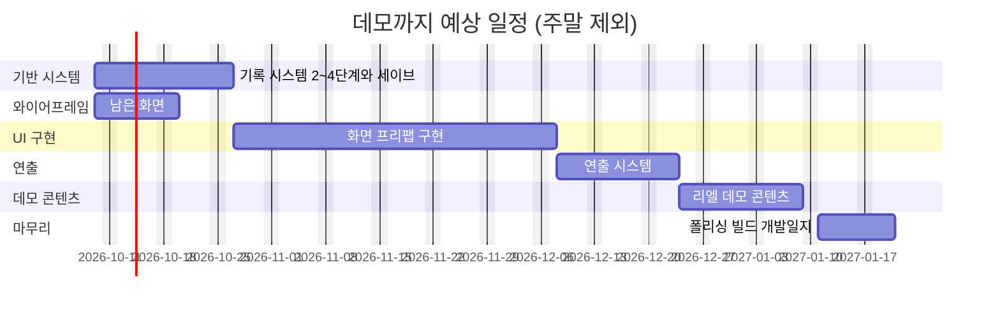

# 라스트메르헨 — 개발 로드맵

| 항목 | 내용 |
| --- | --- |
| 최종 갱신 | 2026-10-08 |
| 하루 작업 시간 | **4시간 (가정 — 실제 값으로 고칠 것)** |
| 주당 작업일 | 5일 (주말 제외 가정) |
| 1차 목표 | 리엘 보스전 데모 + 개발일지 공개 |
| 데모 예상 완료 | **2027년 1월 하순** (범위: 2026년 12월 말 ~ 2027년 2월 말) |
| 제외한 것 | 아트(도트·일러스트) 제작 시간, 시나리오 집필 시간, 공휴일 |

## 읽는 법

- 예상은 **작업일**(하루 작업 시간 기준) 단위다. 처음 세운 값이라 오차가 크다. 실제 걸린 시간을 진행 기록에 쌓으면서 매주 보정한다.
- 담당: **사용자**(와이어프레임·테스트·콘텐츠·판단), **Claude**(코드·문서), **함께**(Claude가 만들고 사용자가 확인·조정).
- 상태: 대기 / 진행 / 완료 / 보류.
- 아트와 시나리오는 사용자가 코드 작업과 병행한다고 보고 일정에 넣지 않았다. 이 둘이 병목이 되면 데모 일정이 그만큼 밀린다.

## 데모까지의 흐름

와이어프레임(B)은 기반 시스템(A)과 병행한다. UI 구현(C)과 연출(D)도 일부 겹칠 수 있어, 순조로우면 위 일정보다 당겨진다.

## A. 기반 시스템 — 약 12일

| ID | 작업 | 담당 | 예상(일) | 선행 | 상태 |
| --- | --- | --- | --- | --- | --- |
| A1 | 기록 시스템 2단계 — `IRecordable`, 층위 선언, 범용 스냅샷, 닻을 스냅샷으로, 경로 3 시작 스냅샷 복원 | Claude | 3 | — | 대기 |
| A2 | 기록 시스템 3단계 — `LoopRecord`·`AnchorRecord`, 회차 마감 흐름, 결말 태그 `#ending`, 닻 선택 화면 연결점 | Claude | 3 | A1 | 대기 |
| A3 | 부록 D 테스트 몰아서 + 버그 수정 (세이브 전에 반드시) | 함께 | 2 | A2 | 대기 |
| A4 | 기록 시스템 4단계 — 파일 저장, 압축·체크섬, 자동 저장, 이어하기, 하드 리셋 | Claude | 4 | A3 | 대기 |
| A5 | 기록 시스템 5단계 — 순환 기록, 기록 내보내기, 에디터 뷰어 | Claude | 3 | A4 | 보류 (데모 이후) |

## B. 와이어프레임 — 약 7일

| ID | 작업 | 담당 | 예상(일) | 선행 | 상태 |
| --- | --- | --- | --- | --- | --- |
| B1 | 닻 선택 화면 (선택지별 대가, Day 1 포함) | 사용자 | 1 | — | 대기 |
| B2 | 프로필 (스킬 숙련도 포함) | 사용자 | 2 | — | 대기 |
| B3 | 인벤토리 | 사용자 | 2 | — | 대기 |
| B4 | 팝업 — 닻 설치, 잠자기 | 사용자 | 1 | — | 대기 |
| B5 | 이야기의 행적 컷씬 모음 | 사용자 | 1 | D4 | 대기 |
| B6 | 지도 | 사용자 | 3 | — | 보류 (데모 이후) |

## C. UI 구현 — 약 30일

| ID | 작업 | 담당 | 예상(일) | 선행 | 상태 |
| --- | --- | --- | --- | --- | --- |
| C1 | 탐색·전투 HUD 프리팹 (시간 보내기 팝업 포함, `TimePass` 기록) | 함께 | 3 | — | 대기 |
| C2 | 타이틀, 이야기 선택, 설정(12/24시간제 포함), 일시정지 | 함께 | 3 | A4 | 대기 |
| C3 | 기록장 3탭 (인물 정보, 자료집, 이번 흐름) | 함께 | 6 | — | 대기 |
| C4 | 이야기의 행적 가지 구조 렌더러 + 회차 상세 + 상세 흐름 보기 | 함께 | 6 | A2 | 대기 |
| C5 | 닻 선택 화면, 재도전 화면 | 함께 | 2 | A2, B1 | 대기 |
| C6 | 프로필 + 스킬 숙련도 시스템 | 함께 | 4 | B2 | 대기 |
| C7 | 인벤토리 시스템 + 화면 | 함께 | 6 | B3 | 대기 |

## D. 연출 시스템 — 약 12일 (기획서 부록 C-8)

| ID | 작업 | 담당 | 예상(일) | 선행 | 상태 |
| --- | --- | --- | --- | --- | --- |
| D1 | NPC 연출 애니메이션 (ink 태그로 대상·키 지정) | Claude | 3 | — | 대기 |
| D2 | 카메라 `FocusOn`/`ReturnToFollow`, 화면 효과(페이드·채도) | Claude | 3 | — | 대기 |
| D3 | NPC 이동·등퇴장 연출 | Claude | 2 | — | 대기 |
| D4 | 일러스트 컷씬 재생기와 컷씬 데이터, 본 컷씬 기록 | Claude | 3 | — | 대기 |
| D5 | 사운드 큐 | Claude | 1 | — | 대기 |

## E. 리엘 데모 콘텐츠 — 약 12일 (집필·아트 제외)

| ID | 작업 | 담당 | 예상(일) | 선행 | 상태 |
| --- | --- | --- | --- | --- | --- |
| E1 | 데모 범위 확정 (며칠분, 어떤 이벤트·결말까지) | 사용자 | 1 | — | 대기 |
| E2 | 이벤트 데이터·ink 연결, 기억 조각 애셋 | 함께 | 5 | E1 | 대기 |
| E3 | 데모 맵, 몬스터 배치, 사냥 밸런스 | 함께 | 3 | E1 | 대기 |
| E4 | 리엘 보스전 밸런스 (난이도별) | 함께 | 3 | E2 | 대기 |

## F. 마무리 — 약 8일

| ID | 작업 | 담당 | 예상(일) | 선행 | 상태 |
| --- | --- | --- | --- | --- | --- |
| F1 | 통합 테스트·버그 수정·폴리싱 | 함께 | 5 | E | 대기 |
| F2 | 빌드, 권장 문구, 첫 실행 안내 | 함께 | 1 | F1 | 대기 |
| F3 | 개발일지 작성 | 함께 | 2 | F2 | 대기 |

## 데모 이후 (범위 확정 전이라 예상 없음)

1부 전체 콘텐츠, 시뮬레이션 모드, 기억 패시브, 지도, 기록 시스템 5단계, 혼 상성표, 콘텐츠 허브 에디터·문구 편집기, 2부. 데모를 마친 뒤 1부 콘텐츠 분량을 정하면 이 부분의 예상을 세운다.

## 합계

| 구간 | 작업일 |
| --- | --- |
| A + C + D + E + F (B는 A와 병행) | 약 74일 |
| 주 5일 기준 | 약 15주 |
| 오차를 감안한 범위 | 60 ~ 100일 |

## 진행 기록

하루를 마칠 때 추가한다. 이 기록으로 예상을 보정한다.

| 날짜 | 작업 ID | 한 일 | 걸린 시간 | 메모 |
| --- | --- | --- | --- | --- |
| 2026-10-06 ~ 10-08 | (로드맵 이전) | UI 와이어프레임(이야기의 행적·타이틀·이야기 선택), 기록 시스템 1단계, 문서 정리, Claude Code 이전 | — | 이 기간은 기준으로 쓰지 않는다 |
