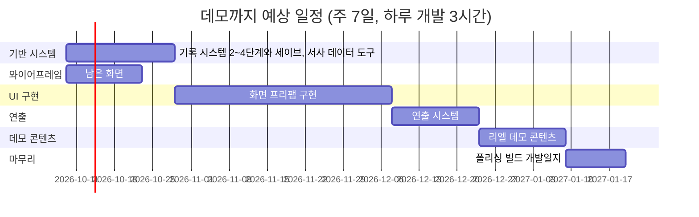

# 라스트메르헨 — 개발 로드맵

| 항목 | 내용 |
| --- | --- |
| 최종 갱신 | 2026-10-10 |
| 하루 작업 시간 | 평균 **5시간** (목표 6~7시간). 주말은 3~7시간으로 들쭉날쭉 |
| 개발 비중 | 약 **60% (하루 3시간)**. 나머지 40%(하루 2시간)는 와이어프레임·그림 |
| 주당 작업일 | 7일 (주말 포함) |
| 작업일 단위 | 표의 "예상(일)"은 **개발 4시간 = 1작업일** 기준. 하루 개발 3시간이므로 1작업일 ≈ 달력 1.33일 |
| 1차 목표 | 리엘 보스전 데모 + 개발일지 공개 |
| 데모 예상 완료 | **2027년 1월 중순 (1월 20일 전후)** (범위: 2027년 1월 초 ~ 2월 하순). 10-09에 A6 추가로 4일 밀림 — 실제 속도가 빨라 10-22 보정에서 당겨질 가능성이 크다 |
| 보정 | 2주마다 진행 기록의 실제 개발 시간·비중으로 다시 계산한다 |
| 제외한 것 | 아트(도트·일러스트) 제작 시간, 시나리오 집필 시간, 공휴일 |

## 읽는 법

- 예상은 **작업일**(개발 4시간) 단위다. 처음 세운 값이라 오차가 크다. 진행 기록에 개발 시간과 디자인·그림 시간을 따로 쌓고, 2주마다 실제 하루 개발 시간으로 남은 일정을 보정한다.
- 달력 일수 = 작업일 × 4 ÷ (하루 실제 개발 시간). 지금 가정(3시간)이면 작업일 × 1.33.
- 와이어프레임(B)은 디자인 시간(하루 2시간)으로 진행한다. B의 예상(일)도 4시간 기준이므로 달력으로는 2배가 걸린다.
- 담당: **사용자**(와이어프레임·테스트·콘텐츠·판단), **Claude**(코드·문서), **함께**(Claude가 만들고 사용자가 확인·조정).
- 상태: 대기 / 진행 / 완료 / 보류.
- 아트와 시나리오는 사용자가 코드 작업과 병행한다고 보고 일정에 넣지 않았다. 이 둘이 병목이 되면 데모 일정이 그만큼 밀린다.

## 데모까지의 흐름

막대 길이는 달력 일수다(작업일 × 1.33, 와이어프레임은 × 2).

와이어프레임(B)은 기반 시스템(A)과 병행한다. UI 구현(C)과 연출(D)도 일부 겹칠 수 있어, 순조로우면 위 일정보다 당겨진다.

## A. 기반 시스템 — 약 15일

| ID | 작업 | 담당 | 예상(일) | 선행 | 상태 |
| --- | --- | --- | --- | --- | --- |
| A1 | 기록 시스템 2단계 — `IRecordable`, 층위 선언, 범용 스냅샷, 닻을 스냅샷으로, 경로 3 시작 스냅샷 복원 | Claude | 3 | — | 완료 (2026-10-09) |
| A2 | 기록 시스템 3단계 — `LoopRecord`·`AnchorRecord`, 회차 마감 흐름, 결말 태그 `#ending`, 닻 선택 화면 연결점 | Claude | 3 | A1 | 완료 (2026-10-09, 게임 쪽. 노드 에디터 칸은 A6) |
| A3 | 부록 D 테스트 몰아서 + 버그 수정 (세이브 전에 반드시) | 함께 | 2 | A2 | 진행 (2026-10-10 착수, 1차 회귀·기록 묶음 완료 — 남은 것: 2차 노드 에디터·이동·사냥·에디터 도구) |
| A4 | 기록 시스템 4단계 — 파일 저장, 압축·체크섬, 자동 저장, 이어하기, 하드 리셋 | Claude | 4 | A3 | 대기 |
| A5 | 기록 시스템 5단계 — 순환 기록, 기록 내보내기, 에디터 뷰어 | Claude | 3 | A4 | 보류 (데모 이후) |
| A6 | 서사 데이터 도구 — 노드 에디터 결말·마일스톤 칸, 마일스톤 목록 창, 화자 이름과 정체(겉모습, 이름 미리보기, 옛 `#speak` 변환, 보스 HUD 이름) | 함께 | 3 | A2 | 대기 (2026-10-09 추가) |

## B. 와이어프레임 — 약 7일

| ID | 작업 | 담당 | 예상(일) | 선행 | 상태 |
| --- | --- | --- | --- | --- | --- |
| B1 | 닻 선택 화면 (선택지별 대가, Day 1 포함) | 사용자 | 1 | — | 진행 (2026-10-08 착수) |
| B2 | 프로필 (스킬 숙련도 포함) | 사용자 | 2 | — | 대기 |
| B3 | 인벤토리 | 사용자 | 2 | — | 대기 |
| B4 | 팝업 — 닻 설치, 잠자기 | 사용자 | 1 | — | 대기 |
| B5 | 이야기의 행적 컷씬 모음 | 사용자 | 1 | D4 | 대기 |
| B6 | 지도 | 사용자 | 3 | — | 보류 (데모 이후) |
| B7 | 자발적 회귀 화면 — 회귀 직전 연출, 빠른 버튼 여부, 닻 선택 화면과 같은 구조의 두 모드 (기획서 7-2 [제안]) | 사용자 | 1 | B1 | 대기 (2026-10-09 추가) |
| B8 | 기록장 인물 탭 겉모습 카드 합치기 (기획서 6-10-5 규칙 6) | 사용자 | 1 | — | 대기 (2026-10-09 추가) |

## C. UI 구현 — 약 30일

| ID | 작업 | 담당 | 예상(일) | 선행 | 상태 |
| --- | --- | --- | --- | --- | --- |
| C1 | 탐색·전투 HUD 프리팹 (시간 보내기 팝업 포함, `TimePass` 기록) | 함께 | 3 | — | 대기 |
| C2 | 타이틀, 이야기 선택, 설정(12/24시간제 포함), 일시정지 | 함께 | 3 | A4 | 대기 |
| C3 | 기록장 3탭 (인물 정보, 자료집, 이번 흐름) | 함께 | 6 | — | 대기 |
| C4 | 이야기의 행적 가지 구조 렌더러 + 회차 상세 + 상세 흐름 보기 | 함께 | 6 | A2 | 대기 |
| C5 | 닻 선택 화면, 재도전 화면 | 함께 | 2 | A2, B1 | 대기 |
| C6 | 프로필 + 스킬 숙련도 시스템 | 함께 | 4 | B2 | 대기 |
| C7 | 인벤토리 시스템 + 화면 | 함께 | 6 | B3 | 대기 |

## D. 연출 시스템 — 약 12일 (기획서 부록 C-8)

| ID | 작업 | 담당 | 예상(일) | 선행 | 상태 |
| --- | --- | --- | --- | --- | --- |
| D1 | NPC 연출 애니메이션 (ink 태그로 대상·키 지정) | Claude | 3 | — | 대기 |
| D2 | 카메라 `FocusOn`/`ReturnToFollow`, 화면 효과(페이드·채도) | Claude | 3 | — | 대기 |
| D3 | NPC 이동·등퇴장 연출 | Claude | 2 | — | 대기 |
| D4 | 일러스트 컷씬 재생기와 컷씬 데이터, 본 컷씬 기록 | Claude | 3 | — | 대기 |
| D5 | 사운드 큐 | Claude | 1 | — | 대기 |

## E. 리엘 데모 콘텐츠 — 약 12일 (집필·아트 제외)

| ID | 작업 | 담당 | 예상(일) | 선행 | 상태 |
| --- | --- | --- | --- | --- | --- |
| E1 | 데모 범위 확정 (며칠분, 어떤 이벤트·결말까지) | 사용자 | 1 | — | 대기 |
| E2 | 이벤트 데이터·ink 연결, 기억 조각 애셋 | 함께 | 5 | E1 | 대기 |
| E3 | 데모 맵, 몬스터 배치, 사냥 밸런스 | 함께 | 3 | E1 | 대기 |
| E4 | 리엘 보스전 밸런스 (난이도별) | 함께 | 3 | E2 | 대기 |

## F. 마무리 — 약 8일

| ID | 작업 | 담당 | 예상(일) | 선행 | 상태 |
| --- | --- | --- | --- | --- | --- |
| F1 | 통합 테스트·버그 수정·폴리싱 | 함께 | 5 | E | 대기 |
| F2 | 빌드, 권장 문구, 첫 실행 안내 | 함께 | 1 | F1 | 대기 |
| F3 | 개발일지 작성 | 함께 | 2 | F2 | 대기 |

## 데모 이후 (범위 확정 전이라 예상 없음)

1부 전체 콘텐츠, 시뮬레이션 모드, 기억 패시브, 지도, 기록 시스템 5단계, 혼 상성표, 콘텐츠 허브 에디터·문구 편집기, 2부. 데모를 마친 뒤 1부 콘텐츠 분량을 정하면 이 부분의 예상을 세운다.

## 합계

| 구간 | 작업일 |
| --- | --- |
| A + C + D + E + F (B는 A와 병행) | 약 77작업일 (개발 약 308시간). 10-09에 A6 서사 데이터 도구 3작업일 추가 |
| 하루 개발 3시간, 주 7일 | 달력 약 103일 (약 15주) → 2026-10-09 시작이면 **2027-01-20** |
| 오차를 감안한 범위 | 63 ~ 103작업일 → 달력 84 ~ 137일 → 2027-01-01 ~ 2027-02-23 |

※ 10-08~10-09 실제 속도는 예상보다 빠르다(A1+A2 예상 6작업일 = 24시간, 실제 약 11.5시간). 표본이 이틀·한 분야(기록 시스템)뿐이라 지금은 예상을 줄이지 않고, 10-22 보정에서 반영한다.

## 진행 기록

하루를 마칠 때 추가한다. 개발 시간과 디자인·그림 시간을 따로 적는다. 이 기록으로 2주마다 예상을 보정한다.

| 날짜 | 작업 ID | 한 일 | 개발 시간 | 디자인·그림 시간 | 메모 |
| --- | --- | --- | --- | --- | --- |
| 2026-10-06 ~ 10-07 | (로드맵 이전) | UI 와이어프레임(이야기의 행적·타이틀·이야기 선택), 기록 시스템 1단계, 문서 정리, Claude Code 이전 | — | — | 이 기간은 기준으로 쓰지 않는다 |
| 2026-10-08 | A1, (로드맵 외) | 기록 시스템 2-A·2-B, 비UTF-8 소스 69개 변환, Map Tool 상주 씬 문제·Ink 경로 예외 수정, 사용 중단 API 경고 정리(세션은 10-09 새벽까지) | 5시간 | 1시간 (와이어프레임: 이야기 선택 화면 마무리, B1 닻 선택 화면 착수) | 총 6시간. 개발 비중 83%로 가정(60%)보다 높다. A1은 예상 3작업일 중 2-C만 남음 |
| 2026-10-09 | A1, A2, (로드맵 외) | 회귀 직후 체력·마나 규칙, 기록 2-C-1·2-C-2(A1 완료), 오버뷰 창 성능, 마커 knot 팝업 버그, 기록 3-A·3-B·3-C(A2 완료), 정신력 충격 Formula, 화자 이름과 정체·자발적 회귀 화면 설계 제안, 개발일지 2편 | 약 6.5시간 | 거의 없음 | 총 약 6시간 40분, 개발 비중 약 97%. A1+A2(예상 6작업일 = 24시간)를 10-08~09 약 11.5시간에 끝냈다 — 예상의 약 절반. 새 작업 A6·B7·B8 추가 |
| 2026-10-10 | A3 | 부록 D 테스트 순서 정리(D-0 묶음 1~8), 1차 테스트(회귀·기록 — 자발적·경로 1·2·Day 1, 선택지, 정신력 충격, 리엘 실전, 마일스톤·결말·디버그 도구) 전부 통과, 완전 리셋 기록 순번 버그 2개 수정, 하드 리셋 흔적 구현 제안(9-7). 세션은 10-11 새벽까지 | 2시간 20분 | 0 | 피곤해서 짧게. A3 예상 2작업일(8시간) 중 1차를 2.3시간에 끝냈다. B1 와이어프레임은 진행 없음 |

## 보정 기록

2주마다 추가한다. 다음 보정 예정: **2026-10-22**.

| 날짜 | 기간 | 실제 하루 평균 개발 시간 | 실제 개발 비중 | 끝낸 작업일 (예상 기준) | 새 데모 예상 완료 | 메모 |
| --- | --- | --- | --- | --- | --- | --- |
| 2026-10-08 | — | 3시간 (가정) | 60% (가정) | — | 2027-01-16 | 처음 세운 값 |
