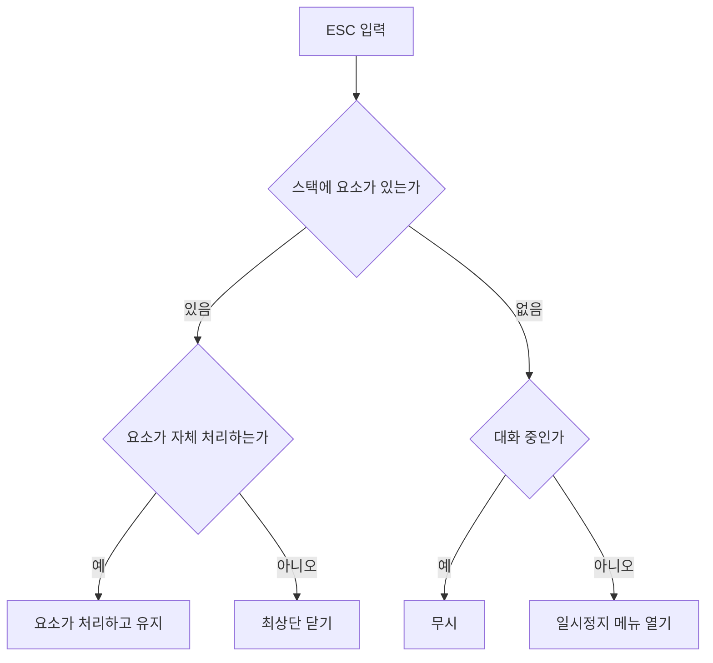
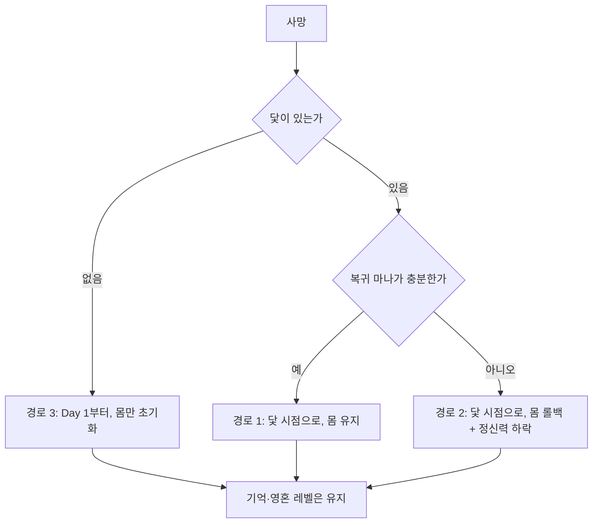

# 개발일지 — UI 기반 시스템과 회귀·기록 구조 정비

| 항목 | 내용 |
| --- | --- |
| 기간 | 2026-09-16 ~ 09-25 |
| 범위 | UI 기반 코드, 대화·말풍선, 회귀 규칙, 기억·행적 데이터, 노드 에디터 |
| 기준 문서 | UI 기획서 v0.2 → v0.2.6 |

---

## 1. 배경

인게임 UI를 실제로 만들기 전에 두 가지를 먼저 끝내기로 했다. 하나는 **화면이 올라탈 기반 코드**이고, 다른 하나는 **화면이 보여줄 데이터 구조**다.

와이어프레임을 그릴 때마다 "이 정보를 어디서 가져오지?"라는 질문이 반복됐고, 그때마다 데이터가 없다는 사실이 드러났다. 순서를 뒤집어 기반부터 정리한 이유다.

---

## 2. UI 기반 시스템

### 2-1. 모드 전환

`UIModeManager`가 탐색·대화·전투 HUD 그룹을 전환한다. 세 가지 문제를 고쳤다.

- 전환이 끝난 뒤에야 `CurrentMode`를 갱신해서, 페이드 도중(0.25초)에 들어온 두 번째 호출이 무시됐다. 호출 즉시 갱신하도록 바꿨다.
- 그룹 루트를 `SetActive`로 껐다 켜서 비활성 오브젝트가 `Start`를 못 받았다. `CanvasGroup`의 알파만 조절하는 방식으로 통일했다.
- 일시정지 중에는 전환이 멈췄다. unscaled 시간 옵션을 추가했다.

### 2-2. 창 스택

ESC로 창과 팝업을 최상단부터 닫는 구조를 만들었다. `UIStackElement`를 공통 기반으로 두고, 각 요소가 레이어(창/팝업/일시정지), ESC 처리 여부, 월드 정지 여부, 대화 중 허용 여부를 스스로 선언한다.

창이 열려 있는 동안 `GlobalActionLock`이 걸려 조작과 상호작용이 막히고, 월드는 `timeScale`로 멈춘다. 창 버튼은 `UIWindowButton` 하나로 통일해 창 ID만 지정하면 열고 닫기, 단축키 글자 표시, 갱신 알림 점이 함께 동작한다.

### 2-3. 알림과 입력

- `NotificationManager`에 큐를 도입해 연달아 들어온 알림이 덮어쓰이지 않게 했다. 같은 문구가 짧은 시간에 반복되면 무시한다.
- `InputBindings`를 액션-키 매핑 레이어로 재작성했다. 이동·전투·UI 키를 한곳에서 관리하고 저장·복원과 변경 이벤트를 지원한다. 하드코딩되어 있던 `KeyCode` 참조를 플레이어·전투·대화 전반에서 걷어냈다.
- 문구는 로컬라이제이션 키로 옮겼다. 스킬 실패 사유는 문자열 대신 키를 반환하도록 바꿨다.

---

## 3. 대화와 말풍선

### 3-1. 타자기 효과

글자를 한 자씩 문자열에 붙이는 방식을 `maxVisibleCharacters` 방식으로 바꿨다. 줄이 늘어날 때 레이아웃이 다시 계산되며 이미 찍힌 글자가 밀리는 문제와, 매 글자 문자열·메시를 다시 만드는 비용이 함께 사라졌다.

### 3-2. 말풍선 자동 크기

말풍선이 글자에 맞춰 자라도록 만들었다. 문제는 TMP가 가려진 글자의 `isVisible`을 false로 만들어 "아직 안 보이는 글자의 크기"를 알 수 없다는 점이었다. 대사 시작 시 한 번만 전체 글자를 드러내 줄 번호와 오른쪽 끝을 기록해두고, 이후에는 그 배열만 조회하는 방식으로 해결했다.

가로는 몇 글자 앞을 내다보며 자라고(글자가 넘치지 않게), 세로는 보이는 글자 기준으로 부드럽게 따라간다. 속도는 가로·세로를 따로 조절한다.

### 3-3. 구조 정리

`DialoguePanel`만 꺼지는 구조 탓에 본문과 선택지가 화면에 남았고, 화면을 덮은 텍스트가 HUD 버튼 클릭을 막고 있었다. 대화 루트를 따로 두어 한 번에 껐다 켜고, 선택지 컨테이너는 말풍선 모드에서도 떠야 하므로 루트 밖에 유지했다.

---

## 4. 회귀 규칙

기획서 7장에서 확정한 규칙을 코드로 옮겼다. 핵심은 **기억은 어떤 경로에서도 유지된다**는 것이다.

함께 고친 것들이다.

- 경로 2가 기억을 되돌리고 경로 3이 기억을 지우던 코드를 제거했다.
- 경로 3이 체력을 회복하지 않아 0인 상태로 시작하던 문제를 고쳤다. 디버그용 리셋 메서드를 쓰다 영혼 레벨까지 초기화되던 문제도 함께 정리했다.
- 닻을 1회용으로 만들고, 과거의 닻으로 돌아가면 그보다 뒤에 내린 닻이 사라지게 했다.
- 닻 설치 검증을 확인 팝업 **앞**으로 옮겼다. 전투 중 차단과 24시간 간격 제한을 추가했다.
- 세 경로에 중복돼 있던 복원 코드를 하나로 모았다.
- 회귀 후 체력을 직접 대입해 변경 이벤트가 발생하지 않아 HUD가 갱신되지 않던 문제를 고쳤다.

개인친밀도는 소라의 혼에 속하므로 스냅샷에서 제외했고, 회귀를 넘어 기억하는 메타 NPC의 호감도는 닻 복원에서도 되돌리지 않게 했다.

---

## 5. 기억과 행적 데이터

기록장이 보여줄 데이터를 먼저 만들었다.

| 추가한 것 | 용도 |
| --- | --- |
| 카드 분류 | 기록장에서 어느 카드에 들어가는지 |
| 확실도 | 글자색(확신/불확실). 최종 단계 여부와 분리해 회색 글씨가 예고가 되지 않게 함 |
| 출처 종류·대상 | 출처 칩(본인/전언/증거/목격) |
| 반증 관계 | 취소선과 부연설명 |
| 관련 인물 목록 | 한 정보가 두 인물에 걸리는 경우 |
| 주제 런타임 로드 | 기존에는 주제 애셋이 게임에서 읽히지 않았다 |

행적 쪽은 **이미 아는 정보를 다시 들어도 기록**하도록 바꿨다. 기존에는 처음 알게 될 때만 남아서 "이번 흐름에서 그 얘길 들었는가"를 알 수 없었다. 이벤트 완료 기록과 출처 NPC를 추가하고, 숨김 수치가 플레이어에게 보이지 않도록 표시용 화이트리스트를 분리했다.

장소는 내부 씬 이름 대신 로컬라이제이션 표시 이름을 쓴다.

---

## 6. 노드 에디터 확장

대화 그래프가 내보내는 ink에 태그를 추가했다.

| 태그 | 용도 |
| --- | --- |
| `#node:guid` | 방문 노드 기록. 읽은 대사 넘기기·진행률·이야기 문양이 같은 데이터를 쓴다 |
| `#mem:키` | 기억 조건이 걸린 선택지에 자동 부착. 선택지 정보 칩과 툴팁의 근거 |
| `#time:N` | 이 대화의 소모 시간을 덮어쓴다. 거절 분기는 0 |
| `#battle:...` | 전투 시작. 대상·난이도·승패 노드·보스 상태 키 |

검증도 늘렸다. 대사 길이(판넬 4줄/말풍선 3줄), 주제 단계 순서 건너뜀, 보스 프로필이 없는 난이도 지정을 잡아낸다.

---

## 7. 안정화

여러 파일에 흩어져 있던 문제들을 함께 정리했다.

- 전투 연출 수치와 사운드 키를 인스펙터 필드로 분리했다.
- 체력이 0이 된 뒤 무적이 풀리고 다시 맞으면 사망 처리가 거듭 호출되어 회차가 중복 증가하던 문제를 고쳤다.
- 소라의 요정화 단계 상수를 도입해 파일마다 다르던 의미 주석을 통일하고, 정신력 회복 메서드를 추가했다.
- NPC 관계 수치와 프리팹 경로를 필드로 분리하고, 미등록 NPC가 조용히 생성되던 것을 에러로 알리도록 바꿨다.
- 이벤트 매니저가 빙의 전환을 반영하지 않던 문제와 트리거 부족을 조용히 넘기던 문제를 고쳤다.
- 디버그 오버레이가 릴리즈 빌드에서 Missing Script가 되던 구조를 바꾸고, 매 프레임 전체 검색을 주기적 스캔으로 교체했다.

---

## 8. 남은 작업

| 구분 | 내용 |
| --- | --- |
| 와이어프레임 | 사건 정보 탭, 앨범 탭, 프로필, 일시정지 메뉴, 팝업, 지도 |
| 구현 | 확정된 화면을 실제 프리팹으로 제작 |
| 코드 | 행적 문장 변환기, 보스전 재도전 흐름, 노련미 보정, 사냥 시간 |

와이어프레임을 마저 끝낸 뒤 실제 화면 제작으로 넘어간다. 데이터와 기반 코드가 준비되어 있어, 이제 화면을 붙이는 작업만 남았다.
