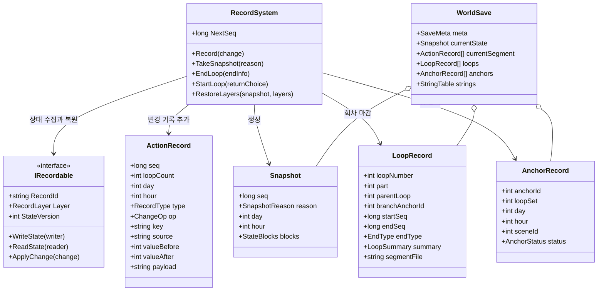
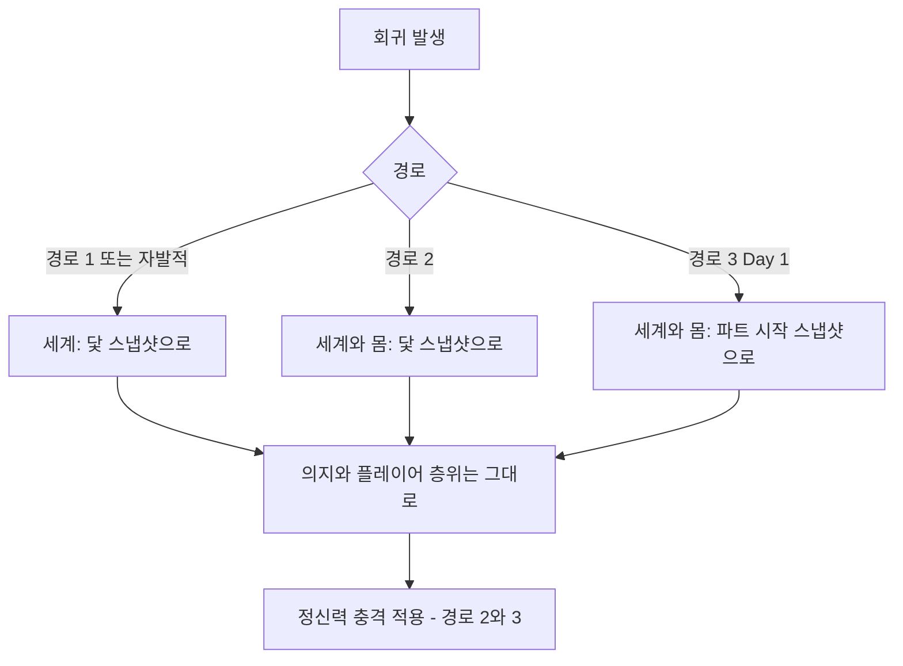
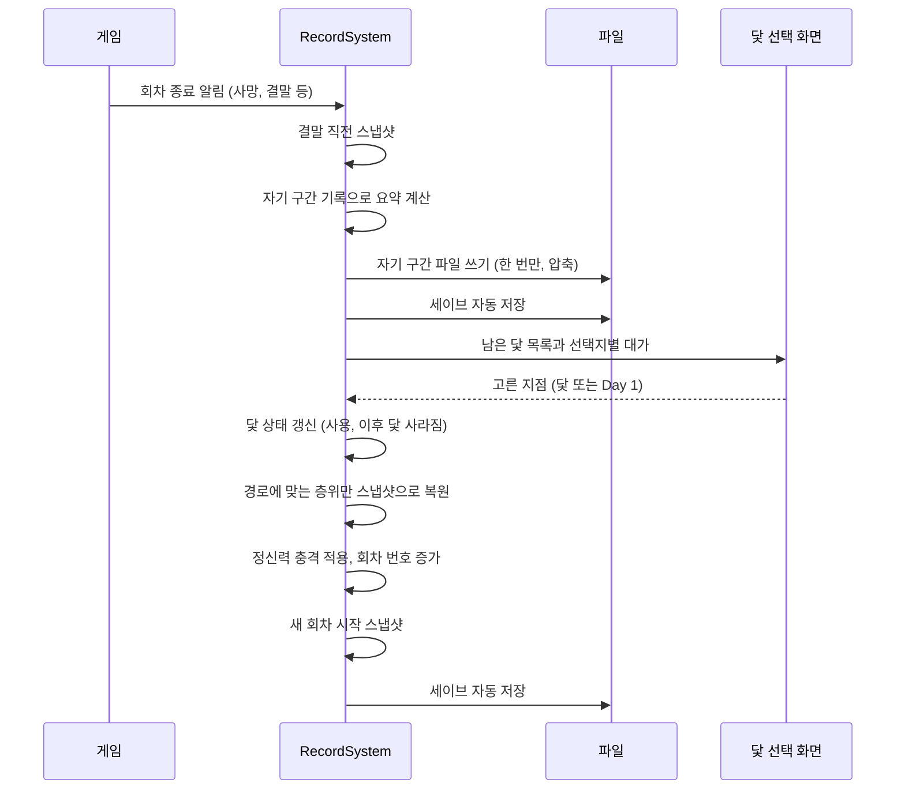
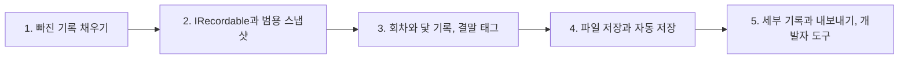
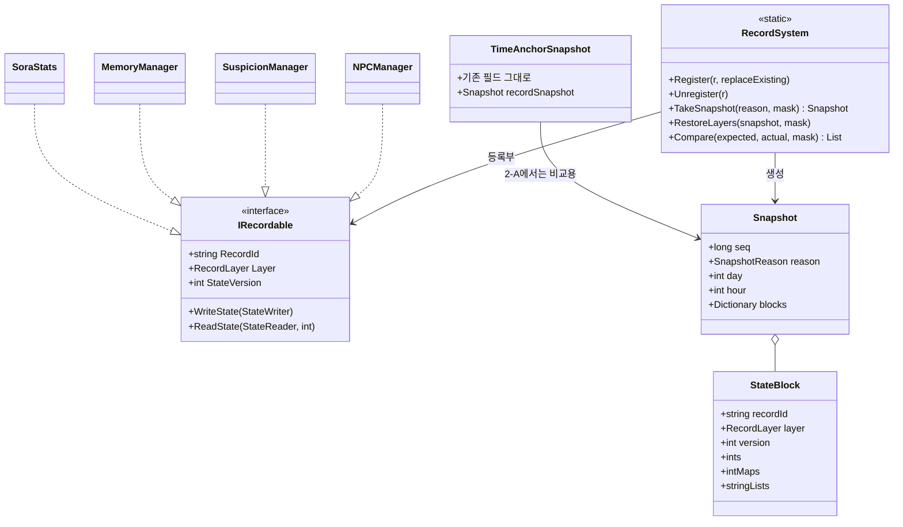
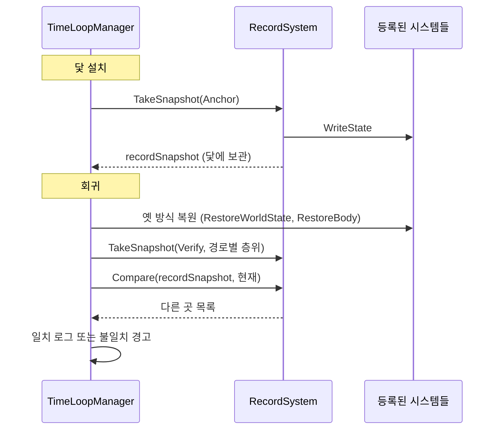
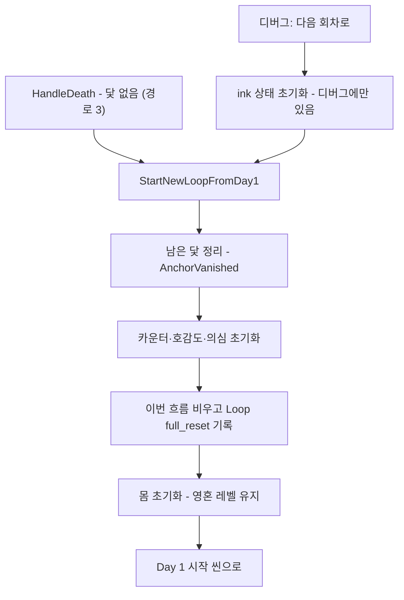
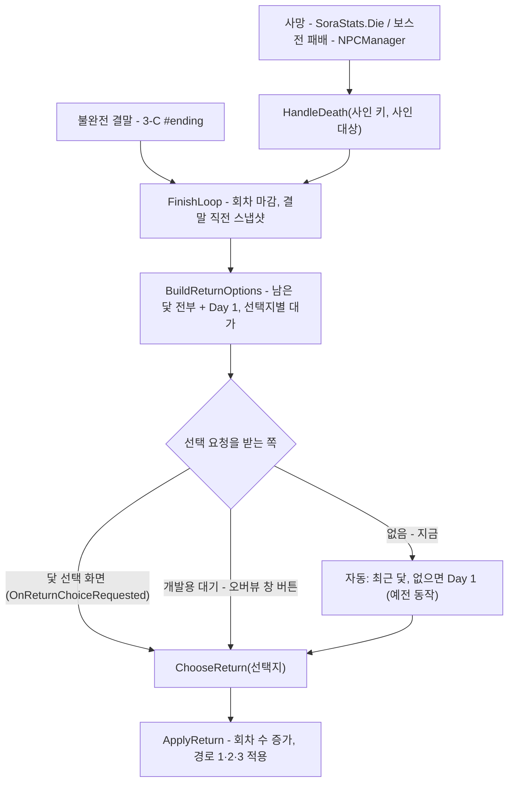

# 라스트메르헨 — 기록 시스템 설계

| 항목 | 내용 |
| --- | --- |
| 관련 문서 | UI 기획서 8장(데이터 층위·세이브), 9-2(행적 기록), 9-7(데이터 보호), 9-8(기록 시스템), 6-6-4(이야기의 행적) |
| 상태 | 표기가 없는 항목은 합의된 방향이고, [제안]은 구현하며 확정한다. **1단계 완료(2026-10-08), 2단계 완료(2026-10-09), 3단계 게임 쪽 완료(2026-10-09, 작가용 노드 에디터 칸은 서사 데이터 도구에서) — 13-3** |
| 범위 | 상태 변화 기록, 스냅샷, 회차·닻 기록, 세이브 파일 형식, 자동 저장, 버그 리포트 |

## 목차

1. 목적과 원칙
2. 핵심 개념
3. 전체 구조
4. 층위와 회귀 경로별 복원
5. 변경 기록
6. 스냅샷
7. 회차와 닻 기록
8. 흐름 — 회차가 끝날 때
9. 파일 구성과 저장 형식
10. 자동 저장
11. 버그 추적과 기록 내보내기
12. 기존 코드와의 관계
13. 구현 순서

---

## 1. 목적과 원칙

기록 시스템의 목적은 두 가지다.

- **완전한 복원.** 지난 회차의 어느 시점이든, 숨김 수치까지 포함해 그때와 똑같은 상태로 되살린다. 이야기의 행적 "상세 흐름 보기"가 이 위에 올라간다.
- **추적.** 버그 리포트가 들어오면 그 플레이어에게 무슨 일이 있었는지 순서대로 따라간다.

이를 위해 세 가지 원칙을 둔다.

**원칙 1. 상태를 바꾸는 모든 변경은 기록을 거친다.** 각 시스템은 값을 직접 바꾸고 끝내지 않는다. 바꾼 사실을 반드시 기록에 남긴다. 기록을 거치지 않은 변경은 복원할 수 없으므로 이것을 설계 규칙으로 둔다.

**원칙 2. 아무것도 버리지 않는다.** 숨김 수치·카운터·내부 값까지 모두 남긴다. 압축은 풀었을 때 원본과 완전히 같아지는 무손실 방식만 쓴다. 화면에 무엇을 보여줄지는 저장과 별개다.

**원칙 3. 끝난 것은 다시 쓰지 않는다.** 끝난 회차의 기록은 한 번 파일로 쓴 뒤 바뀌지 않는다. 평소 저장은 진행 중인 회차만 다룬다.

---

## 2. 핵심 개념

| 개념 | 뜻 |
| --- | --- |
| 세계 | 플레이어 한 명의 세이브 전체. 슬롯은 없다. 1부·2부가 한 세계 안에 있다 |
| 회차 | 회귀와 회귀 사이의 한 흐름. 이야기의 행적에서 한 행이 된다 |
| 자기 구간 | 회차가 분기점 이후 직접 걸어온 부분. 분기점 이전은 부모 회차와 같으므로 저장하지 않고 부모에서 이어 붙인다 |
| 변경 기록 | 상태가 바뀔 때마다 남기는 한 줄. 무엇이, 언제, 왜, 얼마에서 얼마로 바뀌었는지 담는다 |
| 스냅샷 | 어느 순간의 모든 상태를 통째로 담은 것. 복원의 출발점이다. 시간의 닻도 스냅샷의 한 종류다 |
| 순번 | 세계 전체에서 하나씩 증가하는 기록 번호. 같은 시각에 여러 일이 일어나도 순서를 확정하고, "이 기록 직후의 상태"처럼 복원 지점을 가리키는 데 쓴다. 회귀해도 되돌리지 않는다 |
| 세부 기록 | 입력·타격처럼 매우 잦은 기록. 버그 추적용으로 최근 일정 시간만 순환 보관하고 영구 저장하지 않는다 |

영상 압축과 같은 원리다. 기준 프레임(스냅샷)을 띄엄띄엄 두고, 그 사이에는 바뀐 부분(변경 기록)만 저장한다. 어느 시점이든 "가장 가까운 앞 스냅샷 + 그 뒤의 변경 기록 재적용"으로 되살린다.

---

## 3. 전체 구조

| 구성 요소 | 역할 |
| --- | --- |
| `RecordSystem` | 단일 진입점. 변경 기록 추가, 스냅샷 생성, 회차 마감·시작, 층위별 복원을 맡는다 |
| `IRecordable` | 상태를 가진 모든 시스템이 구현한다. 자기 상태를 쓰고(스냅샷), 읽고(복원), 변경 한 줄을 다시 적용한다(재생). 새 시스템(인벤토리, 지도 핀 등)은 이것만 구현하면 닻·세이브·복원에 자동으로 포함된다 |
| `ActionRecord` | 지금의 행적 기록 한 줄을 확장한 것. 순번·연산·추가 데이터 필드가 붙는다 |
| `Snapshot` | 시스템별 상태 덩어리의 묶음 |
| `LoopRecord` | 회차 하나의 요약과 자기 구간 파일 위치 |
| `AnchorRecord` | 닻 하나. 누적 번호, 설치 위치·시각, 최종 상태 |
| `WorldSave` | 세이브 본체 |

`IRecordable`을 구현할 시스템: `TimeManager`(날짜·시각·코인), `SceneLoader`(씬·위치), `SoraStats`(레벨·경험치·HP·MP·공방민·정신력·피로도·시간결정체·영혼 레벨), `MemoryManager`(기억·카운터), `NPCManager`(호감도·개인친밀도·사용한 증가 키), `SuspicionManager`(의심·신뢰·선넘음), `TimeLoopManager`(보유 닻·회차), `VisitedNodeLog`, 앞으로 생길 인벤토리·지도 핀·스킬 숙련도.

`RecordId`는 한 번 정하면 바꾸지 않는다. 클래스 이름을 바꿔도 세이브와 맞도록, 클래스 이름이 아니라 고정 문자열을 쓴다.

---

## 4. 층위와 회귀 경로별 복원

모든 `IRecordable`은 자기가 어느 층위인지 선언한다(UI 기획서 8장).

| 층위 | 예 | 회귀할 때 |
| --- | --- | --- |
| 세계 | NPC 상태, 카운터, 이벤트 진행, 날짜·위치 | 경로에 따라 되돌린다 |
| 소라의 몸 | 레벨, 경험치, HP·MP, 공·방·민, 피로도 | 경로 2·3에서만 되돌린다 |
| 소라의 의지 | 기억, 스킬 숙련도, 개인친밀도, 사용한 증가 키, 정신력, 영혼 레벨, 시간결정체, 방문 지역 | 되돌리지 않는다 |
| 플레이어 | 행적 기록, 방문 노드, 메모·핀, 전적(회차 수 포함) | 되돌리지 않는다 |

피로도·시간결정체·회차 수의 층위는 2026-10-08에 확정했다. 피로도는 공·방·민과 같은 몸의 상태이고, 시간결정체는 기억을 되찾는 장치라 유지하며, 회차 수는 전적이라 어떤 경로에서도 되돌리지 않는다.

회귀 경로마다 "어느 층위를 무엇으로 되돌리는가"만 정하면 된다.

**파트 시작 스냅샷.** 각 파트의 1회차 Day 1을 시작하는 순간을 한 번 저장해 둔다. 경로 3은 이것으로 세계와 몸을 되돌린다. 지금 코드는 `ResetAffectionForNewLoop`, `ResetBodyForNewLoop`처럼 시스템마다 초기화 함수를 따로 부르는데, 하나를 빠뜨리면 그 값만 초기화되지 않는 버그가 생긴다. 시작 스냅샷으로 되돌리면 새 시스템이 추가돼도 빠뜨릴 일이 없다.

---

## 5. 변경 기록

### 5-1. 형식

지금의 `ActionRecord`에 필드를 더한다.

| 필드 | 뜻 |
| --- | --- |
| `seq` | 세계 전체 순번 (신규) |
| `loopCount`, `day`, `hour` | 언제 |
| `sceneId` | 어디서 (표시 이름은 저장하지 않고 표시할 때 조회한다) |
| `type` | 무엇에 대한 기록인가 |
| `op` | 연산: 값 설정 / 집합에 추가 / 집합에서 제거 / 사건(상태 변화 없음) (신규) |
| `key` | 대상 키 (NPC, 플래그, 카운터, 스탯 이름 등) |
| `source` | 원인 (누구에게서, 어느 이벤트에서) |
| `valueBefore`, `valueAfter` | 이전 값, 이후 값 |
| `payload` | 정수로 담기지 않는 값 (메모 글, 핀 좌표 등). 대부분 비어 있다 (신규) |

`sceneName`(표시 이름)은 저장에서 뺀다. 언어를 바꾸면 옛 기록이 옛 언어로 남기 때문이다. 시각도 숫자로만 저장한다(UI 기획서 5-4).

### 5-2. 상태 변경과 사건의 구분

| 종류 | 예 | 복원에 쓰는가 |
| --- | --- | --- |
| 상태 변경 (`op`가 설정·추가·제거) | 호감도 변화, 기억 획득, 정신력 하락, 닻 설치 | 쓴다. 다시 적용하면 상태가 그대로 재현된다 |
| 사건 (`op`가 사건) | 이벤트 완료, 이동, 사냥, 잠자기 시작 | 쓰지 않는다. 무슨 일이 있었는지 보여주고 추적하는 데 쓴다 |

### 5-3. `RecordType` 규칙

`RecordType`은 숫자로 저장된다. **순서를 바꾸지 않고 끝에만 추가한다.** 중간에 끼워 넣으면 옛 기록의 숫자가 다른 뜻으로 읽힌다. 안 쓰게 된 종류도 지우지 않고 남긴다.

### 5-4. 지금 기록되지 않는 변화

구현 1단계에서 모두 기록 경로로 옮긴다.

| 상태 | 담당 | 추가할 기록 종류 [제안] |
| --- | --- | --- |
| 정신력 | `SoraStats` | `MentalChange` |
| 피로도 | `SoraStats` | `FatigueChange` |
| 시간결정체 | `SoraStats` | `TimeCrystalChange` |
| 개인친밀도, 사용한 증가 키 | `NPCManager` | `PersonalBondChange` |
| 닻 거두기, 닻 사용·소멸 | `TimeLoopManager` | `AnchorRetracted`, `AnchorUsed`, `AnchorVanished` |
| 잠자기 | `EventManager` | 이미 이벤트 완료로 기록됨. 추가 불필요 |
| 시간 보내기 | 시간 보내기 팝업 | `TimePass` (사건) — 1-B |
| 경험치 | `PlayableCharacter` | `ExpChange` |
| 기억 지우기 | `MemoryManager` | 기존 `MemoryErased` 기록이 빠져 있었음 |
| 날짜·시각 이동 | `TimeManager` | `TimeAdvance` |
| 씬 진입 | `SceneLoader` | `SceneEnter` |
| 체력·마나 | `CharacterStats` | `VitalsCheckpoint` — 행동 단위가 끝날 때의 값만 |
| 결말 도달 | 결말 태그 | `EndingReached` |
| 스킬 숙련도, 인벤토리, 지도 핀 | 시스템 없음 | 만들 때 함께 추가 |

---

## 6. 스냅샷

### 6-1. 찍는 시점

| 시점 | 이유 |
| --- | --- |
| 파트 시작 (1회차 Day 1) | 경로 3 복원의 기준 |
| 회차 시작 | 그 회차 자기 구간의 출발점 |
| 닻 설치 | 닻 복귀의 기준. 닻은 곧 스냅샷이다 |
| 하루 시작 (00:00) | 긴 회차에서 복원할 때 재생할 기록 수를 줄인다 |
| 결말 직전 | 회차의 마지막 상태 |

### 6-2. 담는 방식

스냅샷은 `IRecordable`마다 `RecordId`를 이름표로 한 상태 덩어리를 모은 것이다. 각 덩어리 앞에 `StateVersion`을 붙여, 나중에 그 시스템의 저장 형식이 바뀌어도 옛 덩어리를 읽어 변환할 수 있게 한다. 모르는 `RecordId`의 덩어리는 버리지 않고 보관만 한다(나중 버전에서 다시 읽을 수 있도록).

지금의 `TimeAnchorSnapshot`은 필드를 하나하나 손으로 나열하는 방식이라, 공·방·민처럼 새 값이 생길 때마다 빠뜨리기 쉬웠다. 이 범용 스냅샷으로 바꾸면 그 문제가 사라진다.

### 6-3. 검증

복원 기능은 자기 검증이 가능하다. 앞 스냅샷에서 시작해 변경 기록을 재생한 결과가 다음 스냅샷과 같아야 한다. 개발 빌드에서 이 비교를 돌리면, **기록 경로를 거치지 않은 변경이 있는 곳**을 자동으로 찾아낸다. 원칙 1을 지키는지 확인하는 장치이자, UI 기획서 9-7의 교차 검증에도 그대로 쓴다.

---

## 7. 회차와 닻 기록

### 7-1. `LoopRecord`

| 필드 | 뜻 |
| --- | --- |
| `loopNumber`, `part` | 회차 번호, 파트 |
| `parentLoop` | 부모 회차. 없으면(첫 회차) 비어 있다 |
| `branchAnchorId` | 갈라져 나온 닻. Day 1에서 시작했으면 비어 있다 |
| `branchDay`, `branchHour` | 분기 시각 |
| `startSeq`, `endSeq` | 자기 구간의 기록 범위 |
| `endType` | 사망 / 불완전 결말 / 자발적 회귀 / 결말 |
| `endingTitleKey`, `deathCauseKey` | 스토리 사망·결말의 제목, 일반 사망의 사인 (UI 기획서 6-6-4) |
| `returnChoice` | 끝난 뒤 고른 지점(닻 또는 Day 1)과 적용된 경로 |
| `summary` | 이야기의 행적 한 행에 필요한 요약 |
| `segmentFile` | 자기 구간 상세 파일 |

`summary`: 시작·끝 레벨, 영혼 레벨 경신 여부(★), 새로 알게 된 정보 수, 마일스톤 전체 목록(화면에서 5개 + 외 N건), 컷씬 목록, 이 회차에 설치한 닻 번호.

요약은 회차가 끝날 때 자기 구간 기록에서 계산해 만든다. 요약은 계산 결과일 뿐이므로, 원본 기록이 있는 한 언제든 다시 만들 수 있다.

### 7-2. `AnchorRecord`

닻은 회차가 아니라 세계 단위로 따로 관리한다. 닻의 최종 상태가 나중 회차에서 바뀌기 때문이다. 예를 들어 8회차에 내린 닻이 10회차의 Day 1 선택으로 사라질 수 있다.

| 필드 | 뜻 |
| --- | --- |
| `anchorId` | 누적 설치 번호. 세계 전체에서 하나씩 증가하고 되돌리지 않는다 |
| `loopSet` | 설치한 회차 |
| `day`, `hour`, `sceneId` | 설치 시각·장소 |
| `status` | 사용 전 / 사용 / 강제 사용 / 사라짐 / 거둠 |
| `usedByLoop` | 이 닻에서 갈라진 회차 |

이야기의 행적은 닻 아이콘을 그릴 때 이 목록의 최종 상태를 쓴다. 거둔 닻도 사라짐 아이콘으로 그리므로 번호가 건너뛰어 보이지 않는다.

---

## 8. 흐름 — 회차가 끝날 때

자기 구간 파일을 쓰고 저장한 **다음에** 닻 선택 화면을 띄운다. 선택 화면에서 게임을 꺼도, 회차의 기록과 결과는 이미 남아 있다. 다시 켜면 닻 선택 화면부터 이어진다.

자발적 회귀도 같은 흐름이다. 닻 선택 화면 대신 기록장 이번 흐름에서 고른 닻이 들어온다.

---

## 9. 파일 구성과 저장 형식

### 9-1. 파일

| 파일 | 내용 | 쓰는 때 |
| --- | --- | --- |
| `world` | 메타, 현재 상태 스냅샷, 진행 중 회차의 변경 기록, 회차 요약 목록, 닻 목록, 문자열 표, 플레이어 층위 | 자동·수동 저장마다 |
| `world.bak` | 직전 저장본 | 저장할 때 이전 `world`를 옮겨 둔다 |
| `loops/part1_0001` … | 끝난 회차 하나의 시작 스냅샷, 하루 시작 스냅샷, 자기 구간 변경 기록 | 회차가 끝날 때 한 번 |
| `simulation/` | 시뮬레이션 세계. 진짜 세계와 섞지 않는다 | 시뮬레이션 저장 시 |

저장 위치는 Steam 계정별 폴더로 나눈다(같은 PC를 여러 사람이 쓰는 경우). Steam과 연결되지 않은 개발 빌드에서는 기본 폴더를 쓴다.

### 9-2. 형식

| 단계 | 방식 |
| --- | --- |
| 직렬화 | 바이너리. 반복되는 문자열(NPC 키, 플래그 ID 등)은 문자열 표의 번호로 바꾼다 |
| 압축 | GZip 또는 Deflate (무손실, .NET 기본 제공) |
| 난독화 | 압축 결과를 키로 뒤섞어 사람이 바로 읽지 못하게 한다. 보안이 아니라 가벼운 장벽이다 |
| 체크섬 | 파일 끝에 붙여 값만 고친 경우와 깨진 파일을 걸러낸다 |
| 버전 | 파일 맨 앞에 형식 버전. 버전이 오르면 옛 파일을 읽어 변환한다 |

### 9-3. 안전한 쓰기

임시 파일에 다 쓴 뒤 기존 파일과 교체한다. 쓰는 도중 게임이 꺼지거나 정전이 나도 직전 저장본은 멀쩡하다. `world`를 읽지 못하면 `world.bak`으로 되살리고, 해설자가 가볍게 언급한다(UI 기획서 9-7, 플레이는 막지 않음).

---

## 10. 자동 저장

결과가 생기는 순간 저장한다(UI 기획서 8장). 불러오기로 결과를 되돌릴 수 없게 하기 위해서다.

| 시점 | 비고 |
| --- | --- |
| 선택지를 고른 직후 | 결과를 피하려고 끄는 것을 막는다 |
| 사망·결말 직후 | 회차 마감 흐름 안에서 (8장) |
| 회귀 직후 | 새 회차 시작 스냅샷과 함께 |
| 닻 설치·거두기 직후 | |
| 하루가 바뀔 때 | 하루 시작 스냅샷과 함께 |
| 일시정지 메뉴의 저장하기 | 수동. 같은 파일을 덮어쓴다 |
| 게임 종료 | 종료 확인 후 |

저장 중 표시는 이미 만든 저장 확인·로딩 팝업을 쓰되, 자동 저장은 화면 구석의 작은 표시로 충분하다 [제안].

---

## 11. 버그 추적과 기록 내보내기

**세부 기록(순환 보관).** 입력, 타격, 상태 전환, 경고·오류 로그처럼 매우 잦은 기록은 메모리의 순환 버퍼에 최근 일정 시간만 담는다. 보관 시간은 인스펙터 값으로 둔다. 영구 저장하지 않는다.

**기록 내보내기.** 설정에 "기록 내보내기"를 둔다. 누르면 아래를 파일 하나로 묶는다.

- `world`와 최근 회차 파일
- 세부 기록 버퍼
- 게임 버전, 운영체제, 해상도 같은 환경 정보

플레이어는 이 파일을 버그 리포트에 첨부한다. 개발자는 에디터 전용 도구로 열어 다음을 한다.

- 순번을 골라 그 시점의 상태 재현 (스냅샷 + 재생)
- 회차·종류·키로 기록 걸러 보기
- 재생 결과와 스냅샷이 다른 지점 찾기 (6-3 검증)

읽는 도구는 에디터에만 두고 게임 빌드에는 넣지 않는다.

---

## 12. 기존 코드와의 관계

| 기존 | 바뀌는 점 |
| --- | --- |
| `PlayerActionLog` | 새로 만들지 않고 변경 기록 저장소로 확장한다. `seq`·`op`·`payload` 추가, 표시 이름 저장 제거. 표시 필터(`VisibleTypes`)는 그대로 |
| `ActionRecord` | 5-1의 필드 추가 |
| `TimeAnchorSnapshot` | 범용 `Snapshot`으로 대체. 닻 하나 = 스냅샷 + `AnchorRecord` |
| `TimeLoopManager` | 회귀 절차가 `RecordSystem`의 회차 마감·시작을 부르고, 층위별 복원을 쓴다. 시스템별 초기화 함수 호출을 시작 스냅샷 복원으로 바꾼다 |
| `FlowLogBuilder` | 그대로. 지난 회차는 파일에서 읽은 기록을 넘긴다 |
| `VisitedNodeLog` | 플레이어 층위 `IRecordable` |
| 각 매니저 | `IRecordable` 구현 + 값을 바꾸는 곳마다 기록 |

---

## 13. 구현 순서

한 단계씩 끝내고 테스트한 뒤 다음으로 간다.

| 단계 | 내용 | 끝났는지 확인하는 방법 |
| --- | --- | --- |
| 1 | `RecordType` 추가, 5-4의 변화를 모두 기록. `seq`·`op` 추가 | 기록장 이번 흐름에 잠자기·정신력 변화 등이 남는다 |
| 2 | `IRecordable`, 층위 선언, 범용 스냅샷. 닻을 스냅샷으로 교체. 경로 3을 시작 스냅샷 복원으로 | 경로 1·2·3이 지금과 같은 결과를 내고, 새 값(공·방·민 등)이 따로 손대지 않아도 복원된다 |
| 3 | `LoopRecord`·`AnchorRecord`, 누적 닻 번호, 회차 마감 흐름, 결말 태그(`#ending`) | 이야기의 행적에 필요한 데이터가 메모리에서 모두 나온다 |
| 4 | 직렬화·압축·체크섬·안전한 쓰기, 자동 저장, 이어하기 | 껐다 켜도 같은 상태. 끝난 회차 파일이 다시 쓰이지 않는다 |
| 5 | 순환 버퍼, 기록 내보내기, 에디터 뷰어, 재생 검증 | 내보낸 파일을 열어 임의 시점을 재현한다 |

### 13-1. 1단계 결과 (완료)

| 묶음 | 한 일 |
| --- | --- |
| 1-A | `ActionRecord`에 `seq`·`op`·`payload` 추가, 장소 표시 이름 저장 제거(`ResolvePlaceName`). 새 `RecordType`(정신력·피로도·시간결정체·개인친밀도·증가 키·경험치·닻 거둠/사용/소멸·시각 변화·씬 진입). 기본 연산 `DefaultOp`. 누적 닻 번호 `anchorId`. 회귀 기록을 숫자로 저장. `GameTimeFormatter` 신설. 훈련 기록을 실제 기본값 전후로. 기억 지우기 기록 누락 수정 |
| 1-B | 이벤트·이동·사냥·전투 기록을 ID·숫자로 저장하고 `FlowLogBuilder`가 표시할 때 조립. `GameSettings` 12/24시간제 → 포맷터, `TimeCoinPanel` 포맷터 사용. `LocalizationManager.Has`가 대체 언어도 보도록. `VitalsCheckpoint`(이벤트·전투·회귀 종료 시). 이동 출발지 버그, 회귀 시 이동 시간 차감 버그, 섞인 사냥 기록 버그, `EventID 0` 카운터 공유 버그 수정. 몬스터 `enemyId` 추가 |

**아직 기록 경로가 없는 것**: 시간 보내기(스크립트 없음 — 만들 때 `TimePass` 추가), 스킬 숙련도·인벤토리·지도 핀(시스템 없음). 디버그 도구의 직접 수정(회차 수 등)은 기록을 우회하므로 2단계에서 디버그 전용 기록 경로를 만든다.

### 13-2. 2단계 (완료, 2026-10-09)

`IRecordable` 인터페이스와 층위 선언 → 범용 스냅샷 → 닻을 스냅샷으로 교체 → 경로 3을 파트 시작 스냅샷 복원으로. 손댈 파일: `TimeLoopManager`, `TimeAnchorSnapshot`(대체), `NPCManager`, `SuspicionManager`, `MemoryManager`, `SoraStats`, `TimeManager`, `SceneLoader`, `VisitedNodeLog`, `PlayerActionLog`.

2단계는 기존 닻·회귀 동작을 깨지 않도록 세 묶음으로 나눈다. **새 틀을 옆에 붙여 비교 → 일치를 확인 → 복원을 교체** 순서다.

| 묶음 | 내용 | 상태 |
| --- | --- | --- |
| 2-A | 새 틀(`RecordLayer`, `IRecordable`, `StateBlock`, `Snapshot`, `RecordSystem`)과 매니저 4개 연결. 닻 설치 때 범용 스냅샷을 함께 찍고, 옛 복원 직후 비교 로그만 남긴다 | 완료 (2026-10-08, 컴파일 확인) |
| 2-B | 두 층위 클래스의 어댑터(기억, 소라의 의지, 회차 수), `VisitedNodeLog`, 피로도를 몸에 추가. 경로 3을 `StartNewLoopFromDay1`로 빼고 디버그 "다음 회차로"가 같은 함수를 쓰게 함. 디버그 전용 기록 경로(`DebugEdit`) | 완료 (2026-10-08, 컴파일 확인) |
| 2-C-1 | 닻 복원을 `RecordSystem.RestoreLayers`로 교체. 파트 시작 스냅샷을 찍고 경로 3을 그것으로 복원. 검증을 자기 검증으로 전환 | 완료 (2026-10-09, 컴파일 확인) |
| 2-C-2 | `StateBlock` 실수 칸, `TimeManager`·`SceneLoader` 연결. `TimeAnchorSnapshot`의 손 나열 필드와 `RestoreBodyFromAnchor` 제거, 오버뷰 창 닻 상세를 범용 스냅샷에서 읽기 | 완료 (2026-10-09, 컴파일 확인) |

#### 13-2-1. 2-A 구조

새 파일은 `Assets/Scripts/Record/`에 있다.

| 파일 | 역할 |
| --- | --- |
| `RecordLayer.cs` | `RecordLayer`(World 0 / Body 1 / Will 2 / Player 3)와 여러 층위를 고르는 `RecordLayerMask`. 숫자로 저장되므로 값을 바꾸지 않는다 |
| `IRecordable.cs` | `RecordId`·`Layer`·`StateVersion`·`WriteState`·`ReadState`. 고정 이름표 `RecordIds`. `ApplyChange`(재생)는 5단계에서 추가한다 |
| `StateBlock.cs` | 한 시스템의 상태 덩어리. 직렬화를 고려해 정수, 정수 사전, 문자열 목록만 담는다. `StateWriter`·`StateReader`는 쓰고 읽을 때 모두 복사해 스냅샷이 오염되지 않게 한다 |
| `Snapshot.cs` | 범용 스냅샷(`seq`, `reason`, `day`, `hour`, `RecordId`→덩어리)과 `SnapshotReason`(PartStart 0 / LoopStart 1 / Anchor 2 / DayStart 3 / BeforeEnding 4 / Verify 5) |
| `RecordSystem.cs` | static 진입점. `Register`·`Unregister`·`TakeSnapshot`·`RestoreLayers`·`Compare`. 덩어리 단위 `try/catch`로 한 시스템의 오류가 전체를 막지 않는다 |

`RecordSystem`을 싱글톤 MonoBehaviour가 아니라 static으로 둔 이유: 싱글톤은 씬에 없으면 설정이 빈 오브젝트를 자동으로 만든다. 도메인 리로드를 끈 플레이 모드에 대비해 `RuntimeInitializeOnLoadMethod`로 시작할 때 등록부를 비운다.

**등록 규칙.** 매니저(싱글톤)는 먼저 등록된 쪽을 유지한다. 중복 매니저가 `Awake`에서 등록한 뒤 제거되면서 원본 등록까지 지우는 일을 막기 위해서다. 소라는 씬마다 새로 생길 수 있어 `replaceExisting: true`로 나중 것으로 교체한다. `Unregister`는 자기 자신이 등록돼 있을 때만 뺀다.

#### 13-2-2. 2-A에서 연결한 시스템

| `RecordId` | 클래스 | 층위 | 담는 것 | 비고 |
| --- | --- | --- | --- | --- |
| `npc.affection` | `NPCManager` | World | 호감도 | `rememberAcrossLoops` NPC는 뺀다. 옛 `RestoreAffections`도 이들을 되돌리지 않기 때문이다 |
| `npc.suspicion` | `SuspicionManager` | World | 의심, 신뢰 적립, 선 넘은 횟수 | |
| `memory.counters` | `MemoryManager` | World | 카운터 | 기억(의지)은 아직 담지 않는다 |
| `sora.body` | `SoraStats` | Body | 레벨, 최대 HP·MP, 경험치, 요구 경험치, 공·방·민 기본값, 피로도(2-B) | 현재 HP·MP는 경로마다 따로 정하므로 담지 않는다. `ReadState`는 `RestoreBodyFromAnchor`와 같은 대입·갱신 경로 |

2-B에서 추가한 것:

| `RecordId` | 클래스 | 층위 | 담는 것 | 비고 |
| --- | --- | --- | --- | --- |
| `memory.acquired` | `MemoryManager.AcquiredState` (어댑터) | Will | 획득한 기억 (획득 순서 보존) | |
| `sora.will` | `SoraStats.WillState` (어댑터) | Will | 정신력, 개인친밀도, 사용한 증가 키, 영혼 레벨, 시간결정체 | 복원할 때 값마다 기록하지 않고 HUD 갱신 이벤트만 부른다 |
| `sora.loop` | `SoraStats.LoopState` (어댑터) | Player | 회차 수 | |
| `player.visited_nodes` | `VisitedNodeLog` | Player | 방문한 대화 노드 | |

어댑터는 바깥 클래스의 `Awake`에서 함께 만들고 등록하며, `OnDestroy`에서 함께 해제한다. 등록 규칙(먼저 등록 유지 / 최신으로 교체)은 바깥 클래스를 따른다.

**피로도 주의.** 피로도는 몸 덩어리에 담기지만, 옛 복원(`RestoreBodyFromAnchor`, `ResetBodyForNewLoop`)에는 피로도가 없다. 따라서 2-C에서 복원을 교체하기 전까지는 경로 2·3에서 피로도가 되돌아가지 않고, 닻을 내린 뒤 피로도가 바뀐 상태로 경로 2를 타면 검증 로그에 `sora.body.fatigue` 불일치가 나온다. 이것은 예상된 불일치다.

`RecordId`와 덩어리 안의 키는 한 번 정하면 바꾸지 않는다.

#### 13-2-3. 검증 흐름

닻 설치 때 옛 `TimeAnchorSnapshot`과 함께 범용 스냅샷을 찍는다. 회귀할 때는 **옛 방식으로 복원한 직후** 현재 상태를 다시 찍어 닻의 범용 스냅샷과 비교하고 콘솔에 남긴다. 비교는 에디터·개발 빌드에서만 돌고, `TimeLoopManager.verifyRecordSnapshot`으로 끌 수 있다.

| 경로 | 비교하는 층위 |
| --- | --- |
| 자발적 회귀, 경로 1 | World |
| 경로 2 | World + Body |
| 경로 3 | 비교 없음 (닻이 없다. 2-C에서 파트 시작 스냅샷으로 바꾼다) |

불일치가 나오면 범용 스냅샷이 빠뜨린 값이거나, 옛 복원이 빠뜨린 값이다. 어느 쪽인지 확인한 뒤 2-C로 넘어간다.

#### 13-2-4. 2-B에서 바뀐 회귀·디버그 흐름

경로 3의 "Day 1부터 새 회차" 절차를 `TimeLoopManager.StartNewLoopFromDay1(sora, source)`로 뺐다. 내용은 기존 경로 3과 같고, 남은 닻을 `AnchorVanished`로 정리하는 단계만 더했다(Day 1은 모든 닻보다 과거이므로 기획서 7-5에 따라 사라진다). 실제 경로 3은 닻이 없을 때만 오므로 동작은 바뀌지 않는다.

디버그 "다음 회차로"(`DebugLoopTools.AdvanceToNextLoop`)는 따로 구현돼 있어 닻이 남고, 몸이 초기화되지 않고, 회귀 기록이 남지 않았다. 이제 같은 함수를 부르므로 실제 경로 3과 같은 결과가 나온다. 디버그로 생긴 기록은 `source: "debug"`가 붙는다.

디버그 도구의 직접 수정은 `RecordType.DebugEdit`로 남긴다(기록장에는 표시하지 않는다). 지금은 오버뷰 창의 회귀 횟수 수정(`SoraStats.SetLoopCountForDebug`)이 이 경로를 쓴다.

#### 13-2-5. 남은 일 (2-C)

**2-C-1 결과 (2026-10-09).** 아래 3번과 2번을 마쳤다.

| 경로 | 복원 | 검증 기준 |
| --- | --- | --- |
| 자발적, 경로 1 | `RestoreFromAnchor(닻, World)` | 닻 스냅샷, World |
| 경로 2 | `RestoreFromAnchor(닻, World + Body)` — 레벨·공방민·피로도·체력·마나까지 | 닻 스냅샷, World + Body |
| 경로 3 | `RestoreLayers(파트 시작, World + Body)` | 파트 시작 스냅샷, World + Body |

- 파트 시작 스냅샷은 `TimeLoopManager.Start`에서 찍는다. 모든 `IRecordable`이 `Awake`에서 등록되고 NPC 데이터도 `Awake`에서 채워지기 때문이다. 세이브가 생기면 함께 저장해야 한다(4단계).
- 행적 로그는 [미결] 층위라 `RestoreFromAnchor` 안에서 옛 동작대로 따로 되돌린다.
- 검증은 이제 "새 복원이 기준과 같은가"를 본다. 불일치는 어떤 `ReadState`가 값을 빠뜨렸다는 뜻이다.
- 바뀐 동작: 경로 2·3에서 피로도가 되돌아간다. 경로 3의 호감도가 0이 아니라 `NPCDefinition.initialAffection`(시작 값)으로 돌아간다.
- 파트 시작 스냅샷이 없을 때만 옛 초기화 호출(`ClearAllCounters`, `ResetAffectionForNewLoop`, `ResetBodyForNewLoop`)로 대신하고 경고를 남긴다.

1. `TimeManager`(날짜·시각, World)·`SceneLoader`(씬·위치, World) 연결. 2-B에서 미룬 이유: 지금 검증은 옛 복원 직후에 도는데 시각은 그 뒤 `LoadScene`에서 바뀌고 씬은 비동기로 바뀌어, 연결하면 항상 불일치가 난다. 위치는 실수라 `StateBlock`에 실수 칸도 필요하다. 복원 교체 때 "닻 → 시각·씬 이동" 흐름과 함께 다룬다.
2. 파트 시작 스냅샷: 1회차 Day 1을 시작하는 순간 `SnapshotReason.PartStart`로 한 번 찍는다.
3. 비교가 일치하면 `RestoreWorldState`·`RestoreBody`를 `RecordSystem.RestoreLayers`로 교체하고, `StartNewLoopFromDay1`의 시스템별 초기화 호출을 파트 시작 스냅샷 복원으로 바꾼다. 이때 피로도가 경로 2·3에서 되돌아가기 시작한다.
4. `TimeAnchorSnapshot`의 손 나열 필드와 `SoraStats.RestoreBodyFromAnchor`를 걷어낸다.
5. 보유 닻 목록·누적 닻 번호·`PlayerActionLog` 순번의 저장은 3단계(`AnchorRecord`)·4단계(세이브)에서 다룬다.

**2-C-2 결과 (2026-10-09).** 위 1번과 4번을 마쳤다.

| 변경 | 내용 |
| --- | --- |
| `StateBlock` | 실수 칸(`floats`, `WriteFloat`·`ReadFloat`). `Compare`는 실수를 오차 0.01로 비교 |
| `time.clock` | `TimeManager` (World). 날짜·시각 |
| `scene.location` | `SceneLoader` (World). 씬 ID, 플레이어 위치 x·y(실수) |
| 회귀에서의 시각·씬 | `RestoreLayers`·`Compare`에 제외 목록 인자를 더하고, `TimeLoopManager.MovedByLoadScene`으로 두 덩어리를 건너뛴다. 씬 로드는 비동기이고 회귀 기록 뒤에 해야 하므로, 이동은 지금처럼 `LoadScene`이 닻의 주소(`day`·`hour`·`sceneID`·`position`)로 한다. 두 덩어리의 `ReadState`(바로 적용)는 세이브 불러오기(4단계)에서 쓴다 |
| 파트 시작 스냅샷의 위치 | 첫 씬 로드 전에 찍히므로 `scene.location`이 비어 있다(씬 ID 0). 경로 3은 `startConfig`로 간다 |
| `TimeAnchorSnapshot` | 남은 필드: `anchorId`, 주소(`sceneID`·`position`·`day`·`hour`), `loopCountAtSave`, `actionLog`([미결]), `recordSnapshot` |
| `SoraStats.RestoreBodyFromAnchor` | 제거 |
| 오버뷰 창 닻 상세 | 덩어리를 층위 순으로 모두 펼치는 범용 표시. 새 `IRecordable`은 창을 고치지 않아도 나온다 |

덩어리 수가 2개 늘어 검증 로그 숫자가 바뀐다. World만 5개, World + Body 6개다.

#### 13-2-6. 결정과 미결

| 항목 | 내용 |
| --- | --- |
| [확정] 한 클래스에 두 층위 | `MemoryManager`는 카운터(World)와 기억(Will)을, `SoraStats`는 몸(Body)과 의지(Will)·회차 수(Player)를 함께 가진다. `IRecordable`은 층위를 하나만 선언하므로 **클래스 안에 작은 어댑터 객체를 따로 등록한다**(2026-10-08). 인터페이스를 덩어리 여러 개로 바꾸는 안은 대부분의 단일 층위 시스템까지 복잡해져 택하지 않았다. `RecordId` 하나 = 덩어리 하나 = 층위 하나가 유지된다 |
| [확정] 피로도·시간결정체·회차 수 | 4장 표 참고 |
| [확정] ink 상태 (2026-10-09) | 되돌리지 않는다. 대신 **ink 안에서 상태를 기억하지 않는다** — 13-3-1 |
| [확정] 이번 흐름 기록의 층위 (2026-10-09) | 되돌리지 않고 회차 구간으로 나눈다 — 13-3-1 |
| [확정] 보유 닻 목록의 층위 (2026-10-09) | 별도 처리 — 13-3-1 |

### 13-3. 3단계 (진행 중, 2026-10-09 착수)

`LoopRecord`·`AnchorRecord`, 회차 마감 흐름, 결말 태그(`#ending`), 마일스톤. 끝 기준은 "이야기의 행적에 필요한 데이터가 메모리에서 모두 나온다"이다. 2단계처럼 동작을 깨지 않는 틀부터 붙이고, 흐름을 바꾸는 일은 뒤로 미룬다.

| 묶음 | 내용 | 상태 |
| --- | --- | --- |
| 3-A | 회차·닻 기록의 틀. `LoopRecord`·`AnchorRecord`·`LoopHistory`. 회귀 세 곳에서 회차를 닫고 연다. 닻 상태 갱신. 행적 로그를 되돌리지 않고 회차 구간으로 나눈다. 회차 시작·결말 직전 스냅샷. 오버뷰 창 표시. **회귀 동작과 기록장 표시는 바뀌지 않는다** | 완료 (2026-10-09, 컴파일 확인). 테스트는 기획서 부록 D-5 |
| 3-B | 회차 마감 흐름과 닻 선택 화면 연결점. `HandleDeath`를 "회차 마감 → 선택지 계산 → 선택 → 적용"으로 나눈다. 선택지마다 대가(마나·몸·정신력). 화면이 없으면 지금처럼 최근 닻 → Day 1을 자동 선택. 사인 키 | 완료 (2026-10-09, 컴파일 확인). 13-3-4 |
| 3-C | `#ending` 태그, `#milestone` 태그, `EndingReached`·`Milestone` 기록, 회차 요약 계산(`LoopSummaryBuilder`) | 완료 (2026-10-09, 컴파일 확인). 13-3-5 |
| 별도 | 마일스톤 관리 도구 — 노드 에디터의 마일스톤 칸, ink 전체의 마일스톤을 한눈에 보는 목록 창 (13-3-3) | 대기 |

#### 13-3-1. 결정 (2026-10-09)

| 항목 | 결정 | 이유 |
| --- | --- | --- |
| 이번 흐름 기록의 층위 | **되돌리지 않는다.** `PlayerActionLog`는 세계 전체의 기록을 쌓기만 한다. "이번 흐름"은 회차 구간으로 계산한다 | 되돌리면 지난 회차의 행적이 사라져 이야기의 행적을 그릴 수 없다. 닻마다 로그 사본을 들고 있을 필요도 없어진다 |
| 보유 닻 목록 | **별도 처리.** 닻의 이력(`AnchorRecord`)은 `LoopHistory`가 세계 단위로 가지며 되돌리지 않는다. 실제 닻(스냅샷 포함)은 지금처럼 `TimeLoopManager`가 가진다. 둘 다 4단계 세이브에서 직접 저장한다. `IRecordable`로 만들지 않는다 | 닻은 회귀 규칙(사용·소멸)으로 정리될 뿐 층위 복원 대상이 아니다. 덩어리 안에 스냅샷이 겹쳐 들어가는 구조도 피한다 |
| ink 상태 | **되돌리지 않는다. 대신 ink 안에서 상태를 기억하지 않는다.** 한 번만 뜨는 선택지, 만남 횟수, 대사 순서처럼 "기억"이 필요한 것은 모두 카운터·외부 함수(우리 코드)를 거친다. ink의 `VAR`(세계 상태용), `*` 선택지(한 번만 뜨는 선택지 — `+`를 쓴다), 노드 방문 횟수 조건, 순서 텍스트(`{a\|b\|c}`)는 쓰지 않는다 | 회귀했을 때 무엇이 되돌아가는지 예측할 수 있어야 한다. 기억이 우리 코드에만 있으면 2단계의 층위 복원이 그대로 적용된다. 2026-10-09 확인 결과 실제 대화(`Assets/Datas`)에는 이런 사용이 없다(`VAR player_name`뿐) |
| 마일스톤 지정 | **노드 단위, ink 태그 `#milestone`.** 작가는 이야기의 큰 장면에만 표시한다. 보스전 결과·영혼 레벨 경신 같은 것은 규칙으로 자동으로 뽑는다(작가 수고 없음). 닻과 결말은 그래프에 아이콘으로 따로 그리므로 마일스톤에 넣지 않는다. 태그를 손으로 치지 않도록 관리 도구를 함께 만든다(13-3-3) | 이벤트 하나 안에서도 아는 정도에 따라 결과가 갈린다. 이벤트 단위(`EventData` 칸)로는 이것을 나눌 수 없다 |

#### 13-3-2. 회차 사이의 연결 규칙 [제안]

| 회귀 | `parentLoop` | `branchAnchorId` | 물려받는 흐름 (`branchSeq`) |
| --- | --- | --- | --- |
| 닻으로 (자발적·경로 1·2) | 그 닻을 내린 회차 | 닻 번호 | 부모 흐름 중 닻 스냅샷 순번(`Snapshot.seq`) 앞부분 |
| Day 1 (경로 3) | 직전 회차 | 없음(0) | 없음(0) |
| 첫 회차 | 없음(-1) | 없음(0) | 없음(0) |

이번 흐름 = 부모의 흐름 중 `branchSeq` 앞부분 + 자기 구간(`startSeq`~`endSeq`). 부모를 따라 올라가며 이어 붙인다. 닻의 스냅샷은 설치 기록(`AnchorSet`)보다 먼저 찍히므로, 닻으로 돌아오면 그 닻의 설치 기록은 흐름에 남지 않는다. 지금까지 행적을 닻 시점으로 되돌리던 결과와 같다.

회차 번호는 `SoraStats.loopCount`를 그대로 쓴다(첫 회차 = 0). 화면에 "1회차"로 보일지는 이야기의 행적 UI를 구현할 때 정한다. 회귀 절차 안에서 생기는 기록(닻 사용·소멸, 정신력 충격, 회귀 기록, 씬 진입)은 모두 **새 회차**의 자기 구간에 들어간다. 회차를 닫는 것은 회귀 절차의 맨 처음이다.

#### 13-3-3. 마일스톤 관리 도구 [제안]

| 도구 | 내용 |
| --- | --- |
| 노드 에디터 칸 | 노드 인스펙터에 "마일스톤" 체크 + 제목 키 + 중요도. 저장하면 `#milestone:<제목 키>:<중요도>` 태그로 나간다 |
| 마일스톤 목록 창 | ink 전체의 마일스톤을 Day 순 표로 보여준다. 열: Day, 노드, 제목(한국어), 중요도, 문구 키 누락. 누르면 그 노드로 이동. 빈 Day가 한눈에 보인다 |

#### 13-3-4. 3-B 결과 (2026-10-09)

| 항목 | 내용 |
| --- | --- |
| `ReturnOption` (`DataClass/`) | 경로, 닻(Day 1이면 null), 마나 비용, 몸 유지 여부, 레벨 전후, 돌아간 직후 체력·마나와 최대치(예상), 정신력 하락, 사라지는 닻 수 |
| 예상 값 | 경로 1은 `NormalReturnVitals`(복귀 비용 뒤 남은 마나로 회복) — 실제 적용도 같은 함수. 경로 2는 닻 스냅샷의 몸 덩어리, Day 1은 파트 시작 스냅샷의 몸 덩어리에서 읽는다 |
| 정신력 | `MentalLossFor(경로, 레벨 전, 레벨 후)` 한 곳에서 정한다. 지금은 경로 2 = `forcedReturnMentalPenalty`, Day 1 = 0. 정신력 충격 Formula는 다음 작업에서 이 함수만 바꾼다 |
| 사인 | `deathCauseKey`(인스펙터 `deathCauseDefaultKey` = `death_cause_monster`, `deathCauseBattleKey` = `death_cause_battle`)와 `deathCauseSource`(보스 NPC 키). 표시 이름이 아니라 키를 남겨, 이름이 바뀌어도 표시할 때 지금 아는 이름으로 조립한다. 보스전 문구는 받침과 무관하게 "{0}에게 패배" |
| 회차 수 증가 | 고른 뒤(`ApplyReturn`)로 옮겼다 (설계 8장 순서) |
| 중복 방지 | 선택을 기다리는 중에 다시 회차 마감이 들어오면 무시한다 |
| 개발용 선택 | `TimeLoopManager.waitForReturnChoiceInEditor`를 켜면 자동 선택 대신 오버뷰 창 맨 위에 선택지 버튼과 대가가 뜬다 |
| 4단계 자리 | `FinishLoop`의 회차 마감 뒤(자기 구간 파일 + 자동 저장), `ChooseReturn` 뒤(자동 저장). 선택을 기다리는 상태도 저장해, 다시 켜면 닻 선택 화면부터 잇는다 |

#### 13-3-5. 3-C 결과 (2026-10-09)

**3단계 게임 쪽 완료.** 이야기의 행적에 필요한 데이터가 메모리에서 모두 나온다 — 회차 행(`LoopRecord` + `LoopSummary`), 닻 아이콘(`AnchorRecord`), 결말 다이아·라벨(끝난 방식, 제목 키, 사인 키·대상). 컷씬만 데이터가 없어 비어 있다(기획서 C-8). 작가가 태그를 넣는 노드 에디터 칸은 "서사 데이터 도구"에서 만든다 — ink는 노드 에디터가 내보내므로 손으로 넣은 태그는 다시 내보내면 지워진다.

| 항목 | 내용 |
| --- | --- |
| `#ending:<종류>:<제목 키>` | 종류: `death`(스토리 사망) / `incomplete`(불완전 결말) / `final`(결말). 태그가 붙은 대화가 **끝날 때** `TimeLoopManager.ReachEnding` → `EndingReached` 기록 → 사망·불완전 결말은 3-B `FinishLoop`(돌아갈 지점 선택), 결말은 회차만 닫는다(이후 흐름 미구현 경고). 같은 대화에 전투 예약이 있으면 결말을 따른다 |
| `#milestone:<제목 키>:<중요도>` | 그 줄을 지나는 순간 `Milestone` 기록(source: 이벤트 기록 키). 중요도를 빼면 `DialogueManager.defaultMilestoneImportance` |
| `RecordType` | 끝에 `EndingReached`(key 제목, after `LoopEndType`), `Milestone`(key 제목, after 중요도). 기록장 이번 흐름에는 보이지 않는다 |
| `LoopSummary` | 시작·끝 몸 레벨(회차 시작·결말 직전 스냅샷), ★ 영혼 레벨 경신, 새 정보 수(`MemoryHeard` 처음 들음), 마일스톤(시간순), 설치한 닻 번호, 컷씬 키(빈 목록). 회차를 닫을 때 계산해 `LoopRecord.summary`에 둔다. 진행 중인 회차는 `TimeLoopManager.GetSummary`가 그때그때 계산 |
| 마일스톤 | 작가 표시(같은 회차에서 같은 키는 한 번) + 자동: 실전 보스전 결과(`bossBattleImportance`), 영혼 레벨 경신(회차의 마지막 하나, `soulRecordImportance`). 훈련 포함 여부 `includeTrainingBattles`. 규칙은 `TimeLoopManager.summaryRules`(인스펙터). 화면에 먼저 보일 5개는 `TopMilestones(5)` — 중요도 → 시간순으로 고르고 다시 시간순 |
| 시험 | 오버뷰 창 디버그 칸의 "불완전 결말로 마감", "마일스톤 기록". 회차를 펼치면 요약이 보인다 |
