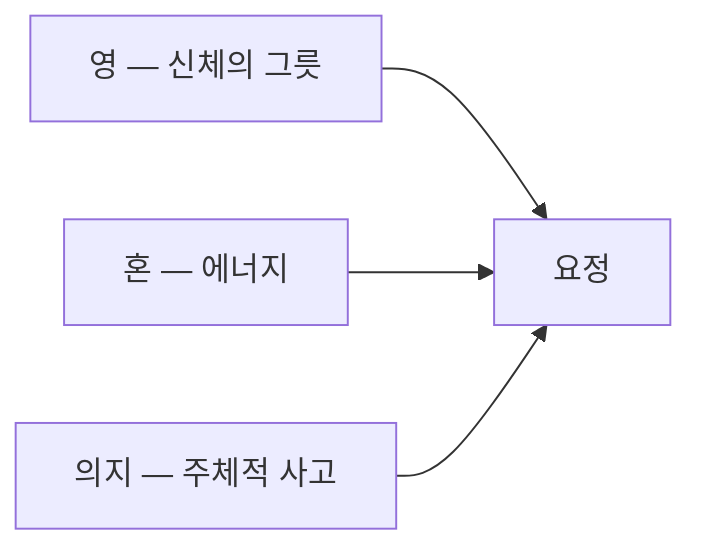
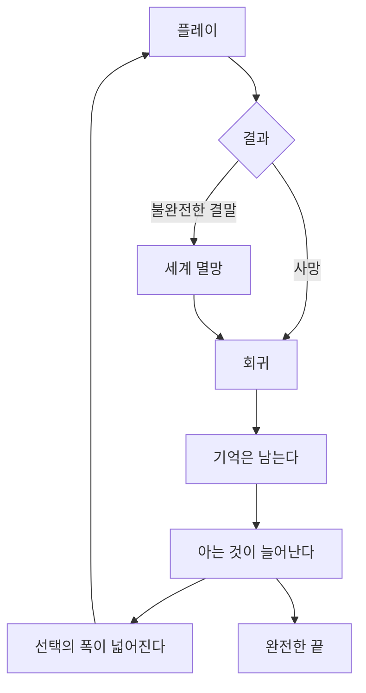

> 이 문서는 전면 개편 예정이다. 용어(혼·의지·영혼)는 UI 기획서 11-1의 표기 원칙이 우선한다.

# 라스트메르헨 — 세계관·서사 설정 v0.1

| 항목 | 내용 |
| --- | --- |
| 버전 | 0.1 |
| 작성일 | 2026-09-29 |
| 범위 | 세계 규칙, 인물, 반복 구조, 메타 구조 |
| 관련 문서 | UI 기획서 v0.3 (화면·시스템 명세) |

이 문서는 서사와 설정만 다룬다. 화면과 시스템 규칙은 UI 기획서를 따른다. 아직 확정되지 않은 항목은 \*\*[미확정]\*\*으로 표시했다.

---

## 1. 개요

### 1-1. 한 줄 요약

> 시간을 되돌려 같은 나날을 반복한다. 강해지는 것은 몸이 아니라, 당신이 아는 것이다.

### 1-2. 성격

| 축 | 내용 |
| --- | --- |
| 중심 | 인물을 이해하고 세계의 진실에 다가가는 추리 |
| 보조 | 관계와 정보가 결과를 바꾸는 액션 |
| 반복 | 회귀. 기억은 남고 세계는 되돌아간다 |
| 목표 | "완전한 끝"에 도달하는 것 |

액션과 추리를 반반으로 내걸지 않는다. **관계가 전투를 바꾸는 게임**으로 위치를 잡는다.

---

## 2. 세계 — 아모르데

### 2-1. 영과 혼

| 개념 | 내용 |
| --- | --- |
| 영 | 태어날 때 정해지는 신체의 그릇. 받아들일 수 있는 혼의 종류가 정해진다 |
| 혼 | 순수 에너지. 생명력이자 마력. 종류가 있다 |
| 단계 | 그릇의 크기. 수련으로 키울 수 있다 (게임의 레벨) |
| 자격 | 시련을 넘으면 늙지 않고 요정에 가까운 힘을 쓴다 |

**그릇이 깨지면 죽고, 혼이 없어도 죽는다.** 심장과 피의 관계와 같다.

혼의 주입은 수혈과 같다. 같은 영끼리가 가장 효율적이고, 의원은 상대의 혼의 흐름을 읽어 "생명의 혼"으로 변환해 주입할 수 있지만 효율이 낮다. 가장 좋은 것은 스스로 흡수하는 것이다. **상성이 맞지 않는 혼이 들어오면 극심한 부작용이 오고, 심하면 죽는다.**

### 2-2. 계통

| 계통 | 세부 혈통 |
| --- | --- |
| 불 | 열, 폭발 |
| 물 | 냉기, 안개 |
| 바람 | 돌풍, 기류 |
| 번개 | 전기, 자기 |
| 바위 | 금속, 결정 |
| 풀 | 나무, 독, 치유 |

상위 계통은 **대지**(불·물·바위·풀)와 **창천**(바람·번개·안개)이며, **빛**과 **어둠**은 별개 축이다. **시간**은 예외다. 다른 영이 "무엇을 다루는가"라면 시간은 "언제를 다루는가"이기 때문이다.

영의 기운은 외형에 드러난다. 불은 붉은 머리, 물은 푸른 계열처럼. 기운이 약하면 색이 흐릿하다.

### 2-3. 사회

능력이 곧 계급인 사회다. 혼을 다루지 못하면 심하게 천대받는다. 영의 그릇이 뚜렷할수록 외형에 드러나므로, **머리색만으로도 계급이 짐작된다.**

### 2-4. 요정화

일반인에게 요정화는 혼 방출을 조절하지 못해 신체 일부가 변형되는 현상이다. 보통 열 살 전후로 조절하게 되지만, 발현 상태로 지내는 사람도 있다. 요정화 중에는 혼 사용 효율이 오른다.

| 계통 | 비행 |
| --- | --- |
| 하위 (불·물·바람·바위·풀) | 마법 날개를 따로 배운다 |
| 상위 (빛·어둠·대지·창천) | 요정화 시 실제 날개가 돋는다 |

소라의 요정화는 실제로는 **요정이 힘을 되찾아 본모습으로 돌아가는 것**이지만, 이 세계에는 그것을 가리키는 말이 없다. 그래서 같은 단어를 쓰고, **그 어긋남 자체가 정체를 암시하는 장치**가 된다.

### 2-5. 시간의 결정체

시간의 요정이 소멸하며 흩어진 혼의 조각이다. 매우 희귀하고, 정제는 황실에서만 가능하다.

| 쓰임 | 내용 |
| --- | --- |
| 정상 | 사물이나 사람의 시간을 되돌리거나 멈춘다 |
| 금지 | 기억을 지우는 약물의 원재료. 단속이 심하지만 암거래가 있다 |

---

## 3. 요정과 시간

### 3-1. 요정의 구성

셋을 모두 갖춰야 요정이다. 다른 속성의 요정들은 온전히 태어나지 못하고 **의지의 형태로만** 존재하며, 깃들 신체를 찾아 사람의 몸을 떠돈다. 깃들어야 살아 있음을 느끼기 때문이다.

**시간의 요정만이 유일하게 요정의 형태로 태어났다.** 그만큼 절대적인 에너지였다.

### 3-2. 소라와 룬

태초의 멸망을 막다가, 살아남기 위해 신체에서 의지를 분리했다.

|  | 소라 | 룬 |
| --- | --- | --- |
| 정체 | 남겨진 영(신체) | 분리된 의지 |
| 비중 | 약 10% | 약 90% |
| 현재 | 혼을 거의 잃은 상태. 의지 자리를 플레이어가 대행 | 여제. 새로 만든 불완전한 신체 |
| 특징 | 살아 있는 이유는 "사고하는 존재"이기 때문 | 영을 잃어 **모든 혼을 다룰 수 있다** |
| 기억 | 잃었다. 결정체를 모으며 되찾는다 | 모두 기억한다. 회귀도 안다 |

룬은 이 세계의 진실(끝나지 않는 반복)을 이미 알고 회의에 빠져 있다.

### 3-3. 플레이어와 소라

초반의 소라는 의지가 비어 있어 스스로 판단한다고 여기지만 결정권은 플레이어에게 있다. 선택지는 **소라의 사념 여러 갈래를 해설자 시스템이 읽어 보여주는 것**이다.

기억과 힘을 되찾을수록 소라에게 인격이 자란다. 표현은 이렇게 한다.

| 시기 | 표현 |
| --- | --- |
| 초반 | 선택지가 여럿 |
| 중반 | 소라의 눈치 문구가 늘어난다 (소라 자신의 목소리) |
| 후반 | 선택지가 하나로 줄거나, 소라가 스스로 입을 연다 |

플레이어가 정할 수 있는 것이 줄어드는 경험 자체가 성장의 감각이 된다. 후반의 대사 예: "제 안에 있는 누군가에게 물을게요. 당신은… 저의 편인가요?"

---

## 4. 인물

| 인물 | 위치 |
| --- | --- |
| 소라 | 주인공. 시간의 요정의 남겨진 조각 |
| 리엘 | 첫 보스. 대외적으로는 중앙기사단 4부대 제1전략기획관, 실제로는 기사단장. 14살 이전 기억이 없다 |
| 디아베르 | 리엘의 10년지기 동료. 10년 전 지하 전쟁에서 부모를 잃었다 |
| 아벨 | 리엘이 유일하게 믿고 맡기는 의원 |
| 파이 | 16세, 불의 영. 요정화가 부분 발현된 상태(머리에 불). 리엘의 조력자 |
| 룬 | 여제. 모든 혼을 다룬다 |
| 가온 | 이 이야기의 작가. 중반까지 정체가 드러나지 않는다 |
| 페리온 | **[미확정]** |

### 4-1. 리엘

기억을 잃은 이유는 **기억을 지우는 금지 약물**이다. 또한 상성이 맞지 않는 **어둠의 혼이 주입되어** 죽을 뻔한 적이 있다. 양아버지가 있고, 잃어버린 동생이 있다는 이야기가 전해진다. **[일부 미확정]**

이복동생은 **두 개의 영이 섞여 태어난 돌연변이**다. 보통 이런 경우 예후가 나빠 죽지만, 그는 살아남았고 빌런 중 하나가 된다.

### 4-2. 파이

과거에는 "리베라 공자"였고, "무우"라는 아이를 구하다 실종됐다. 사고로 영의 그릇에 금이 갔다.

### 4-3. 가온

이야기의 작가이자, 이 세계가 태어난 이유다. 소라가 꾸는 꿈에서 **얼굴 없는 그림자**로 가온의 과거 트라우마가 재생된다. 초중반에는 세계와의 연관을 알아채기 어렵다.

**그 트라우마의 형상이 세계를 파괴하는 진짜 빌런이다.**

---

## 5. 반복 구조

### 5-1. 회귀

기억은 어떤 경로로도 유지된다. 되돌아가는 것은 세계와 몸이다. 자세한 규칙은 UI 기획서 7장을 따른다.

### 5-2. 회귀를 기억하는 존재

| 존재 | 이유 |
| --- | --- |
| 소라 | 기억은 유지된다는 규칙 |
| 룬 | 시간의 요정 본체에 가깝다 |
| 가온 | 작가 |
| 해설자 | 시스템 그 자체 |

### 5-3. 꿈

잠들 때 간헐적으로 꾼다. 가온의 과거가 그림자 형태로 재생되며, **소라는 내용을 이해하지 못한다.** 기록장에도 "꿈을 꾼 것 같다" 정도만 남는다.

---

## 6. 메타 구조

### 6-1. 해설자

플레이어에게만 보이는 존재이며, **시스템 그 자체**다. 시스템의 능력이 곧 해설자의 능력이므로, 모든 시스템 판넬 문구는 해설자의 목소리다.

| 원칙 | 내용 |
| --- | --- |
| 목표 선언 | 도입부에 "정보를 모아 선택의 폭을 넓혀 완전한 끝을 찾아라"를 분명히 말한다 |
| 호칭 | 소라가 아니라 "플레이어씨"를 부른다 |
| 개입 시점 | 처음 겪는 상황에만. 겪은 뒤에 한마디 |
| 태도 | 친절하지 않다. 일부러 말을 아끼고 경고한다 |

호칭이 중요하다. 초반부터 아무렇지 않게 써두면, 소라와 플레이어가 별개임이 드러날 때 장치가 된다.

### 6-2. 기록되지 않는 것

기록장에는 메타 요소(해설자·시스템의 정체, 가온이 작가라는 사실)를 적지 않는다. 해설자는 **아모르데 이야기의 완결을 위해** 그 창을 제공하는 존재이기 때문이다.

이 원칙이 확고할수록, 나중에 기록이 망가지거나 새어 나오는 연출이 강해진다.

| 예정된 균열 | 내용 |
| --- | --- |
| 가온 소실 | 가온 관련 기록이 망가진다 **[제안]** |
| 시즌 2 | UI 창이 무너진다 = 해설자가 흔들린다 |

---

## 7. 톤과 연출

| 요소 | 방향 |
| --- | --- |
| 아트 | 도트와 파스텔. 몽환적이고 귀엽다 |
| 내용 | 타락, 폭주, 사별, 트라우마 |
| 간극 | **약점이 아니라 무기다.** 숨기지 말고 전환을 보여준다 |
| 장르 표기 | 회귀 · 추리 · 액션 |

트레일러는 밝은 대화와 도트로 시작해 중반에 꺾는 구성으로 간다.

---

## 8. 미확정 목록

| 항목 | 내용 |
| --- | --- |
| 페리온 | 위치와 역할 |
| 대지·창천 | 날개 형태와 대표 인물 |
| 리엘의 동생 | 생사와 등장 시점 |
| 소라의 날개 | 시간을 시각적으로 어떻게 표현할지 |
| 자격 | "시간의 자격"을 넘는 조건과 시점 |
| 기억 패시브 | 친해진 인물의 기운이 전투에 드러나는 방식 |
