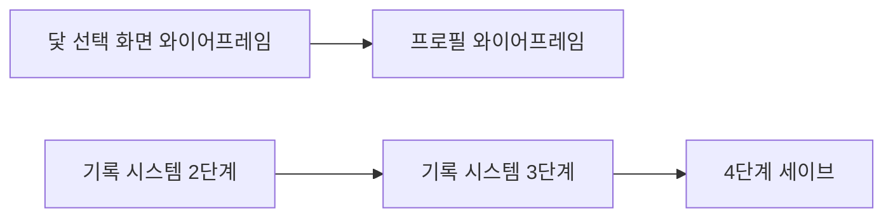

# 라스트메르헨 — 작업 인수인계

| 항목 | 내용 |
| --- | --- |
| 최종 갱신 | 2026-10-09 |
| 목적 | 새 세션(Claude Code 포함)에서 맥락을 바로 이어가기 위한 문서 |
| 읽는 순서 | 1장 → 2장 → 7장(진행 상황) → 8장(다음 할 일). 규칙은 프로젝트 루트의 `CLAUDE.md` |

## 목차

1. 프로젝트 개요
2. 문서
3. 진행 방식
4. 완성된 시스템
5. 확정된 설계 규칙
6. 최근 결정 사항 (2026-10-06 ~ 10-08)
7. 진행 상황
8. 다음 할 일
9. 미결 사항
10. 핵심 클래스 지도
11. 새 세션을 시작할 때

---

## 1. 프로젝트 개요

| 항목 | 내용 |
| --- | --- |
| 제목 | 라스트메르헨 (구 라스트 테일) |
| 엔진 | Unity 6 LTS, 2D URP. 편집기는 Visual Studio |
| 아트 | 픽셀아트 + 카툰. 몽환적·귀여운 도트에 무거운 서사 |
| 장르 표기 | 회귀 · 추리 · 액션 |
| 한 줄 요약 | 시간을 되돌려 같은 나날을 반복한다. 강해지는 것은 몸이 아니라 당신이 아는 것이다 |
| 당면 목표 | 리엘 보스전 데모 완성 → 유튜브 개발일지 공개 |
| 주인공 | 소라(시간의 요정의 육체, 의지가 빠진 상태를 플레이어가 이끈다). 첫 보스 리엘 |
| 파트 구조 | 한 프로그램에 1부·2부. 2부는 1부 결말 후 열림. 2부까지 확정, 3부는 흥행 시 검토. DLC 방식은 미정 |

핵심 구조. 플레이어가 정보를 모을수록 선택지가 늘고, 관계가 전투의 양상을 바꾼다. 회귀해도 기억은 남고 세계와 몸만 되돌아간다.

---

## 2. 문서

모두 `docs/` 폴더의 마크다운이다. 노션에는 그대로 복사해 붙인다(다이어그램은 mermaid 코드 블록).

| 문서 | 내용 |
| --- | --- |
| `docs/인수인계.md` | 이 문서 |
| `docs/개발로드맵.md` | 데모까지의 작업 목록, 예상 일정, 진행 기록. 하루 계획의 기준 |
| `docs/UI기획서.md` | 화면·시스템 명세 전부. 가장 중요 |
| `docs/기록시스템_설계.md` | 기록·스냅샷·세이브 구조와 구현 5단계 |
| `docs/세계관설정.md` | 영과 혼, 요정, 인물. 전면 개편 예정 |
| `docs/개발일지_01_UI기반정비.md` | 공개용 개발일지 1편 |
| `CLAUDE.md` (루트) | 작업 규칙·용어. 세션마다 자동으로 읽힌다 |
| `.claude/skills/` | `day-start`(오늘 시작), `day-end`(오늘 마무리), `handoff`(세션 옮기기) |

기획서에서 자주 참조하는 절.

| 절 | 내용 |
| --- | --- |
| 5-4 | 시각 표기 (12/24시간제, 포맷터) |
| 6-4 | 기록장 (인물 정보 / 자료집 / 이번 흐름) |
| 6-6-4 | 이야기의 행적 (가지 구조, 결말 분류, 무손실 저장) |
| 6-12 | 타이틀과 이야기 선택 |
| 7-2 | 회귀 경로와 돌아갈 지점 선택, 정신력 충격 |
| 8 | 데이터 층위, 세이브 규칙(슬롯 없음), 파트 |
| 9-7, 9-8 | 데이터 보호, 기록 시스템 |
| 10 | 미결 사항 |
| 11-1, 11-5 | 혼·의지 표기 원칙, 스킬 숙련도 |
| 부록 C | 앞으로 구현할 항목 (C-7 와이어프레임, C-8 연출) |
| 부록 D | 테스트 대기 목록 |

---

## 3. 진행 방식

- **UI 와이어프레임을 먼저 확정하고 구현한다.** 사용자는 피그마로 와이어프레임을 만들어 이미지로 공유한다. 피드백 후 확정된 규칙은 기획서 해당 절에 반영한다.
- **테스트는 몰아서 한다.** 당장 확인이 꼭 필요한 경우에만 "지금 테스트해야 한다"고 알린다. 나머지는 기획서 부록 D에 쌓는다.
- **코드는 추측으로 쓰지 않는다.** 관련 파일을 직접 읽고 작업한다.
- **코드 수정은 승인 후에.** 무엇을 왜 바꾸는지 먼저 설명하고 승인을 받는다. 작업 단위가 끝나면 커밋 메시지를 제안한다.
- 사용자는 긴 설명보다 **정확한 위치와 이유**를 원한다. 생략하지 않는다.
- 기획서는 버전 번호를 올리지 않는다. 변경 이력 표에만 남긴다.

---

## 4. 완성된 시스템

| 영역 | 상태 |
| --- | --- |
| 회귀 3경로 | 완료. 기억은 어떤 경로에서도 유지. 세계와 몸만 되돌림. 경로 2·3에서 공·방·민도 되돌림 |
| 시간의 닻 | 완료. 1회용, 과거로 가면 이후 닻 소멸, 영혼 레벨 기준 최대 개수, 누적 번호 |
| 기억·주제 데이터 | 완료. 분류·확실도·출처·반증·관련 인물 |
| 기록 시스템 1단계 | 완료. 모든 주요 상태 변화 기록, 순번·연산·추가 데이터, 문구 대신 ID 저장 |
| 시각 포맷터 | 완료. `GameTimeFormatter` + `GameSettings` 12/24시간제. HUD 시계 연결 |
| 대화·말풍선 | 완료. 타자기, 자동 크기, 선택지, 창 스택 |
| UI 기반 | 완료. 모드 전환, 창 스택, 알림 큐, 입력 바인딩 |
| 노드 에디터 | 완료. `#node #mem #time #battle` 태그, 검증, 보스 프로필 연동 |
| 전투 | 완료. 보스 프로필, 난이도, 패링·가드·그로기, 보상 수식(Formula 애셋) |
| 성장 | 완료. 노련미 보정, 레벨 차이 경험치 보정, 훈련 |
| 이동·사냥 시간 | 완료. `TravelTimeTracker`, `HuntTracker` |
| 로컬라이제이션 | 완료. KO 기준, 빈 칸은 KO로 대체 |

**미검증**: 위 항목 중 최근 수정분 대부분. 부록 D에 테스트 항목이 쌓여 있다.

**없는 것**: 세이브·로드, 스킬 숙련도, 인벤토리, 지도, 일러스트 컷씬 재생기, 결말 태그(`#ending`), 시간 보내기 기능 스크립트, 힌트 NPC(`HasDoneInCurrentFlow`를 쓰는 곳이 아직 없음), 닻 선택 화면, 실제 UI 프리팹 대부분.

---

## 5. 확정된 설계 규칙

| 규칙 | 이유 |
| --- | --- |
| 체력·마나는 `Heal`/`RecoverMana`를 거친다 | 직접 대입하면 변경 이벤트가 안 떠서 HUD가 멈춘다 |
| 말풍선 루트는 항상 켜두고 `BubblePanel`만 토글 | `LateUpdate`가 위치·크기를 계산하기 때문 |
| 버튼이 아닌 이미지·텍스트는 Raycast Target을 끈다 | HUD 버튼이 막힌다 |
| 기억은 어떤 회귀 경로에서도 유지 | 되돌리는 것은 세계와 몸(경로 2·3) |
| 회귀 기록은 복원 뒤에 남긴다 | `RestoreWorldState`가 행적 로그를 되돌리므로 |
| 닻 번호는 누적 설치 횟수 | 보유 순번을 쓰면 번호가 겹친다 |
| 상태를 바꾸는 모든 변경은 `PlayerActionLog.Record`를 거친다 | 기록에 없는 변경은 복원할 수 없다. 디버그 도구의 수정도 마찬가지 |
| 기록에는 표시 문구가 아니라 ID와 숫자를 저장한다 | 언어·시간제를 바꿔도 지난 기록이 바르게 표시된다 |
| `RecordType`은 끝에만 추가한다 | 숫자로 저장되므로 순서가 바뀌면 옛 기록의 의미가 바뀐다 |
| 기록 순번(`seq`)과 닻 번호는 회귀해도 되돌리지 않는다 | 세계 전체의 고유 번호 |
| 시각 표시는 `GameTimeFormatter`를 거친다 | 12/24시간제 설정 하나로 모든 화면이 바뀐다 |
| 숨김 수치(호감도·의심·신뢰)는 UI에 노출 금지 | 반응으로만 전달. 저장은 전부 한다 |
| 기록장에 메타 요소(해설자·가온의 정체)를 적지 않는다 | 해설자는 UI를 제공하는 존재 |
| 세이브 슬롯은 없다 | 플레이어당 세계 하나. 새 시작은 하드 리셋 |

---

## 6. 최근 결정 사항 (2026-10-06 ~ 10-08)

자세한 내용은 기획서 변경 이력(v0.3.1 ~ v0.3.3)에 있다.

| 주제 | 결정 |
| --- | --- |
| 결말 분류 | 사망 / 불완전 결말 / 자발적 회귀 / 결말. 결말은 1부 완결로 단 하나. 희생은 불완전 결말. 사망 라벨은 일반 사망(회색 괄호 사인)과 스토리 사망(제목) 두 가지 |
| 회차 산정 | 모든 회귀마다 +1, 보스전 재도전만 제외 |
| 돌아갈 지점 | 사망·불완전 결말 후 닻 선택 화면에서 닻 또는 Day 1. Day 1은 마나 없음·몸 초기화·정신력 하락. 자발적 회귀는 닻으로만, 마나가 충분할 때만 |
| 정신력 충격 | 기본 하락 + 레벨당 하락 × 몸이 되돌아간 레벨 폭 (Formula 애셋) |
| 이야기의 행적 | 와이어프레임 완료. 마일스톤 최대 5개 + "외 N건" 펼치기. ★은 영혼 레벨 경신 때만. 닻 복귀 불가(기록장 이번 흐름에서만). 상세 흐름 보기 유지 |
| 지난 회차 저장 | 숨김 수치까지 무손실 저장. 자기 구간만 + 회차별 파일 + 압축 + 지연 로드 |
| 세이브 | 슬롯 폐지. 결과 시점 자동 저장. Steam 계정별 폴더. 시뮬레이션은 별도 데이터 |
| 타이틀·이야기 선택 | 시작하기/이어하기 전환, 새 게임 버튼 없음. 2부 카드는 1부 결말 후 표시. 결말 후 1부는 시뮬레이션으로만 |
| 스킬 숙련도 | "스킬 레벨" 대신 숙련도, 로마 숫자(라틴 I·V·X). 의지에 남고 쓸 수 있는 상한은 몸 레벨. 숙련 경험치 하나로 성장(제안) |
| 용어 | 혼 = 원소 에너지. 소라는 설정상 의지(정신). UI·해설자는 "영혼 레벨"처럼 플레이어 언어를 써도 된다 |
| 기록 시스템 | 스냅샷 + 변경 기록, 층위 선언, 자기 검증, 버그 리포트 내보내기 |
| 기록 2단계 진행 방식 (10-08) | 기존 닻·회귀를 깨지 않도록 새 틀을 옆에 붙여 비교 → 일치 확인 → 복원 교체(2-A/2-B/2-C) |
| 두 층위 클래스 (10-08) | 클래스 안에 어댑터 객체를 따로 등록한다. `RecordId` 하나 = 덩어리 하나 = 층위 하나 (설계 13-2-6) |
| 층위 추가 확정 (10-08) | 피로도 = 몸(공·방·민과 같은 취급), 시간결정체 = 의지(유지), 회차 수 = 플레이어(절대 되돌리지 않음) |
| 디버그 "다음 회차로" (10-08) | 실제 경로 3과 같은 절차(`StartNewLoopFromDay1`) — 닻 정리, 몸 초기화, 회귀 기록 |
| 일정 가정 (10-08) | 주 7일, 하루 평균 5시간 중 개발 60%(3시간). 작업일 = 개발 4시간. 2주마다 실제 비중으로 보정 (로드맵) |
| 인코딩 (10-08) | 텍스트 파일은 모두 UTF-8. `.editorconfig`로 고정 |
| `Liel_Day5.ink` | 노드 에디터 테스트용 임시 파일. 카운터가 이상해도 무시. 데모는 Day 1~4 대화만 맞으면 된다 |
| 문서 형식 | 마크다운 원본. 버전 번호 올리지 않음 |

---

## 7. 진행 상황

### 7-1. 와이어프레임

| 화면 | 상태 |
| --- | --- |
| 탐색·대화·전투 HUD | 확정 |
| 기록장 인물 정보·자료집·이번 흐름 | 확정 |
| 재도전, 일시정지, 저장 확인·로딩, 시간 보내기 팝업 | 확정 |
| 이야기의 행적 전체 흐름 | 확정 (세부 색은 구현 때) |
| 타이틀, 이야기 선택 | 확정 (이야기 선택 화면 마무리 수정 2026-10-08) |
| 닻 선택 화면 | **진행** — 2026-10-08 착수 |
| 프로필 (스킬 숙련도 포함) | 미착수 |
| 인벤토리 | 미착수 |
| 팝업(닻 설치·잠자기) | 미착수 |
| 이야기의 행적 컷씬 모음 | 미착수 (일러스트 컷씬 데이터가 생긴 뒤) |
| 지도 | 후순위 |

### 7-2. 코드

| 작업 | 상태 |
| --- | --- |
| 기록 시스템 1단계 (1-A, 1-B) | 완료, 컴파일 확인. 동작 테스트는 부록 D |
| 공·방·민 회귀 되돌림 | 완료 |
| `GameStateOverviewWindow` 갱신 | 완료 (누적 닻 번호, 기록 필터, `AddAffection` 경유) |
| 기록 시스템 2단계 2-A (새 틀 + 매니저 4개 연결, 비교 로그) | 완료 (2026-10-08), 컴파일 확인. 동작 테스트는 부록 D-2 "기록 2-A" |
| 기록 시스템 2단계 2-B (어댑터, 방문 노드, 경로 3 함수화, 디버그 기록 경로) | 완료 (2026-10-08), 컴파일 확인. 동작 테스트는 부록 D-2 "기록 2-B" |
| 비UTF-8 소스 69개를 UTF-8(BOM)로 변환, `.editorconfig` 추가 | 완료 (2026-10-08) |
| Map Tool(`MapDataEditor`) 상주 씬 문제 + `EventMarkerEditor` 경로 금지 문자 | 완료 (2026-10-09), 컴파일 확인. 동작 테스트는 부록 D-4 |
| 사용 중단 API 경고 정리 (`FindObject(s)OfType` 14곳, `OverlapCircleNonAlloc`) + CS0114(`PlayableCharacter.OnValidate`) | 완료 (2026-10-09), 컴파일 확인. CS0618·CS0114 경고 0개. 커밋 `c0dbb9a`, **push는 인증 실패로 사용자가 직접** |
| `EventMarkerEditor` "기존 knot에서 선택" 팝업이 노드 이름을 덮어쓰는 문제 | **다음 작업** — 원인 확인(8장 코드 쪽 1번), 수정 전 |
| 기록 시스템 2단계 2-C (복원 교체, 시각·씬 연결, 경로 3 시작 스냅샷) | 대기 — 먼저 부록 D-2 "기록 2-A·2-B"를 몰아서 확인 |

### 7-3. 구현 때 챙길 메모

- 이야기의 행적 마일스톤 점 색: 주황이 강제 사용 닻·불완전 결말과 겹친다. 흰 점 + 선 색 테두리 제안.
- 사용 전 닻 툴팁(게임 중에만): "기록장 › 이번 흐름에서 돌아갈 수 있다".
- 컷씬 밀어내기: 썸네일 왼쪽 끝 = 날짜, 오른쪽 끝을 넘으면 안쪽으로.
- 시뮬레이션 첫 진입 해설자 대사, 하드 리셋 확인·재시작 대사, 플레이 권장 문구는 기획서 8장·9-7에 초안이 있다.
- 꿈 이벤트 등 `EventID 0` 이벤트는 기록 키가 `node:{InkNodeName}`이다.

---

## 8. 다음 할 일

두 줄은 병행할 수 있다.

**화면 쪽 (사용자)**
1. 닻 선택 화면 — 7-2 표의 대가(마나, 몸 유지, 정신력)를 선택지마다 표시. Day 1 포함
2. 프로필 — 스킬 숙련도의 최고 도달 단계와 지금 쓸 수 있는 단계

**데이터 쪽 (사용자)**
- **먼저 상주 씬의 옛 마커 정리**: Map Tool을 열면 맨 위 빨간 안내에 `Persistent Scene`의 마커 수가 나온다. `BeginnerTown` 마커와 중복이므로 "삭제" 후 상주 씬을 저장한다 (부록 D-4).
- 리엘 Day 1 오후·저녁 이벤트가 Day 5 노드를 가리킨다. `EventTable.csv`의 10001(Day1 14~17시)·10000(Day1 19~21시)이 `Liel_Day5_001`로 돼 있다. 의도는 10001 → `Liel_Day1_002`, 10000 → `Liel_Day1_003`으로 보인다(두 노드는 어디서도 쓰이지 않았다). CSV는 Map Tool이 씬 마커에서 내보내는 결과물이라 **`BeginnerTown`의 마커를 고치고 Save Current Scene**으로 다시 저장한다. Map Tool은 2026-10-09에 고쳤다. **단, 지금은 노드 이름을 바꿀 수 없다** — 아래 코드 쪽 1번을 먼저 고친다.
- 상주 씬 옛 마커 정리는 2026-10-09에 사용자가 완료했다(커밋 `c0dbb9a`에 포함).

**코드 쪽 (Claude)**
1. **"기존 knot에서 선택" 팝업 버그** (`Assets/Scripts/Editor/EventMarkerEditor.cs` 아래쪽 "기존 knot에서 고르기", 약 10분). 그래프 Start 노드 목록(`GraphKeySource.GetKnotNames`)에 지금 이름이 없으면 `IndexOf`가 -1 → `Mathf.Max(0, current)`로 팝업이 0번(`Liel_Day5_001`)을 보여주고, 변경 확인 없이 `knots[picked] != InkNodeName`이면 대입하므로 **매 repaint마다 이름이 0번으로 덮어써진다**. 목록에는 `Liel_Day5_001`, `Liel_Day5_Exhausted`만 있어 다른 이름은 입력할 수 없다. 리엘 Day 1 마커가 `Liel_Day5_001`이 된 원인도 이것으로 추정한다. 수정안(사용자에게 제안함, 승인 전): `EditorGUI.BeginChangeCheck()`로 감싸 사용자가 팝업을 직접 바꿀 때만 반영하고, 목록에 없는 이름이면 팝업 맨 앞에 "(직접 입력: 이름)" 항목을 넣어 표시
2. (완료 2026-10-09) Map Tool 상주 씬 문제. `MapDataEditor`는 열린 씬 중 `SceneTable.csv`에 있는 씬을 "맵 씬"으로 보고, 마커 생성·검색·저장·삭제를 맵 씬으로 한정한다. 이동은 Additive로 열고 옛 맵만 닫는다. 맵 씬 밖 마커는 안내 후 옮기기/삭제. Save의 "입력된 ID로 저장" 대체 경로는 없앴다. 저장 검증에 EventID 중복·맵 씬 밖 마커를 더했다. `EventMarkerEditor`는 노드 이름의 경로 금지 문자를 예외 대신 HelpBox로 알린다. 동작 테스트는 부록 D-4
3. 기록 시스템 2단계 (기록시스템_설계 13-2)
   - 2-A 완료: `Assets/Scripts/Record/`의 새 틀 + `NPCManager`·`SuspicionManager`·`MemoryManager`·`SoraStats` 연결. 복원은 아직 옛 방식이고, 닻 회귀 때 비교 로그만 남긴다
   - 2-B 완료: 두 층위 클래스는 어댑터로 나눔([확정]), 기억·소라의 의지·회차 수·방문 노드 연결, 경로 3을 `StartNewLoopFromDay1`로 빼고 디버그 "다음 회차로"가 같은 함수를 씀, `RecordType.DebugEdit`
   - 2-C 다음: 부록 D-2 "기록 2-A·2-B"를 확인한 뒤 복원을 `RecordSystem.RestoreLayers`로 교체, `TimeManager`·`SceneLoader` 연결, 경로 3을 파트 시작 스냅샷으로 (설계 13-2-5). [미결] ink 상태를 실제 회귀에서도 되돌릴지 (13-2-6)
   - 씬 메모: `Persistent Scene`의 `Manager` 오브젝트에 `TimeAnchorInputHandler`가 중복으로 붙어 있었다 → 사용자가 제거
4. 3단계: `LoopRecord`·`AnchorRecord`, 회차 마감 흐름, 결말 태그 `#ending`
5. 4단계: 파일 저장·자동 저장 (이때 부록 D-2·D-3 테스트를 먼저 몰아서)

**컴파일 확인 방법(유니티를 열지 않고):** 세션 스크래치에 만든 스크립트로 `Assembly-CSharp.csproj`를 복사해 절대 경로로 바꾸고, 프로젝트 참조를 `Library/ScriptAssemblies`의 DLL로 대신한 뒤 `dotnet msbuild`로 빌드했다. 새 파일은 유니티가 csproj를 다시 만들기 전이라 `Compile Include`로 직접 더해야 한다. 빌드 출력은 반드시 저장소 밖에 둔다.

---

## 9. 미결 사항

전체 목록은 기획서 10장. 자주 걸리는 것만 적는다.

| 항목 | 내용 |
| --- | --- |
| 12/24시간제 기본값 | `GameSettings.default24HourClock`. 지금은 12시간제 |
| DLC 방식 | 같은 빌드(Steam DLC) vs 별도 빌드 |
| 기억 패시브 | 친해진 NPC의 기운이 전투에 드러나는 방식. 리엘(빛)부터 |
| 피로도 한계 | 쓰러지는 장치는 보류. 경고 방식이면 고려 |
| 혼 저장소 | 출처 불명 설정. 기획서 7-1에 취소선으로 보류 |
| 세계관 문서 | 전면 개편 예정 |

---

## 10. 핵심 클래스 지도

| 영역 | 클래스 |
| --- | --- |
| 회귀·닻 | `TimeLoopManager`, `TimeAnchorSnapshot`, `TimeAnchorConfirmPopup`, `TimeAnchorInputHandler`, `TimeAnchorMarker` |
| 기록 | `PlayerActionLog`(+`ActionRecord`, `RecordType`, `ChangeOp`, `RecordKeys`), `FlowLog`, `FlowLogBuilder`, `VisitedNodeLog` |
| 스냅샷 (`Assets/Scripts/Record/`) | `RecordSystem`, `IRecordable`(+`RecordIds`), `RecordLayer`(+`RecordLayerMask`), `Snapshot`(+`SnapshotReason`), `StateBlock`(+`StateWriter`, `StateReader`) |
| 시간 | `TimeManager`, `GameTimeFormatter`, `TimeCoinPanel`, `TravelTimeTracker`, `HuntTracker` |
| 캐릭터 | `CharacterStats`, `PlayableCharacter`, `SoraStats`, `Stat`, `PlayerCombat`, `SkillBase` |
| NPC·관계 | `NPCManager`, `NPCData`, `SuspicionManager`, `NPC`, `Liel_AI` |
| 기억 | `MemoryManager`, `MemoryFragmentData`, `MemoryTopicData` |
| 이벤트 | `EventManager`(+`EventData`, `RecordKey`), `IEventBehavior` 구현들, `AmbientEventManager`, `DialogueManager` |
| 전투 수식 | `CombatFormulaService`, `*Formula` 애셋들 |
| UI | `UIManager`, `UIWindowManager`, `UIStackElement`, `UIWindow`, `HUDStatusPanel`, `BossHUDPanel`, `DialogueUIPanel` |
| 설정·문구 | `GameSettings`, `LocalizationManager`, `SceneNameUtil`, `CsvTableLoader` |
| 연출 | `CameraDirector`, `CameraFollow`, `CutsceneAnimationPlayer`(캐릭터 연출 애니. 일러스트 컷씬 아님) |
| 디버그 | `GameStateOverviewWindow`(에디터), `DebugLoopTools` |

데이터 표: `StreamingAssets/Datas`의 `LocalizationTable.csv`, `SceneTable.csv`, `PlayerLevelTable.csv`, `SkillTable.csv`, `SkillLevelTable.csv` 등.

---

## 11. 새 세션을 시작할 때

1. `CLAUDE.md`(자동)와 이 문서를 읽는다.
2. 그날 첫 세션이면 `day-start` 절차로 오늘 분량을 제안한다. 아니면 8장 "다음 할 일"에서 이어간다. 사용자가 다른 작업을 원하면 그쪽을 따른다.
3. 코드를 고칠 때는 관련 파일을 직접 읽고, 계획 설명 → 승인 → 수정 → 커밋 메시지 제안 순서로 한다.
4. 와이어프레임 이미지를 받으면 피드백하고, 확정된 규칙은 기획서에 반영한다.
5. 작업이 끝나면 이 문서의 4·7·8장과 `docs/개발로드맵.md`를 갱신한다.
