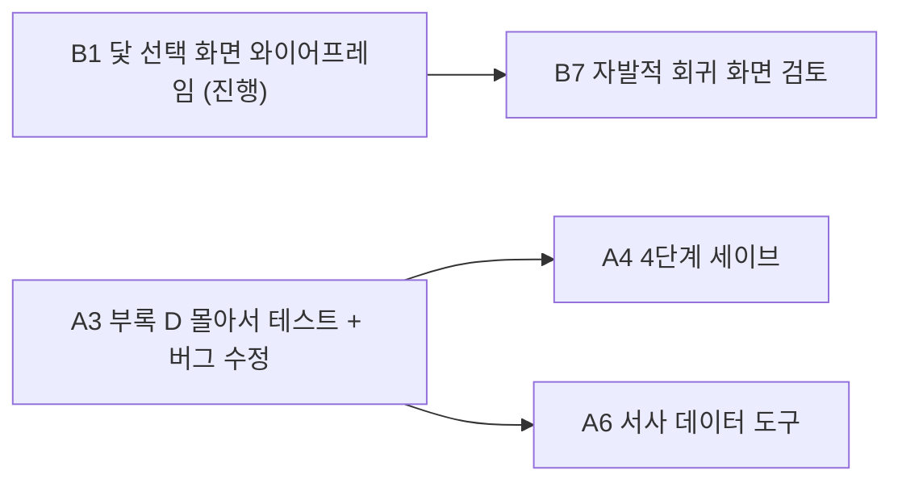

# 라스트메르헨 — 작업 인수인계

| 항목 | 내용 |
| --- | --- |
| 최종 갱신 | 2026-10-10 |
| 목적 | 새 세션(Claude Code 포함)에서 맥락을 바로 이어가기 위한 문서 |
| 읽는 순서 | 1장 → 2장 → 7장(진행 상황) → 8장(다음 할 일). 규칙은 프로젝트 루트의 `CLAUDE.md` |

## 목차

1. 프로젝트 개요
2. 문서
3. 진행 방식
4. 완성된 시스템
5. 확정된 설계 규칙
6. 최근 결정 사항 (2026-10-06 ~ 10-09)
7. 진행 상황
8. 다음 할 일
9. 미결 사항
10. 핵심 클래스 지도
11. 새 세션을 시작할 때

---

## 1. 프로젝트 개요

| 항목 | 내용 |
| --- | --- |
| 제목 | 라스트메르헨 (구 라스트 테일) |
| 엔진 | Unity 6 LTS, 2D URP. 편집기는 Visual Studio |
| 아트 | 픽셀아트 + 카툰. 몽환적·귀여운 도트에 무거운 서사 |
| 장르 표기 | 회귀 · 추리 · 액션 |
| 한 줄 요약 | 시간을 되돌려 같은 나날을 반복한다. 강해지는 것은 몸이 아니라 당신이 아는 것이다 |
| 당면 목표 | 리엘 보스전 데모 완성 → 유튜브 개발일지 공개 |
| 주인공 | 소라(시간의 요정의 육체, 의지가 빠진 상태를 플레이어가 이끈다). 첫 보스 리엘 |
| 파트 구조 | 한 프로그램에 1부·2부. 2부는 1부 결말 후 열림. 2부까지 확정, 3부는 흥행 시 검토. DLC 방식은 미정 |

핵심 구조. 플레이어가 정보를 모을수록 선택지가 늘고, 관계가 전투의 양상을 바꾼다. 회귀해도 기억은 남고 세계와 몸만 되돌아간다.

---

## 2. 문서

모두 `docs/` 폴더의 마크다운이다. 노션에는 그대로 복사해 붙인다(다이어그램은 mermaid 코드 블록).

| 문서 | 내용 |
| --- | --- |
| `docs/인수인계.md` | 이 문서 |
| `docs/개발로드맵.md` | 데모까지의 작업 목록, 예상 일정, 진행 기록. 하루 계획의 기준 |
| `docs/UI기획서.md` | 화면·시스템 명세 전부. 가장 중요 |
| `docs/기록시스템_설계.md` | 기록·스냅샷·세이브 구조와 구현 5단계 |
| `docs/세계관설정.md` | 영과 혼, 요정, 인물. 전면 개편 예정 |
| `docs/개발일지/` | 개발일지. 하루 하나(`YYYY-MM-DD_주제.md`), 1편(09-16~09-25)도 여기로 옮겼다. **로컬 보관용, 커밋하지 않는다**(`.gitignore`). `day-end`에서 쓴다. 작업 맥락은 여기가 아니라 설계 문서와 이 문서에 둔다 |
| `CLAUDE.md` (루트) | 작업 규칙·용어. 세션마다 자동으로 읽힌다 |
| `.claude/skills/` | `day-start`(오늘 시작), `day-end`(오늘 마무리), `handoff`(세션 옮기기) |

기획서에서 자주 참조하는 절.

| 절 | 내용 |
| --- | --- |
| 5-4 | 시각 표기 (12/24시간제, 포맷터) |
| 6-4 | 기록장 (인물 정보 / 자료집 / 이번 흐름) |
| 6-6-4 | 이야기의 행적 (가지 구조, 결말 분류, 무손실 저장) |
| 6-12 | 타이틀과 이야기 선택 |
| 7-2 | 회귀 경로와 돌아갈 지점 선택, 정신력 충격 |
| 8 | 데이터 층위, 세이브 규칙(슬롯 없음), 파트 |
| 9-7, 9-8 | 데이터 보호, 기록 시스템 |
| 10 | 미결 사항 |
| 11-1, 11-5 | 혼·의지 표기 원칙, 스킬 숙련도 |
| 부록 C | 앞으로 구현할 항목 (C-7 와이어프레임, C-8 연출) |
| 부록 D | 테스트 대기 목록 |

---

## 3. 진행 방식

- **UI 와이어프레임을 먼저 확정하고 구현한다.** 사용자는 피그마로 와이어프레임을 만들어 이미지로 공유한다. 피드백 후 확정된 규칙은 기획서 해당 절에 반영한다.
- **테스트는 몰아서 한다.** 당장 확인이 꼭 필요한 경우에만 "지금 테스트해야 한다"고 알린다. 나머지는 기획서 부록 D에 쌓는다.
- **코드는 추측으로 쓰지 않는다.** 관련 파일을 직접 읽고 작업한다.
- **코드 수정은 승인 후에.** 무엇을 왜 바꾸는지 먼저 설명하고 승인을 받는다. 작업 단위가 끝나면 커밋 메시지를 제안한다.
- 사용자는 긴 설명보다 **정확한 위치와 이유**를 원한다. 생략하지 않는다.
- 기획서는 버전 번호를 올리지 않는다. 변경 이력 표에만 남긴다.

---

## 4. 완성된 시스템

| 영역 | 상태 |
| --- | --- |
| 회귀 3경로 | 완료. 기억은 어떤 경로에서도 유지. 세계와 몸만 되돌림. 복원은 범용 스냅샷(`RecordSystem.RestoreLayers`) — 경로 1·자발적 World, 경로 2 World+Body(닻), 경로 3 World+Body(파트 시작 스냅샷). 경로 1은 남은 마나로 체력 회복, 경로 2는 닻 직전의 체력·마나. 사망 뒤 돌아갈 지점은 선택지(`ReturnOption`)로 — 화면이 없으면 최근 닻 → Day 1 자동. 정신력 충격(`MentalShockFormula`)은 경로 2·Day 1 |
| 기록 시스템 3단계 | 게임 쪽 완료 (10-09). 회차·닻 이력(`LoopHistory`), 행적을 되돌리지 않고 회차 구간으로, 회차 마감 → 돌아갈 지점 선택(`ReturnOption`, 화면 없으면 자동), 사인, `#ending`·`#milestone`, 회차 요약. 노드 에디터 칸은 아직 |
| 기록 시스템 2단계 | 완료 (10-09). `IRecordable` 9개 덩어리(호감도, 의심, 카운터, 시각, 위치 / 몸 / 기억, 의지 / 회차 수, 방문 노드), 층위별 복원, 자기 검증 로그 |
| 시간의 닻 | 완료. 1회용, 과거로 가면 이후 닻 소멸, 영혼 레벨 기준 최대 개수, 누적 번호 |
| 기억·주제 데이터 | 완료. 분류·확실도·출처·반증·관련 인물 |
| 기록 시스템 1단계 | 완료. 모든 주요 상태 변화 기록, 순번·연산·추가 데이터, 문구 대신 ID 저장 |
| 시각 포맷터 | 완료. `GameTimeFormatter` + `GameSettings` 12/24시간제. HUD 시계 연결 |
| 대화·말풍선 | 완료. 타자기, 자동 크기, 선택지, 창 스택 |
| UI 기반 | 완료. 모드 전환, 창 스택, 알림 큐, 입력 바인딩 |
| 노드 에디터 | 완료. `#node #mem #time #battle` 태그, 검증, 보스 프로필 연동 |
| 전투 | 완료. 보스 프로필, 난이도, 패링·가드·그로기, 보상 수식(Formula 애셋) |
| 성장 | 완료. 노련미 보정, 레벨 차이 경험치 보정, 훈련 |
| 이동·사냥 시간 | 완료. `TravelTimeTracker`, `HuntTracker` |
| 로컬라이제이션 | 완료. KO 기준, 빈 칸은 KO로 대체 |

**미검증**: 위 항목 중 최근 수정분 대부분. 부록 D에 테스트 항목이 쌓여 있다.

**없는 것**: 세이브·로드, 스킬 숙련도, 인벤토리, 지도, 일러스트 컷씬 재생기, 노드 에디터의 결말·마일스톤 칸(태그 처리는 있음), 시간 보내기 기능 스크립트, 힌트 NPC(`HasDoneInCurrentFlow`를 쓰는 곳이 아직 없음), 닻 선택 화면, 실제 UI 프리팹 대부분.

---

## 5. 확정된 설계 규칙

| 규칙 | 이유 |
| --- | --- |
| 체력·마나는 `Heal`/`RecoverMana`를 거친다 | 직접 대입하면 변경 이벤트가 안 떠서 HUD가 멈춘다 |
| 말풍선 루트는 항상 켜두고 `BubblePanel`만 토글 | `LateUpdate`가 위치·크기를 계산하기 때문 |
| 버튼이 아닌 이미지·텍스트는 Raycast Target을 끈다 | HUD 버튼이 막힌다 |
| 기억은 어떤 회귀 경로에서도 유지 | 되돌리는 것은 세계와 몸(경로 2·3) |
| 회귀 기록은 복원 뒤에 남긴다 | `RestoreFromAnchor`가 행적 로그를 되돌리므로 |
| 회귀로 되돌릴 상태는 `IRecordable`로 등록한다 | 시스템마다 초기화·복원을 따로 부르면 하나를 빠뜨린다(피로도가 그랬다). 등록하면 경로 2·3과 오버뷰 창에 저절로 포함된다 |
| 닻은 내리기 직전을 찍는다 | 설치 비용을 낸 뒤를 찍으면 돌아왔을 때 마나가 깎인 것처럼 보인다 |
| 닻 번호는 누적 설치 횟수 | 보유 순번을 쓰면 번호가 겹친다 |
| 상태를 바꾸는 모든 변경은 `PlayerActionLog.Record`를 거친다 | 기록에 없는 변경은 복원할 수 없다. 디버그 도구의 수정도 마찬가지 |
| 기록에는 표시 문구가 아니라 ID와 숫자를 저장한다 | 언어·시간제를 바꿔도 지난 기록이 바르게 표시된다 |
| `RecordType`은 끝에만 추가한다 | 숫자로 저장되므로 순서가 바뀌면 옛 기록의 의미가 바뀐다 |
| 기록 순번(`seq`)과 닻 번호는 회귀해도 되돌리지 않는다 | 세계 전체의 고유 번호 |
| 시각 표시는 `GameTimeFormatter`를 거친다 | 12/24시간제 설정 하나로 모든 화면이 바뀐다 |
| 숨김 수치(호감도·의심·신뢰)는 UI에 노출 금지 | 반응으로만 전달. 저장은 전부 한다 |
| 기록장에 메타 요소(해설자·가온의 정체)를 적지 않는다 | 해설자는 UI를 제공하는 존재 |
| 세이브 슬롯은 없다 | 플레이어당 세계 하나. 새 시작은 하드 리셋 |

---

## 6. 최근 결정 사항 (2026-10-06 ~ 10-09)

자세한 내용은 기획서 변경 이력(v0.3.1 ~ v0.3.3)에 있다.

| 주제 | 결정 |
| --- | --- |
| 결말 분류 | 사망 / 불완전 결말 / 자발적 회귀 / 결말. 결말은 1부 완결로 단 하나. 희생은 불완전 결말. 사망 라벨은 일반 사망(회색 괄호 사인)과 스토리 사망(제목) 두 가지 |
| 회차 산정 | 모든 회귀마다 +1, 보스전 재도전만 제외 |
| 돌아갈 지점 | 사망·불완전 결말 후 닻 선택 화면에서 닻 또는 Day 1. Day 1은 마나 없음·몸 초기화·정신력 하락. 자발적 회귀는 닻으로만, 마나가 충분할 때만 |
| 정신력 충격 | 기본 하락 + 레벨당 하락 × 몸이 되돌아간 레벨 폭 (Formula 애셋) |
| 이야기의 행적 | 와이어프레임 완료. 마일스톤 최대 5개 + "외 N건" 펼치기. ★은 영혼 레벨 경신 때만. 닻 복귀 불가(기록장 이번 흐름에서만). 상세 흐름 보기 유지 |
| 지난 회차 저장 | 숨김 수치까지 무손실 저장. 자기 구간만 + 회차별 파일 + 압축 + 지연 로드 |
| 세이브 | 슬롯 폐지. 결과 시점 자동 저장. Steam 계정별 폴더. 시뮬레이션은 별도 데이터 |
| 타이틀·이야기 선택 | 시작하기/이어하기 전환, 새 게임 버튼 없음. 2부 카드는 1부 결말 후 표시. 결말 후 1부는 시뮬레이션으로만 |
| 스킬 숙련도 | "스킬 레벨" 대신 숙련도, 로마 숫자(라틴 I·V·X). 의지에 남고 쓸 수 있는 상한은 몸 레벨. 숙련 경험치 하나로 성장(제안) |
| 용어 | 혼 = 원소 에너지. 소라는 설정상 의지(정신). UI·해설자는 "영혼 레벨"처럼 플레이어 언어를 써도 된다 |
| 기록 시스템 | 스냅샷 + 변경 기록, 층위 선언, 자기 검증, 버그 리포트 내보내기 |
| 기록 2단계 진행 방식 (10-08) | 기존 닻·회귀를 깨지 않도록 새 틀을 옆에 붙여 비교 → 일치 확인 → 복원 교체(2-A/2-B/2-C) |
| 두 층위 클래스 (10-08) | 클래스 안에 어댑터 객체를 따로 등록한다. `RecordId` 하나 = 덩어리 하나 = 층위 하나 (설계 13-2-6) |
| 층위 추가 확정 (10-08) | 피로도 = 몸(공·방·민과 같은 취급), 시간결정체 = 의지(유지), 회차 수 = 플레이어(절대 되돌리지 않음) |
| 디버그 "다음 회차로" (10-08) | 실제 경로 3과 같은 절차(`StartNewLoopFromDay1`) — 닻 정리, 몸 초기화, 회귀 기록 |
| 일정 가정 (10-08) | 주 7일, 하루 평균 5시간 중 개발 60%(3시간). 작업일 = 개발 4시간. 2주마다 실제 비중으로 보정 (로드맵) |
| 인코딩 (10-08) | 텍스트 파일은 모두 UTF-8. `.editorconfig`로 고정 |
| `Liel_Day5.ink` | 노드 에디터 테스트용 임시 파일. 카운터가 이상해도 무시. 데모는 Day 1~4 대화만 맞으면 된다 |
| 문서 형식 | 마크다운 원본. 버전 번호 올리지 않음 |
| 회귀 직후 체력·마나 (10-09) | 경로 1 = 남은 마나를 생명력으로 바꿔 회복(목표 50%, 마나 1당 체력 2, 최소 10). 경로 2 = 닻 시점의 체력·마나. 자발적 = 비용만. 기획서 7-2 |
| 닻 스냅샷 시점 (10-09) | 닻을 **내리기 직전**(설치 비용을 내기 전)을 찍는다. 경로 2로 돌아오면 설치 마나도 돌아온다. 콘솔 `[회귀]` 줄로 전후 체력·마나와 내역 확인 |
| 혼의 두 축 (10-09) | 속성(불·물·시간…)과 변환(생명의 혼: 치유·재생·오러 / 마법의 혼 / 이능의 혼). 변환 이름은 임시. 변환끼리 바꿀 수 있으나 손실이 있다. 혼은 그릇(신체·사물)이 없으면 흩어진다. 세계관설정 2-1-1·2-1-2 |
| 신 (10-09, 초안) | 세계 안에서는 종교·신화. 여제는 신이 실재함을 안다. 신은 사실상 가온(작가). 빈 설정이 가온 쪽으로 끼워 맞춰진다. 세계관설정 2-6 |
| 현재 체력·마나의 층위 (10-09) | 몸. 몸 덩어리에 `health`·`mana` 키 추가. 경로 1은 몸 층위를 복원하지 않으므로 충돌 없음 |
| 이번 흐름 기록의 층위 (10-09) | 되돌리지 않는다. `PlayerActionLog`는 세계 전체 기록을 쌓기만 하고, "이번 흐름"은 회차 구간(부모 흐름 앞부분 + 자기 구간)으로 계산. 설계 13-3-1 |
| 보유 닻 목록 (10-09) | 별도 처리. 닻 이력(`AnchorRecord`)은 `LoopHistory`, 실제 닻은 `TimeLoopManager`. `IRecordable` 아님. 4단계에서 직접 저장 |
| ink 상태 (10-09) | 되돌리지 않는다. 대신 **ink 안에서 상태를 기억하지 않는다** — 한 번만 뜨는 선택지·만남 횟수·대사 순서는 카운터·외부 함수로. `VAR`(세계 상태), `*` 선택지, 방문 횟수 조건, 순서 텍스트 금지. `CLAUDE.md` 코드 규칙에도 있다 |
| 화자 이름과 정체 (10-09, 제안) | 인물(세계의 진실, 숨김 수치 기준)과 겉모습(플레이어가 보는 모습)을 나눈다. 확실한 정보로만 정체를 묶고, 기록장은 지금 아는 이름. 기획서 6-10-5. A6에서 구현 |
| 자발적 회귀 화면 (10-09, 제안) | 회귀 직전 연출과 접근성(빠른 버튼)을 검토. 닻 선택 화면과 같은 구조를 두 모드로(사망: 검정 배경·푸른 반투명 몸 / 자발적: 지금 모습, Day 1 없음, 취소 가능). 기획서 7-2 |
| 정신력 충격 위치 (10-09) | `MentalShockFormula`는 `CombatFormulaService`가 아니라 `TimeLoopManager`에 연결한다 — 전투가 아니라 회귀 규칙(복귀 비용·회복 비율과 같은 묶음)이다 |
| 개발일지 (10-09) | `docs/개발일지/`에 하루 하나, 로컬 보관용(`.gitignore`), 커밋하지 않는다. `day-end`에서 쓴다 |
| 마일스톤 (10-09) | 노드 단위 `#milestone` 태그 + 자동(보스전 결과, 영혼 레벨 경신). 닻·결말은 아이콘이라 제외. 노드 에디터 칸과 목록 창을 함께 만든다(사용자 요청: 한눈에 보고 고칠 수 있게). 기획서 6-6-4, 설계 13-3-3 |

---

## 7. 진행 상황

### 7-1. 와이어프레임

| 화면 | 상태 |
| --- | --- |
| 탐색·대화·전투 HUD | 확정 |
| 기록장 인물 정보·자료집·이번 흐름 | 확정 |
| 재도전, 일시정지, 저장 확인·로딩, 시간 보내기 팝업 | 확정 |
| 이야기의 행적 전체 흐름 | 확정 (세부 색은 구현 때) |
| 타이틀, 이야기 선택 | 확정 (이야기 선택 화면 마무리 수정 2026-10-08) |
| 닻 선택 화면 | **진행** — 2026-10-08 착수. 받는 데이터 `ReturnOption` 확정(10-09) |
| 자발적 회귀 화면 | 검토 — 회귀 직전 연출, 빠른 버튼 여부, 닻 선택 화면과 같은 구조의 두 모드 (기획서 7-2 [제안], 10-09) |
| 기록장 인물 탭 겉모습 카드 합치기 | 검토 — 기획서 6-10-5 규칙 6 (10-09) |
| 프로필 (스킬 숙련도 포함) | 미착수 |
| 인벤토리 | 미착수 |
| 팝업(닻 설치·잠자기) | 미착수 |
| 이야기의 행적 컷씬 모음 | 미착수 (일러스트 컷씬 데이터가 생긴 뒤) |
| 지도 | 후순위 |

### 7-2. 코드

| 작업 | 상태 |
| --- | --- |
| 기록 시스템 1단계 (1-A, 1-B) | 완료, 컴파일 확인. 동작 테스트는 부록 D |
| 공·방·민 회귀 되돌림 | 완료 |
| `GameStateOverviewWindow` 갱신 | 완료 (누적 닻 번호, 기록 필터, `AddAffection` 경유) |
| 기록 시스템 2단계 2-A (새 틀 + 매니저 4개 연결, 비교 로그) | 완료 (2026-10-08), 컴파일 확인. 동작 테스트는 부록 D-2 "기록 2-A" |
| 기록 시스템 2단계 2-B (어댑터, 방문 노드, 경로 3 함수화, 디버그 기록 경로) | 완료 (2026-10-08), 컴파일 확인. 동작 테스트는 부록 D-2 "기록 2-B" |
| 비UTF-8 소스 69개를 UTF-8(BOM)로 변환, `.editorconfig` 추가 | 완료 (2026-10-08) |
| Map Tool(`MapDataEditor`) 상주 씬 문제 + `EventMarkerEditor` 경로 금지 문자 | 완료 (2026-10-09), 컴파일 확인. 동작 테스트는 부록 D-4 |
| 사용 중단 API 경고 정리 (`FindObject(s)OfType` 14곳, `OverlapCircleNonAlloc`) + CS0114(`PlayableCharacter.OnValidate`) | 완료 (2026-10-09), 컴파일 확인. CS0618·CS0114 경고 0개 (사용자: 다른 경고가 더 있었던 것 같다 — 보이면 목록을 받아 정리) |
| `EventMarkerEditor` "기존 knot에서 선택" 팝업이 노드 이름을 덮어쓰는 문제 | 완료 (2026-10-09), 컴파일 확인. 동작 테스트는 부록 D-4 |
| 부록 D-2 "기록 2-A·2-B" 테스트 (10-09) | A1·B1·B2·B3(=B4, fatigue만 불일치 — 예상)·B5(World 3개)·C2 통과. C3(오버뷰 로그) 통과, 기록장 쪽은 기록장 UI 구현 때. C4 보류(다른 플레이어블 없음). D1·D3·D4 통과 |
| 회귀 체력·마나 규칙, 닻 직전 스냅샷, `[회귀]` 콘솔 로그, 몸 덩어리 HP·MP, 오버뷰·F1에 공방민·시각 | 완료 (2026-10-09), **동작 확인 통과** (경로 1 회복, 경로 2 마나 31→31, 레벨 2 = 110/55/150) |
| 기록 시스템 2단계 2-C-1 (복원을 `RestoreLayers`로 교체, 파트 시작 스냅샷, 경로 3 복원, 자기 검증) | 완료 (2026-10-09), **동작 확인 통과** (경로 2 피로도 복원, 경로 3 시작 값) |
| 기록 시스템 2단계 2-C-2 (실수 칸, 시각·씬 연결, 손 나열 필드·`RestoreBodyFromAnchor` 제거, 오버뷰 닻 상세 범용 표시) | 완료 (2026-10-09), **동작 확인 통과** (자발적·경로 1 World 5개, 경로 2·3 World+Body 6개, 오버뷰 표시). **2단계 전체 완료**, 커밋 `62a6c04` |
| 기록 시스템 3단계 3-A (`LoopRecord`·`AnchorRecord`·`LoopHistory`, 행적 로그를 되돌리지 않고 회차 구간으로, 회차 시작·결말 직전 스냅샷, 닻 이력 상태, 오버뷰 "회차·닻 기록" 칸, 빙의 중 0회차 기록 버그, 하드 리셋 때 닻이 남던 문제) | 완료 (2026-10-09), 컴파일 확인. 동작 테스트는 부록 D-5 |
| 정신력 충격 Formula (`MentalShockFormula`, 경로 2·Day 1, Day 1 `[회귀]` 콘솔 줄) | 완료 (2026-10-09), 컴파일 확인. **애셋 생성·연결은 사용자**. 동작 테스트는 부록 D-5 "정신력 충격" |
| 기록 시스템 3단계 3-C (`#ending`·`#milestone` 태그, `EndingReached`·`Milestone` 기록, `LoopSummaryBuilder`·`LoopSummary`, 자동 마일스톤 규칙 `summaryRules`, 오버뷰 요약 표시·시험 버튼) | 완료 (2026-10-09), 컴파일 확인. 동작 테스트는 부록 D-5 "기록 3-C". **3단계 게임 쪽 완료** |
| 기록 시스템 3단계 3-B (회차 마감 흐름 `FinishLoop` → `ReturnOption` 선택지·대가 → `ChooseReturn` → `ApplyReturn`, 사인 키·보스 키, 닻이 있어도 Day 1·과거 닻 선택 가능, 오버뷰 개발용 선택) | 완료 (2026-10-09), 컴파일 확인. 동작 테스트는 부록 D-5 "기록 3-B" |
| 플레이 중 렉(12 FPS, 입력 지연) 조사 (10-09) | 프로파일러(Edit Mode) 결과 게임 PlayerLoop는 2~5ms, 우리 스크립트는 0.0x ms. 비용은 에디터 쪽: 프로파일러 창 자체 55~71ms, Game 뷰 그리기 16~18ms(Stats·Gizmos 오버레이 추정), 오버뷰 창의 매 틱 Repaint(수정 완료, 커밋 `1682d74`). 프로파일러를 닫고 Stats·Gizmos를 끈 상태의 조작감은 **사용자 확인 대기** |

### 7-3. 구현 때 챙길 메모

- 이야기의 행적 마일스톤 점 색: 주황이 강제 사용 닻·불완전 결말과 겹친다. 흰 점 + 선 색 테두리 제안.
- 사용 전 닻 툴팁(게임 중에만): "기록장 › 이번 흐름에서 돌아갈 수 있다".
- 컷씬 밀어내기: 썸네일 왼쪽 끝 = 날짜, 오른쪽 끝을 넘으면 안쪽으로.
- 시뮬레이션 첫 진입 해설자 대사, 하드 리셋 확인·재시작 대사, 플레이 권장 문구는 기획서 8장·9-7에 초안이 있다.
- 꿈 이벤트 등 `EventID 0` 이벤트는 기록 키가 `node:{InkNodeName}`이다.
- HUD 시계 `timeText`의 폰트가 LiberationSans SDF라 "오전/오후"가 □□로 나왔다 → 사용자가 한글 폰트로 교체(10-09). 다른 텍스트에서 같은 경고(`not found in LiberationSans SDF`)가 보이면 같은 원인이다.
- **밸런스**: 경로 1이 복귀 비용 30 + 회복 마나를 함께 써서 마나 부담이 크다(최대 마나 50 기준 회복 여유 20). 복귀 비용·`healthPerMana`·목표 비율 조정 필요 (사용자 의견, 10-09).
- `TimeLoopManager.waitForReturnChoiceInEditor`(개발용)를 켜 둔 채 테스트를 끝내면 사망할 때마다 오버뷰 창에서 골라야 한다. 테스트가 끝나면 끈다.

---

## 8. 다음 할 일

화면 줄(사용자)과 코드 줄은 병행할 수 있다. **10-09 기준 기록 시스템 3단계(A2)와 정신력 충격까지 끝났다.** 큰 변경이 많이 쌓였고 대부분 컴파일만 확인했으므로, 다음 코드 작업 전에 A3 테스트를 먼저 하는 것을 권한다.

**화면 쪽 (사용자)**
1. B1 닻 선택 화면 (진행 중) — 받는 데이터는 `ReturnOption`(설계 13-3-4). 10-09에 Claude가 추천한 구성: 머리(끝난 방식·사인 한 줄), 닻 카드(시간순, 처음 포커스는 최근 닻) + Day 1 카드, 선택한 카드의 대가(몸 Lv 전후, 직후 체력·마나, 정신력, 사라지는 닻 수), 확인 버튼 하나(취소 없음), 선택으로 "이번 흐름 보기". 사망 모드 분위기: 검정 배경, 반투명하고 푸른빛 도는 몸
2. B7 자발적 회귀 화면 — 회귀 직전 연출, 기록장 밖 빠른 버튼 여부, 닻 선택 화면과 같은 구조의 두 모드 (기획서 7-2 [제안])
3. B2 프로필 — 스킬 숙련도의 최고 도달 단계와 지금 쓸 수 있는 단계
4. B8 기록장 인물 탭 겉모습 카드 합치기 (기획서 6-10-5 규칙 6)

**사용자 확인 대기**
- 렉: 10-10 재부팅 뒤 괜찮아 보인다. 사용자가 지켜보는 중 — 다시 느려지면 프로파일러를 닫고 Game 뷰의 Stats·Gizmos를 끄고, 그래도 느리면 Game 뷰 해상도를 Free Aspect로 (7-2 렉 조사 줄 참고)
- 경고: 10-10 기준 따로 뜨는 경고 없음. 생기면 사용자가 알려준다

**코드 쪽 (Claude, 권하는 순서)**
1. **A3 부록 D 몰아서 테스트 + 버그 수정** (10-10 착수) — 4단계 세이브 전에 반드시. **1차**: 기획서 부록 D-0의 묶음 1~8(회귀·기록 — D-5 전체, D-4 회귀 항목, D-2 2-A·2-B). 공통 준비로 `TimeLoopManager`의 Min Anchor Count 3, Min Hours Between Anchors 0, Set Anchor Mana Cost 0을 Play 중에 바꾼다. **2차**: 표시 없는 줄 — D-1(노드 에디터), D-2 나머지, D-3(이동·사냥·보상), D-4 에디터 도구. 사용자가 돌리고 Claude가 결과를 받아 고친다
2. **A4 기록 시스템 4단계** — 파일 저장·압축·체크섬·안전한 쓰기, 자동 저장, 이어하기, 하드 리셋. 저장 대상: 현재 상태 스냅샷, 진행 중 회차의 기록, `LoopHistory`(회차·닻 이력, 요약), 실제 닻 목록(`TimeLoopManager._anchors`·스냅샷), 누적 닻 번호, 기록 순번, 파트 시작 스냅샷(지금은 플레이할 때마다 `TimeLoopManager.Start`에서 새로 찍는다), 선택 대기 상태(다시 켜면 닻 선택 화면부터). `time.clock`·`scene.location`의 `ReadState`(바로 적용)가 불러오기에서 처음 쓰인다. 자동 저장 자리는 `FinishLoop`·`ChooseReturn`·`ReachEnding`에 `// 4단계` 주석으로 표시돼 있다
3. **A6 서사 데이터 도구** (사용자 승인 10-09) — 기획서 6-10-5(화자 이름과 정체) + 설계 13-3-3(마일스톤 도구) + 노드 에디터의 결말 칸(`#ending`). 인물(세계의 진실, 숨김 수치 기준)과 겉모습(이름 단계, 확실한 정보로만 정체 연결, 장면 별칭). 사용자가 특히 원한 것: 노드 에디터에서 "지금 이 줄이 어떤 이름으로 보이는지" 미리보기. 지금은 줄마다 이름 글자를 직접 입력(`#speak:Liel:리엘`, 46곳)하고 보스 HUD는 내부 키(`Liel`)를 그대로 보여준다. `deathCauseSource`도 이때 겉모습 ID로
4. 회귀 마나 밸런스 — 경로 1이 복귀 비용 30 + 회복 마나를 함께 써서 부담이 크다(7-3). 복귀 비용·`healthPerMana`·`deathReturnHealTargetRatio`, 정신력 충격 값은 사용자와 함께
5. B1 와이어프레임이 확정되면 C5 닻 선택 화면 구현 — `OnReturnChoiceRequested` 구독 → `ChooseReturn`. 자발적 모드(B7)는 Day 1을 빼고 마나 부족한 닻을 비활성으로 하는 선택지 목록만 더하면 된다

**기록 시스템 구조 요약 (2~3단계, 다음 작업 전 참고)**
- 상태: `IRecordable` 9개 덩어리(호감도, 의심, 카운터, 시각, 위치 / 몸 / 기억, 의지 / 회차 수, 방문 노드). 닻(`TimeAnchorSnapshot`)에는 주소(`sceneID`·`position`·`day`·`hour`), `loopCountAtSave`, `recordSnapshot`만 있다
- 회귀 복원: `RestoreFromAnchor(닻, 층위)` → `RecordSystem.RestoreLayers`. 시각·씬은 `MovedByLoadScene`으로 건너뛰고 회귀 기록 뒤 `LoadScene`이 옮긴다. 경로 3은 파트 시작 스냅샷
- 회차: `LoopHistory`(static). 회차는 회귀 절차의 맨 처음에 닫고(`EndCurrentLoop`, 결말 직전 스냅샷·요약) → 선택 → `ApplyReturn`에서 회차 수 증가 → 새 회차(`BeginLoopFromAnchor` / `StartNewLoopFromDay1`). 회차 시작 스냅샷은 새 회차 뒤 첫 씬 로드 완료 때
- 행적: `PlayerActionLog.Records` = 세계 전체 기록(되돌리지 않음), `CurrentFlowRecords` = 이번 흐름(부모 흐름 앞부분 + 자기 구간)
- 회귀 흐름: `HandleDeath(사인 키, 사인 대상)` / `ReachEnding` → `FinishLoop` → `BuildReturnOptions` → (화면 / 개발용 대기 / 자동) → `ChooseReturn` → `ApplyReturn`. 정신력은 `MentalLossFor` 한 곳
- 로그: `[RecordSystem] … 검증 일치 (World, 덩어리 5개)` / World+Body 6개. `[회귀] <경로> → 닻 #N …`, `[회귀] Day 1 …`
- 오버뷰 창: 맨 위 선택지(대기 중일 때), 닻 덩어리 표시, 회차·닻 기록(요약 포함), 결말·마일스톤 시험 버튼, 전체 로그의 "이번 흐름만"
- 디버그로 회차 수를 고치면 회차 번호가 겹칠 수 있다(`LoopHistory`가 경고). 테스트 때만 주의

**컴파일 확인 방법(유니티를 열지 않고):** 세션 스크래치에 만든 스크립트로 `Assembly-CSharp.csproj`를 복사해 절대 경로로 바꾸고, 프로젝트 참조를 `Library/ScriptAssemblies`의 DLL로 대신한 뒤 `dotnet msbuild`로 빌드했다. 10-09에 고친 스크립트는 `Assets/Scripts` 아래에서 csproj에 아직 없는 새 `.cs`를 찾아 자동으로 더한다(출력의 `added:` 줄). 빌드 출력은 반드시 저장소 밖에 둔다. 스크립트(`compile_check.ps1 -Root <저장소> -Out <스크래치\build>`)는 이전 세션 스크래치(`%TEMP%\claude\C--Users-slimo-Documents-GitHub-LastTale-UnityPortfolio1-LastTale\` 아래에서 가장 최근 것)에 있으니 새 세션 스크래치로 복사해 쓴다. 새로 만든 `.cs`는 Write 도구가 BOM 없이·LF로 만들므로 PowerShell로 BOM + CRLF로 바꾼 뒤 확인한다. 경고 확인은 출력에서 `warning CS0618|CS0114`를 함께 거른다.

**커밋 방법:** Bash heredoc(`git commit -F - <<'EOF'`)으로 한다. PowerShell 파이프로 메시지를 넘기면 맨 앞에 BOM이 붙는다(10-09 `cac68a4`에서 발생, 그대로 둠).

---

## 9. 미결 사항

전체 목록은 기획서 10장. 자주 걸리는 것만 적는다.

| 항목 | 내용 |
| --- | --- |
| 12/24시간제 기본값 | `GameSettings.default24HourClock`. 지금은 12시간제 |
| DLC 방식 | 같은 빌드(Steam DLC) vs 별도 빌드 |
| 기억 패시브 | 친해진 NPC의 기운이 전투에 드러나는 방식. 리엘(빛)부터 |
| 피로도 한계 | 쓰러지는 장치는 보류. 경고 방식이면 고려 |
| 혼 저장소 | 출처 불명 설정. 기획서 7-1에 취소선으로 보류 |
| 세계관 문서 | 전면 개편 예정 |

---

## 10. 핵심 클래스 지도

| 영역 | 클래스 |
| --- | --- |
| 회귀·닻 | `TimeLoopManager`, `TimeAnchorSnapshot`, `TimeAnchorConfirmPopup`, `TimeAnchorInputHandler`, `TimeAnchorMarker` |
| 기록 | `PlayerActionLog`(+`ActionRecord`, `RecordType`, `ChangeOp`, `RecordKeys`), `FlowLog`, `FlowLogBuilder`, `VisitedNodeLog` |
| 회차·닻 이력 (`Assets/Scripts/Record/`) | `LoopHistory`, `LoopRecord`(+`LoopEndType`), `AnchorRecord`(+`AnchorStatus`) |
| 스냅샷 (`Assets/Scripts/Record/`) | `RecordSystem`, `IRecordable`(+`RecordIds`), `RecordLayer`(+`RecordLayerMask`), `Snapshot`(+`SnapshotReason`), `StateBlock`(+`StateWriter`, `StateReader`) |
| 시간 | `TimeManager`, `GameTimeFormatter`, `TimeCoinPanel`, `TravelTimeTracker`, `HuntTracker` |
| 캐릭터 | `CharacterStats`, `PlayableCharacter`, `SoraStats`, `Stat`, `PlayerCombat`, `SkillBase` |
| NPC·관계 | `NPCManager`, `NPCData`, `SuspicionManager`, `NPC`, `Liel_AI` |
| 기억 | `MemoryManager`, `MemoryFragmentData`, `MemoryTopicData` |
| 이벤트 | `EventManager`(+`EventData`, `RecordKey`), `IEventBehavior` 구현들, `AmbientEventManager`, `DialogueManager` |
| 전투 수식 | `CombatFormulaService`, `*Formula` 애셋들 |
| UI | `UIManager`, `UIWindowManager`, `UIStackElement`, `UIWindow`, `HUDStatusPanel`, `BossHUDPanel`, `DialogueUIPanel` |
| 설정·문구 | `GameSettings`, `LocalizationManager`, `SceneNameUtil`, `CsvTableLoader` |
| 연출 | `CameraDirector`, `CameraFollow`, `CutsceneAnimationPlayer`(캐릭터 연출 애니. 일러스트 컷씬 아님) |
| 디버그 | `GameStateOverviewWindow`(에디터), `DebugLoopTools` |

데이터 표: `StreamingAssets/Datas`의 `LocalizationTable.csv`, `SceneTable.csv`, `PlayerLevelTable.csv`, `SkillTable.csv`, `SkillLevelTable.csv` 등.

---

## 11. 새 세션을 시작할 때

1. `CLAUDE.md`(자동)와 이 문서를 읽는다.
2. 그날 첫 세션이면 `day-start` 절차로 오늘 분량을 제안한다. 아니면 8장 "다음 할 일"에서 이어간다. 사용자가 다른 작업을 원하면 그쪽을 따른다.
3. 코드를 고칠 때는 관련 파일을 직접 읽고, 계획 설명 → 승인 → 수정 → 커밋 메시지 제안 순서로 한다.
4. 와이어프레임 이미지를 받으면 피드백하고, 확정된 규칙은 기획서에 반영한다.
5. 작업이 끝나면 이 문서의 4·7·8장과 `docs/개발로드맵.md`를 갱신한다.
